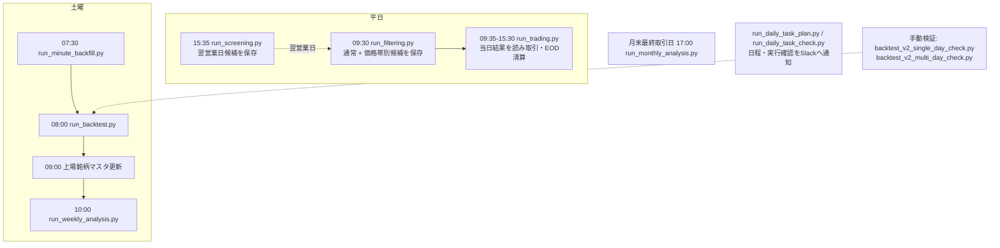

`src/config/task_schedule.py`は日付ごとの予定を返すモジュールで、OSタスクスケジューラやcronの代わりにプロセスを起動するものではない。v2検証スクリプトは通常の`run_backtest.py`と別のヒストリカル再生CLIで、結果は`data/backtest_v2_scratch/`を使う。

## Slack通知

| チャンネル | 主な送信内容 |
|---|---|
| `critical` | 取引キルスイッチ、緊急停止・EOD未決済、401復旧失敗、タスク実行要確認、例外終了（`process_notification`でライフサイクル通知を有効にした場合） |
| `daily` | スクリーニング・フィルタ結果、取引開始・日次レポート、日次タスク予定と実行結果 |
| `analysis` | 分足バックフィル、通常バックテスト、週次・月次分析 |

`process_notification()`は開始・終了をログに記録し、例外時に例外ログと設定されていればLLM原因分析を行って例外を再送出する。`notify_lifecycle=True`のときだけ開始/終了Slack通知を行い、異常終了はcriticalへ送る。現行entrypointの多くは`notify_lifecycle=False`で、処理結果を機能ごとにdaily/analysis/criticalへ個別通知する。通知失敗は本処理を停止させずログへ記録する。