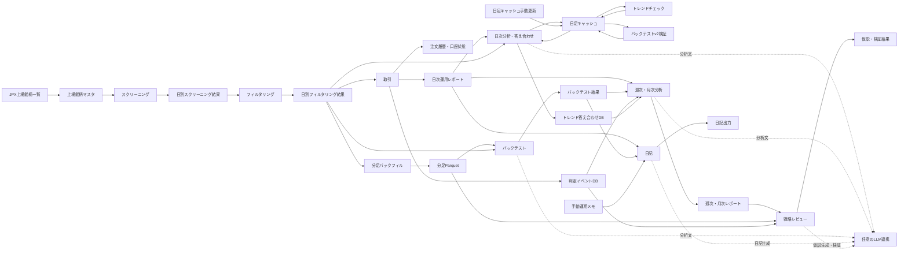

# 全体のデータの流れ

各機能が受け渡す永続データと、その保存場所を示します。保存先はコードと `data/用途_*.md` で確認できたものに限っています。

表は永続化される主な受け渡しデータです。日足キャッシュは銘柄・指数ごとのJSONで、日付付きの日足データを保存します。

## データの置き場所

| データ | 作る機能 | 読む機能 | 保存場所 | 形式 |
|---|---|---|---|---|
| 上場銘柄マスタ | 上場銘柄マスタ更新 | スクリーニング、過去検証 | `data/universe/listed_securities.csv` | CSV |
| スクリーニング結果 | スクリーニング | フィルタリング、分足バックフィル、バックテスト | `data/screening/{日付}.json` | JSON |
| フィルタリング結果 | フィルタリング | 取引、分足バックフィル、バックテスト、分析 | `data/filtering/{日付}.json` | JSON |
| 注文履歴・口座状態 | 取引 | 取引の再起動後復元、分析 | `data/trading/` | JSON、非常停止フラグ |
| 判定イベント | 取引、バックテスト | 取引・週次/月次分析・戦略レビュー | `data/state/filter_decision_events.sqlite3`、`data/backtest/filter_events/` | SQLite |
| 日足キャッシュ | 日次分析（`refresh_cache_with_retries`→`update_cache`、120日・最大3回リトライ）、`run_trend_check --refresh-cache`、`update_daily_bar_cache`、バックテストv2単日・複数日検証 | 日次分析・答え合わせ、トレンドチェック、バックテストv2単日・複数日検証 | `data/cache/yahoo_daily/{symbol}.json`（指数は`^N225.json`・`^VIX.json`） | 日付（`YYYY-MM-DD`）をキーとするJSON辞書。値は`open`/`high`/`low`/`close`/`volume`。`volume`キーがない旧形式は再取得対象 |
| 分足データ | 分足バックフィル | 分足バックテスト、戦略レビュー | `data/minute_bars_parquet/symbol=.../date=.../data.parquet` | Parquet |
| 運用レポート | 取引、日次・週次・月次分析 | 日次・週次・月次分析、日記、戦略レビュー | `data/reports/daily/`、`weekly/`、`monthly/` | JSON |
| トレンド答え合わせ結果 | 日次分析・答え合わせ | 日次・週次・月次分析 | `data/analysis/trend_check.sqlite3`、`data/reports/trend_check/` | SQLite、JSON |
| バックテスト結果 | バックテスト | 週次・月次分析、日記 | `data/backtest/latest/`、`runs/` | JSON |
| 日記 | 日記 | 手動参照 | `data/notes/diary/` | JSON、Markdown |
| 戦略レビューの仮説・検証結果 | 戦略レビュー | 手動参照 | `data/strategy_hypotheses/`、`data/strategy_verification/` | 要確認 |

日足キャッシュ更新では`latest_confirmed_trading_day()`を必要範囲の上限として使い、当日分は引け後のみを対象にします。ただし、Yahooから取得した履歴をキャッシュへ保存する前に上限日で切り詰めているかは要確認です。`run_backtest.py --live`はこの共有キャッシュ取得関数を呼んでいないため、日足は別経路で取得します。戦略レビューは日足キャッシュを読まず、週次・月次レポート、分析DB、ADRを仮説生成の文脈に、分足Parquetと判定DBを検証に使います。

図に示した各機能のレイヤー構成は[コーディング規約](coding-guidelines.md)を参照してください。実装上の保存先と読書き関係を確認できないデータの流れは、推測で補わず「要確認」としています。
