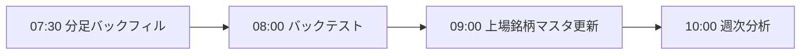

# 実行スケジュール

正は [`src/config/task_schedule.py`](../../src/config/task_schedule.py) です。このファイルはその写しであり、OSのタスクスケジューラへの登録とは別です。実際の登録・起動は [`scripts/tasks/`](../../scripts/tasks/) のスクリプトで行います。

## 平日（取引日）

| 時刻 | 機能 | 起動スクリプト | 通知先 |
|---|---|---|---|
| 09:30 | フィルタリング | `scripts/tasks/run_filtering.ps1` | `daily` |
| 09:35-15:30 | 取引 | `scripts/tasks/run_trading.ps1` | `daily`、`critical` |
| 15:35 | スクリーニング | `scripts/tasks/run_screening.ps1` | `daily` |
| 既定16:30（設定変更可） | 日次分析・答え合わせ | `scripts/tasks/run_daily_analysis.ps1` | `analysis`、失敗時`critical` |

## 土曜

| 時刻 | 機能 | 起動スクリプト | 通知先 |
|---|---|---|---|
| 07:30 | 分足バックフィル | `scripts/tasks/run_minute_backfill.ps1` | `analysis` |
| 08:00 | バックテスト | `scripts/tasks/run_backtest.ps1` | `analysis` |
| 09:00 | 上場銘柄マスタ更新 | `scripts/tasks/run_update_listed_securities_master.ps1` | `daily` |
| 10:00 | 週次分析 | `scripts/tasks/run_weekly_analysis.ps1` | `analysis` |

## 月末最終取引日

| 時刻 | 機能 | 起動スクリプト | 通知先 |
|---|---|---|---|
| 17:00 | 月次総合分析 | `scripts/tasks/run_monthly_analysis.ps1` | `analysis` |

土曜の定期処理は次の順に実行されます。

`task_schedule.py`は日付ごとの予定を返すモジュールで、OSタスクスケジューラやcronの代わりにプロセスを起動するものではありません。平日のフィルタリング・取引・スクリーニング・日次分析と、土曜の分足バックフィル・バックテスト・銘柄マスタ更新・週次分析を予定として列挙し、月末最終取引日の月次分析も返します。

`backtest_v2_single_day_check.py`と`backtest_v2_multi_day_check.py`は通常の`run_backtest.py`とは別のヒストリカル再生検証CLIです。両スクリプトの検証結果は`data/backtest_v2_scratch/`に出力します。

予定通知と実行確認通知はそれぞれ`run_daily_task_plan.py`と`run_daily_task_check.py`がSlackへ送ります（運用資料記載の予定は毎朝07:00、実行確認は18:00）。これらは`TASKS`の業務処理一覧とは別のOSタスクです。
