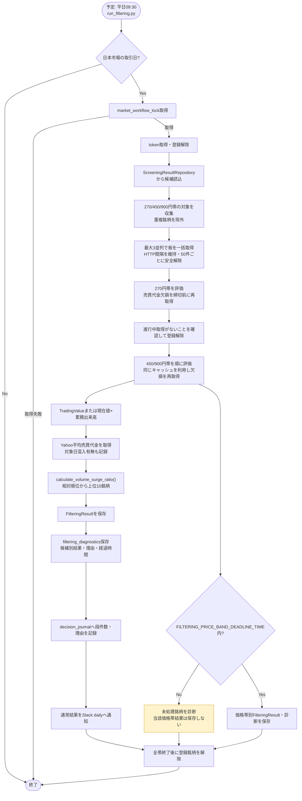

# 詳細設計書 02 フィルタリング機能

> 状態: 現行    最終更新: 2026-10-04
> 起動: `run_filtering.py`    関連: [01 スクリーニング](./01-screening-design.md)、[03 取引ループ](./03-trading-loop-design.md)

対象: ①の通常スクリーニング結果と価格帯別結果を入力とし、当日のトレードループ開始前に出来高・売買代金比で候補を絞る機能。
担当ユースケース: `application/filtering_usecase.py`

## 1. 概要

当日の通常・価格帯別スクリーニング結果を読み、板情報とYahoo Financeの日足から売買代金比を評価します。通常結果と価格帯別結果を保存し、通常結果は取引ループへ渡します。発注・取引判断は本機能の対象外です。

## 2. 実行方式

- **独立起動**: `run_filtering.py`は専用プロセスとして市場ワークフローロックを取得し、取引日確認・トークン取得・銘柄登録解除を行ってからフィルタUseCaseを呼び出す。トークンは`run_trading.py`と共有せず各プロセスで取得する。
- **実行予定: 平日09:30**（`src/config/task_schedule.py`）。寄り付き直後を避ける。
- 実行順序:

```
run_filtering.py起動
 → 取引日判定・market_workflow_lock取得
 → kabu APIトークン取得・登録銘柄全解除
 → 270/450/900円帯の対象を読み、重複を除いて板を一括取得
 → 270円帯を評価・保存
 → 450/900円帯を順番に評価・診断を追加作成
 → 後続のrun_trading.pyが当日FilteringResultを読み込む
```

- 通常スクリーニングは`/ranking`を使用しないため、ランキングデータクリア時間の制約は適用されない。
- ②と③は別プロセスで、フィルタ結果ファイルを介して受け渡す。取引側は当日付の結果を確認してから起動する。

`src/config/task_schedule.py`は平日09:30にフィルタリング、09:35に取引を予定します。予定表がプロセスを起動するわけではなく、実際の起動はOSスケジューラ等が行います。

## 3. 入出力

通常候補は取引日の`data/filtering/`へ保存し、価格帯別結果・診断は検証用系列に分けて保存します。

| 項目 | 方向 | 場所・形式 | 備考 |
|---|---|---|---|
| スクリーニング結果 | 入力 | `data/screening/`、価格帯別結果ディレクトリ | 01設計書参照 |
| 板・売買代金 | 入力 | kabu STATION API | 現在値×累積出来高を代替に使う場合あり |
| 平均売買代金 | 入力 | Yahoo Finance | 通常経路は直近最大20本 |
| 通常フィルタ結果 | 出力 | `data/filtering/YYYY-MM-DD.json` | 取引ループが読む |
| 価格帯別結果・診断 | 出力 | `FILTERING_PRICE_BAND_RESULT_ROOT/`、`data/filtering_diagnostics/` | 検証用 |
| 判断記録・完了通知 | 出力 | 判定イベントDB、Slack `daily` | 段件数・理由・結果 |

## 4. 処理フロー

```
① 通常・価格帯別のスクリーニング結果を先に読み、板取得対象を銘柄コードで重複除外
② `RegistrationAwareBoardCache`から最大3並列で板を取得。HTTP開始間隔は共通処理の設定を守り、50件ごとの全解除は実行中の取得が終わるまで待つ
③ 各帯を270円、450円、900円の順に評価する。売買代金欠損は各帯の締切設定に従い、最大2ラウンド再取得
④ 当日売買代金（板の`TradingValue`、未提供時は現在値×累積出来高）とYahoo平均売買代金を取得
⑤ `calculate_volume_surge_ratio()`で比を計算し、上位10銘柄を選択
⑥ `FilteringResultRepository`へ保存。`filtering_diagnostics`とdecision journalにも件数・除外理由を記録
⑦ 通常結果をSlack dailyへ通知。価格帯別結果は別保存先で、締切を超えた場合は結果を保存せず中断
```



---

## 5. 判断ルール・仕様

### 売買代金比の算出について（重要な制約）

kabuステーション`/board/{symbol}`から当日の`TradingValue`を取得する。値がなければ`CurrentPrice × TradingVolume`で代替する。過去の日足売買代金は`YahooFinanceClient.get_average_turnover_details()`から取得する。

```
売買代金比 = 当日累計売買代金（kabu /board） ÷ Yahoo日足から算出した平均売買代金

9:30時点の当日累計値と日足平均値は時間軸が一致しないため、絶対倍率による足切りは行わず、候補内の相対順位で上位10件を採用する。通常経路は直近最大20本分の`close × volume`を平均し、診断に使用日数と対象日が含まれたかを記録する。同日の値が平均へ含まれる場合も現行実装は除外しないため、部分日足の混入有無は運用データで確認する。
```

- kabu側とYahoo Finance側で銘柄コードの表記が異なる場合がある（例: `.T`サフィックス等）ため、
  `infrastructure/market_data/yahoo_finance_client.py`側で銘柄コード変換を吸収する
- Yahoo Finance側の取得に失敗した銘柄は、基準値が不明なためスコアリング対象から除外する（推測値で補わない）

### フィルタリング上書きCLI（`run_filtering_override.py`）

祝日等で通常の前営業日計算が正しいスクリーニング結果を指さない場合に、参照スクリーニング日だけを指定して、当日のライブ板・出来高で通常の`FilteringUseCase`を手動実行します。バックテストや過去日の板再生ではありません。

| 項目 | 現行動作 |
|---|---|
| 入力 | 必須CLI引数`--screening-date YYYY-MM-DD`で指定した日付のスクリーニング結果。板・出来高・終値等は実行時のライブデータ |
| 日付の扱い | `FixedDateScreeningRepository`が`load_for_date()`への要求を指定日の`ScreeningResultRepository.load_for_date()`へ置き換える。`FilteringUseCase.execute(target_date=None)`で実行し、フィルタ結果の日付は実行日になる |
| 市場処理ガード | `market_workflow_lock()`を取得し、取得できなければ警告して終了。取得後に`process_notification(..., notify_lifecycle=False)`内で実行 |
| 前処理 | APIトークンを取得し、`unregister_all(token)`で既存登録銘柄を解除。トークンなし、全解除失敗はいずれも`SystemExit` |
| 通常フィルタとの関係 | 通常の`run_filtering.py`とは別entrypoint。結果計算は同じ`FilteringUseCase`を利用し、銘柄登録には`BoardRepository`を使う |
| 出力 | 通常設定の`data/filtering/`へ実行日付の`FilteringResult`を保存し、完了通知は`notify_daily`を使用 |
| 例外 | `process_notification()`が例外を記録し再送出する。ライフサイクル通知は無効のため、このコンテキストから開始・異常終了通知は出さない |

---

## 6. レイヤー別の構成

### application/filtering_usecase.py
- `FilteringUseCase.execute() -> FilteringResult`
- 責務: ①〜④の呼び出し順序を制御。ロジックは持たない。
- 依存: `ScreeningResultRepository`（①の成果物読込）, board/volume client, `domain.rules.calculate_volume_surge_ratio()` / `select_top_n_by_surge_ratio()`, `FilteringResultRepository`

### infrastructure/market_data/yahoo_finance_client.py（現行）
- 主経路は`get_average_turnover_details(symbol, days=20, target_date=today)`。過去日リプレイでは対象日より前の平均値を`get_average_turnover_before()`から取得する。
- 詳細APIは`average_turnover`・`average_days`・`average_includes_target_date`を返す。通常経路は直近最大20本を平均し、対象日の有無は診断用に記録する。
- 旧`get_average_volume()`は後方互換として残るが、通常の現行フィルタ経路では使用しない。kabu銘柄コードに`.T`を付けてYahoo Financeへ渡す。

### domain/rules.py 現行関数
- `calculate_volume_surge_ratio(today_volume: float, average_volume: float) -> float`
  - 当日売買代金 ÷ 平均売買代金（純粋関数）。モデル・関数のvolume名は後方互換。
- `select_top_n_by_surge_ratio(scored: list[ScoredCandidate], n: int = 10) -> list[str]`
  - 出来高急増率が高い順に上位10件（固定）を抽出

### domain/models.py 追加モデル
| モデル | フィールド | 用途 |
|---|---|---|
| `ScoredCandidate` | symbol, today_volume, average_volume, surge_ratio | ③の中間結果 |
| `FilteringResult` | date, symbols(list[str]), generated_at | ④の永続化対象・③(トレードループ)の入力 |

`ScoredCandidate.today_volume` / `average_volume`はモデル上の後方互換名であり、現行フィルタでは売買代金値を保持する。

### 現行の診断・キャッシュ・価格帯別処理

- `FilteringDiagnosticsRepository`は候補別のnumerator/取得元・board価格・平均売買代金・ratio・rank・採用有無・理由コード、集計のinput/evaluated/skipped/selected件数、reason counts、処理時間・締切状態を保存する。診断ファイルは通常運用で保存し、異常系の調査に使う。
- `DecisionJournalRepository`は日付ごとの入力件数・評価件数・スキップ件数・採用件数と理由別件数を`filter_stage_summaries`に保存する。個別の除外理由も銘柄×日付×理由で集約する。
- `infrastructure/kabu/registration_aware_board_cache.py`の`RegistrationAwareBoardCache`は同一実行内の板結果と例外を銘柄別に再利用し、同一銘柄への同時要求を1回にまとめる。最大並列数は`FILTER_BOARD_MAX_CONCURRENCY`（既定3）。kabu登録枠の上限に合わせて50件ごとに登録解除し、進行中の取得がすべて終わるまで解除しない。解除失敗後は新しい板取得をブロックする。欠損リトライ結果も銘柄・ラウンド単位で共有し、後続帯で同じリトライを繰り返さない。
- `infrastructure/market_data/cached_volume_client.py`の`CachedVolumeClient`は同一実行内の重複した平均売買代金取得を再利用する。
- 通常結果に加え、`SCREENING_ALTERNATE_PRICE_CAPS`（既定450/900円）ごとの結果を生成し、`FILTERING_PRICE_BAND_RESULT_ROOT/<上限>/`へ保存する。`FILTERING_PRICE_BAND_DEADLINE_TIME`（既定09:34）までに終わらない価格帯は中断し、未処理銘柄を診断に残す。通常の本番入力とは別の分析用系列である。
- 帯ごとに「板取得→評価→欠損リトライ→結果保存」を270→450→900円の順に完結させる（`application/price_band_filtering_usecase.py`の`PriceBandFilteringUseCase`が担当し、`run_filtering.py`は依存を組み立てて呼び出す）。前の帯で取得済みの銘柄はキャッシュを使い再取得しない。後の帯が締め切りに間に合わなくても先の帯の結果は保存済み。板取得1件ごとの開始/完了時刻・所要時間・登録数・帯は診断JSONの`board_fetches`、帯ごとの取得時間の合計・中央値・最大はサマリーの`board_fetch_stats`に記録する。
- `request_handler`はboard APIの429を設定回数・待機時間で再試行する。板取得時間、設定/実測並列数、429応答・再試行結果、帯域ごとの評価時間と欠損・時間切れ銘柄は既存の診断JSONへ記録する。
- 同時刻帯の過去分足がないため、現行も絶対倍率による足切りはせず、候補内の相対順位で選ぶ。

### 配置整理の記録（2026-10-04）

上記のキャッシュと価格帯別処理は記載先へ移設済み。`run_filtering_override.py`は他entrypointに依存せず、両entrypointは`BoardRepository`を利用する。キャッシュのテストimportもinfrastructureへ移行した。

### infrastructure/persistence/filtering_result_repository.py（新規）
- `save(result: FilteringResult) -> None`
- `load_latest() -> FilteringResult | None`
- 用途: `TradingUseCase`（③トレードループ機能）が監視対象銘柄リストとしてここから読み込む

---

## 7. 異常系・失敗時の動き

| ケース | 対応 |
|---|---|
| ①のスクリーニング結果ファイルが存在しない（前日実行失敗等） | フィルタ処理をスキップし、エラー通知。`FilteringResult`は「対象0件」として保存し、③トレードループ側は安全に待機（推測で銘柄リストを補わない） |
| `GET /board/{symbol}` が一部銘柄で失敗 | 当該銘柄はスコアリング対象から除外（他銘柄の処理は継続） |
| Yahoo Financeの平均売買代金取得が一部銘柄で失敗 | 当該銘柄はスコアリング対象から除外（基準値不明のため比を計算しない） |
| 絞り込み後の候補が10件に満たない | 取得できた分だけで継続（警告ログのみ、処理は止めない） |
| 9:30時点の当日値と終日平均の時間軸が不一致 | 絶対倍率の足切りをせず、取得できた候補を相対順位で選ぶ |

---

## 8. 設定項目

設定項目は[config-reference.md](../reference/config-reference.md)を参照。

## 9. 決定事項と変更履歴

### 2026-08-15 すり合わせ済み事項

- フィルタ指標: 当日売買代金 ÷ 過去日足平均売買代金（平均出来高ベースから置き換え済み、2026-10-04）
- 平均売買代金の取得元: Yahoo Finance（`infrastructure/market_data/yahoo_finance_client.py`）
- 算出期間: 直近最大20本。対象日が平均に含まれるかを診断し、含まれる場合も現状除外しない（要確認）
- 銘柄コード変換ルール: 「4桁+.T」（例: `7203` → `7203.T`）
- 起動方式: 独立起動（`entrypoints/run_filtering.py`を別プロセスで実行、結果はファイル経由で③に受け渡す）
- 実行タイミング: 当日9:30頃
- 対象銘柄数: 10件固定（有効な候補が10件未満の場合は取得できた分だけ）
- 最小急増率の足切り: `filter_by_min_surge_ratio()`を設ける初期案は現行コードに実装せず、絶対倍率でなく相対順位を使用する形へ置き換え済み（2026-10-04）

## 10. 未決・既知の課題

- 平均売買代金に対象日が含まれる場合も現状は除外しない。対象日の混入有無は診断に記録する。
