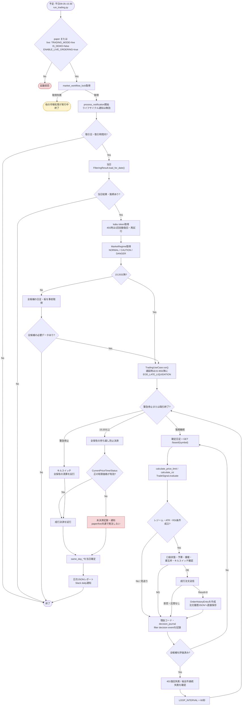

# 詳細設計書 03 取引ループ機能

> 状態: 現行    最終更新: 2026-10-07
> 起動: `run_trading.py`    関連: [02 フィルタリング](./02-filtering-design.md)、[06 ヒストリカル再生](./06-trading-usecase-historical-replay.md)、[ADR-0002](../adr/0002-atr-trailing-stop-take-profit.md)、[ADR-0007](../adr/0007-unify-trading-and-backtest.md)

対象: ②の当日フィルタ結果を読み込み、取引時間中に監視・判定・発注する機能。
担当ユースケース: `src/application/trading_usecase.py`。起動処理: `src/entrypoints/run_trading.py`。

## 1. 概要

当日フィルタリング結果の銘柄を取引時間中に監視し、市場データ・レジーム・ATR等の判断条件を用いて注文を行います。注文、口座状態、判定イベント、日次レポートを扱います。バックテスト・日次分析・戦略レビュー自体は本機能のスコープ外です。

## 2. 実行方式

`src/config/task_schedule.py`が示す平日の予定は、09:30フィルタリング(270円帯のみ。450/900円帯は昼12:00のYahoo分足推定フィルタへ移行、`task_schedule`には未登録で`register_midday_filtering_task.ps1`で登録)、09:35〜15:30取引、15:35スクリーニング、既定16:30(設定変更可)の日次分析。日次分析は確定日足キャッシュを更新し、トレンド答え合わせを行ってからanalysisチャンネルへ通知する。日足更新は最大3回まで再試行し、更新が完了しなくても通知を続けて答え合わせを判定不能とする。取引終了通知にはLLM評価を含めず、約定・損益・保有・エラー概要・強制売却確認のみをdailyチャンネルへ送る。土曜は07:30分足バックフィル、08:00バックテスト、09:00上場銘柄マスタ更新、10:00週次分析、月末最終取引日は17:00月次総合分析である。週次・月次は日次判定結果を集計し、日足キャッシュを更新しない。このモジュールは予定表・取引日判定用であり、プロセスを起動するスケジューラ自体ではない。

日次・週次・月次の分析通知はA.ペーパートレード実績、B.戦略の答え合わせ、D.次回確認の順に統一する。週次・月次はC.バックテストを独立した別枠に置き、対象期間と一致する実行がなければ「なし」と表示する。週次は曜日別損益・市場状態・答え合わせの週内推移、月次は判定不能の原因を補足する。複数営業日基準の結果は通知に含めない。

価格帯別答え合わせの処理・表示仕様は[03b 価格帯別トレンド答え合わせ](./03b-price-band-trend-check.md)を参照する。

`run_trading.main()`はログ設定直後に`validate_startup_config(config)`（`src/config/startup_validation.py`）で売買設定値を検証する。範囲・項目間関係の違反は全件まとめて`ConfigValidationError`となり、ERRORログと`notify_critical`（通知失敗は握りつぶす）へ出力して`SystemExit(1)`で停止する。この時点ではロック・通知コンテキスト・トークン取得・UseCase生成はいずれも開始しない。import時のATR・コスト系検証は従来どおりで、これはログ設定前に評価される。運用者は`scripts/check_startup_config.py`で`.env`の適合を事前確認できる。検証後、`market_workflow_lock()`で市場処理の多重実行を防ぐ。ロック取得後に`process_notification("取引", notify_lifecycle=False, trigger="フィルタリング結果")`へ入り、現在日時が日本市場の取引日・取引時間内かを確認し、`FilteringResultRepository.load_for_date(now.date())`で当日結果を読む。結果がない、または銘柄が0件なら終了する。トークン取得後にUseCaseを組み立て、翌日持ち越し警告と市場レジーム判定を行い、取引開始通知をdailyチャンネルへ送る。

- 注文経路のガードは3条件すべてを要求する: `TRADING_MODE=live`、`IS_DEMO=false`、`ENABLE_LIVE_ORDERING=true`。`paper`では`PaperOrderClient`を注入する。どれかが不一致ならライブUseCase生成を拒否する。
- 初回はフィルタ結果の全銘柄について確定日足と板を事前取得する。必要RSI履歴または板価格が1銘柄でも不足すれば`collect_preflight_market_data()`は失敗し、ループを開始しない。
- 場中に候補の再フィルタや上位3銘柄への事前絞り込みはしない。全フィルタ銘柄を評価し、実保有枠`TARGET_POSITIONS`（既定3）を新規買い時に制御する。
- `process_notification`は開始・終了・例外をログに記録し、例外は再送出する。ここでは`notify_lifecycle=False`のためライフサイクルSlack通知は行わない。設定により例外のLLM分析を試みるが、取引判定の代替にはしない。
- 取引中間報告は取引日・取引時間内に起動した`TradingUseCase.run()`の既存ループから、既定11:30と14:00に各1回Slack dailyへ送る。時刻は`TRADING_PROGRESS_REPORT_1_HOUR/MINUTE`、`TRADING_PROGRESS_REPORT_2_HOUR/MINUTE`で変更し、起動時に取引時間内かつ第1報告<第2報告を検証する。起動時刻より前の報告枠は遡って送らない。
- 中間報告は約定件数（liveは実約定照会未実装のため注文受付件数）・Paperの日次実現損益・保有銘柄とAPI返却の含み損益・開始時のMarketRegime・日経225当日値動き（前日終値比）・新規買い見送り/停止とATR損切りを含む。MarketRegimeは起動時評価を再利用し、判定ロジックと売買処理は変更しない。含み損益は保有一覧1回の取得値を使い、銘柄ごとの板取得は行わない。日経225は通知ごとにYahoo Financeの1分足を1回取得し、直近営業日の終値との比率を表示する。取得不能値は0と見なさず「取得不可」とする。文面生成は`domain.trading_progress_report.build_trading_progress_report()`の純粋関数で行う。
- `15:20`以降に起動した場合は事前取得を行わず`run()`へ進み、持ち越し防止決済を実行する。`15:30`以降の遅延復帰は遅延決済経路となる。

## 3. 入出力

取引処理は当日付のフィルタ結果を読み、APIおよび状態ファイルを使って取引を行います。実注文の詳細はcritical、日次レポートや進捗報告はdailyへ通知します。

| 項目 | 方向 | 場所・形式 | 備考 |
|---|---|---|---|
| 当日フィルタ結果 | 入力 | `data/filtering/YYYY-MM-DD.json` | 対象銘柄 |
| 日足・板・口座情報 | 入力 | Yahoo Finance、kabu STATION API | 場中判定・発注可否 |
| 注文履歴・口座状態 | 入出力 | `data/trading/` | JSON、非常停止フラグ |
| 判定イベント | 出力 | `data/state/filter_decision_events.sqlite3` | 銘柄・日付・理由等 |
| 日次レポート | 出力 | `data/reports/daily/` | JSON |
| Slack通知 | 出力 | `daily`、`critical` | 取引開始・中間報告・注文・終了・異常 |

## 4. 処理フロー

### ③ 日足・板情報の取得
- **担当**: `get_yahoo_daily_bars()` / `get_yahoo_daily_closes()` と`BoardRepository.get_current_board()`。
- Yahoo Financeから当日未確定足を除いた確定日足を取得し、RSI用終値とATR用OHLCを使う。空データは`DAILY_DATA_UNAVAILABLE`、履歴不足は`INSUFFICIENT_RSI_HISTORY`等を記録し、RSIなしで通常シグナルを出さない。
- kabu板の`CurrentPrice`等は`dict`として受け渡す。データの推測補完はしない。
- ループ中に板取得が対象銘柄全件で連続失敗すると、`BOARD_FETCH_CONSECUTIVE_FAILURE_THRESHOLD`（既定3周）で1 runにつき1回通知する。一部取得できた周は連続回数をリセットする。

### ④ 売買条件・レジーム・ATR判定
- **通常条件**: `calculate_price_limit(closes, period=5)`は直近5確定終値の単純平均を計算し、`lower_band=round(SMA×0.99, 1)`、`upper_band=round(SMA×1.01, 1)`を返す。`TradeSignal.evaluate()`は`current_price >= upper_band`かつRSIがエントリー閾値以上ならBUY、`current_price <= lower_band`かつRSIが出口閾値以下ならSELLを返す。通常閾値は55/45。RSIは`calculate_rsi()`のWilder方式、既定14期間・最低30終値で、本日を除くデータを使う。
- **市場レジーム**: `MarketRegimeUseCase`は日経225実現ボラティリティ・VIX・日経前日比で`NORMAL/CAUTION/DANGER`を判定し、ADXが閾値以上なら1段階緩和する。データ不足時は安全側に`DANGER`。`CAUTION`のBUY RSI閾値は60（NORMALは55）、DANGERでは新規BUYを見送る。SELL条件のRSI閾値は45のまま。
- **ATR**: `assess_volatility()`は日足OHLCのATR比で`NORMAL/CAUTION/DANGER`を判定。CAUTIONは数量を既定0.5比率で売買単位に丸め、DANGERは既定`skip`で新規買い数量を0にする。保有中は当日最高値を更新し、最高値からATR倍率を引いたトレーリングラインで出口を判定する。エントリー価格からの含み益が既定0.5 ATR以上なら利確専用倍率へ切替える。詳細な設計判断は[ADR-0002](../adr/0002-atr-trailing-stop-take-profit.md)・[ADR-0006](../adr/0006-atr-profit-lock-multiplier-separation.md)を参照。
- バックテストは`domain.rules`の`calculate_price_limit()`、`calculate_rsi()`、`TradeSignal.evaluate()`等を共有する。一方、`backtest_usecase.py`の時間・状態オーケストレーション全体が本番と同一ではない。統合ロードマップは[ADR-0007](../adr/0007-unify-trading-and-backtest.md)を参照。

### ⑤ 発注可否の確認
- 現金・保有状態はシグナルごとに読み直す。新規買いは建玉枠、利用可能現金、残り枠按分、`MAX_ORDER_AMOUNT_PER_TRADE`、売買単位、ATR数量調整、日次買い注文数・損失、重複注文、注文ロックを確認する。
- 本番では`/apisoftlimit`を取得し、取得不能ならキルスイッチで新規発注を停止する。ペーパーでは設定値`API_SOFT_LIMIT`を使う。
- NG理由はdecision journal等へ記録する。売りは保有全量を対象とし、保有なし・安全条件不成立時は発注しない。

### ⑥ 注文・履歴
- `place_market_order()`から本番の`send_order`または`PaperOrderClient`へ成行注文を渡す。`Result == 0`を受付成功として、`TradeSignal.to_order_history_entry()`経由で注文履歴へ記録する。API応答・例外は成功扱いにしない。
- `PaperOrderClient`は注文開始時に価格を検証する。価格欠落は`ORDER_REJECTED_PAPER_PRICE_MISSING`、0以下・NaN・無限大・数値以外は`ORDER_REJECTED_PAPER_PRICE_INVALID`で拒否し、約定状態・注文ID・状態ファイルを変更しない。理由はクライアントの`last_rejection_reason`とERRORログに出し、通常注文の拒否判断はDecisionJournalにも記録する。注文口に価格時刻や秒数しきい値は持たせない。
- 注文履歴の実読み書き担当は`TradingUseCase._load_order_history()` / `_save_order_history()`であり、`ORDER_HISTORY_FILE`のJSONを直接読み書きする。過去設計で担当としていた専用`OrderHistoryRepository`は現行コードにない。※規約上は永続化をinfrastructureへ寄せるべき既知の乖離であり、この設計更新ではコードを変更しない。
- 起動時の履歴読み込みでは全行の必須項目・型・ISO timestampを検査し、不正行があれば0始まりの行番号・銘柄・値をまとめた`ValueError`で停止する。検査エラーはcriticalログに記録し、`_notify_safely()`からcritical通知する。`is_duplicate_order()` / `is_recent_order()`にも`ORDER_HISTORY_TIMESTAMP_INVALID` warningを残す二重の防御がある。
- `OrderHistoryEntry.price`は発注時の参照価格であり、本番の実約定価格照会結果ではない。約定価格記録・照会は未実装で、[本番EOD・約定照会タスク](../tasks/task-live-eod-liquidation-and-fill-reconciliation.md)に残る。
- 状態ファイルの保存・破損対応: `storage.write_json()`は一時ファイルへ書いて`os.replace`で置換し、成否を`bool`で返す(例外は出さない)。`PaperOrderClient`は起動時に`read_json_strict()`で読み、破損・読込失敗・値不正は`StateFileCorruptError`で停止する(`<名前>.corrupt-<YYYYmmdd-HHMMSS>`へコピーを残し、元ファイルは残す。`process_notification`内で生成されるためcritical通知される)。実行中の保存失敗は、注文履歴が`TradingUseCase._order_history_save_failures`、Paper状態が`PaperOrderClient.consecutive_save_failures`で連続回数を持ち、初回失敗でcritical通知して続行する。連続回数が`STATE_SAVE_CONSECUTIVE_FAILURE_THRESHOLD`(既定3)以上の間は新規買いのみ`NEW_BUY_HALTED_STATE_SAVE_FAILURE`で見送り(売り・ATR損切り・EOD決済は継続)、停止中は買いシグナルのたびに再保存を試み、成功すれば解除する。

### ⑦〜⑨ ループ終了・決済・レポート
- 1周ごとに`LOOP_INTERVAL`（60秒）休止し、`is_market_closed()`で15:30終了を判定する。
- 取引ループは設定された中間報告時刻を跨いだ周回で通知する。約定がない場合も「動きなし」として送る。取引時間外・休場日は`run_trading.main()`の取引セッションガードによりループ自体を開始しない。
- `ALLOW_OVERNIGHT_HOLDING=false`（既定）では15:20以降に全保有を成行決済し、ループを終了する。15:30以降の遅延復帰では`EOD_LATE_LIQUIDATION`として同様に決済する。
- EOD経路は`CurrentPriceTime`がJSTの当日であること、`CurrentPriceStatus`が1または8であること、`CurrentPrice`が有限かつ正であることを`_fresh_liquidation_quote()`で検証する。検証できない場合は対象銘柄を未決済として記録・通知し、保守的に発注しない。この挙動は現状paper/live共通であり、ライブで鮮度検証失敗後も成行注文を試す設計にはまだなっていない。
- 手動緊急停止もpaperでは`_fresh_liquidation_quote()`を使い、失敗銘柄は未決済のまま残してERROR記録と銘柄まとめ通知を1回行う。status 8は引け後の価格として許容する。liveの手動緊急停止は従来どおりfreshnessを要求せず、成行注文を試みる。モード判定は`TradingUseCase._is_paper_mode()`に集約する。liveのEOD鮮度失敗時の扱いは[本番EOD・約定照会タスク](../tasks/task-live-eod-liquidation-and-fill-reconciliation.md)で別途扱う。
- `run()`終了後に日次JSONレポートを保存し、Slackのdailyチャンネルへ通知する。評価損益、注文・スキップ統計、キルスイッチ、EOD決済結果、任意のLLM参考分析を含む。通知失敗は取引処理を止めない。

## 5. 判断ルール・仕様

売買シグナルはSMA・RSIを基礎に、市場レジーム、ATR、保有枠、口座状態、金額制限、キルスイッチを組み合わせて評価します。理由コードと判断イベントを残し、異常条件では新規買いを止めるか決済を保留します。

### 状態・判断記録

| 状態 | 保持場所・更新 |
|---|---|
| kabu API token | `TokenProvider`シングルトン。401で`request_handler`が再取得して同一リクエストを1回だけ再試行。再取得最小間隔は既定60秒、再試行も401なら既定300秒クールダウン |
| 候補銘柄 | 当日`FilteringResult`。run中は固定 |
| 現金・保有 | 発注判断に応じAPIまたは`PaperOrderClient`から再取得 |
| 注文履歴 | `TradingUseCase.order_history`。成功受付時に追記しJSONへ保存 |
| 保有中最高値 | `TradingUseCase._holding_high_prices`。run中のメモリ保持、注文時に初期化・消去 |
| 判断記録 | `DecisionJournalRepository`。銘柄×日付×理由で集約し、ループ周回後にflush。DB障害時も取引を継続 |

認証復旧後も401が続く場合は保有一覧を付けて1 run 1回通知する。board全銘柄の連続取得失敗も閾値到達時に1 run 1回通知する。

### 理由コード

`DecisionJournalRepository.TRADING_REASON_CODES`に定義された取引判断コードは次のとおり。フィルタ段の除外コードは②設計書に記載する。

| 理由コード | 意味 |
|---|---|
| `DAILY_DATA_UNAVAILABLE` | Yahooの日足データが空 |
| `INSUFFICIENT_RSI_HISTORY` / `RSI_DATA_UNAVAILABLE` | RSI入力の本数不足・計算不能 |
| `BOARD_UNAVAILABLE` | 板または現在値を取得できない |
| `ATR_DATA_UNAVAILABLE` / `ATR_ENTRY_PRICE_UNAVAILABLE` | ATR日足または保有取得価格が不足 |
| `budget_below_one_lot` / `buy_quantity_invalid_inputs` | 予算または数量入力から1単元を作れない |
| `atr_danger_skip` / `caution_rounding_to_zero` / `atr_quantity_adjustment_zero` | ATR数量調整後の買い数量が0 |
| `ORDER_QUANTITY_ZERO` | 最終注文数量が0 |
| `POSITION_LIMIT_REACHED` / `WALLET_UNKNOWN` | 建玉上限または買付余力不明 |
| `MARKET_REGIME_DANGER_SKIP` | DANGERによる新規買い見送り |
| `ORDER_AMOUNT_LIMIT_EXCEEDED` / `ORDER_SAFETY_BLOCKED` | 金額上限または一般安全条件で拒否 |
| `NEW_BUY_HALTED_STATE_SAVE_FAILURE` | 状態ファイル保存の連続失敗による新規買い停止 |
| `ORDER_REJECTED_NONE` / `ORDER_REJECTED_RESULT` | 注文応答なし、またはResultが成功値以外 |
| `ORDER_REJECTED_PAPER_PRICE_MISSING` / `ORDER_REJECTED_PAPER_PRICE_INVALID` | ペーパー注文価格の欠落、または有限正値・数値型の検証失敗 |
| `BOARD_RECOVERED` / `EOD_PRICE_UNAVAILABLE` | 板取得の復旧、または通常EOD経路の参照価格不明 |
| `EOD_LIQUIDATION_POSITIONS_UNAVAILABLE` / `LIQUIDATION_BOARD_UNAVAILABLE` | 清算対象の保有一覧、またはfresh板の取得不能 |
| `LIQUIDATION_PRICE_TIME_INVALID` / `LIQUIDATION_PRICE_NOT_TODAY` / `LIQUIDATION_PRICE_STATUS_INVALID` / `LIQUIDATION_PRICE_INVALID` | EOD価格の時刻・当日性・status・有限正値の検証失敗 |
| `EOD_LIQUIDATION_EXCEPTION` / `EOD_LATE_LIQUIDATION` | EOD処理例外、または15:30以降の遅延決済 |

### 判定イベント・同日基準

`FilterDecisionRepository`が保存するイベント種別は`ATR_DANGER_SKIP`、`ATR_STOP_EXIT`、`MARKET_REGIME_DANGER_SKIP`、`MARKET_REGIME_CAUTION_RSI_FILTER`、`ADX_TREND_RELIEF`。`input_json`にはATR・True Range・レジーム・実現ボラ・VIX・日経前日比・ADX・RSI・通常/適用閾値等の判断入力を保存する。RSIが取引可能な注文履歴には`rsi_input`として判断日時、レジーム、RSI・閾値、計算可否、不足理由、終値本数、最終終値、現在値、判定結果を保存する。

当日基準(`same_day_*`)の確定はコード上の3か所で行う。

1. 最初のループ周回: `include_today=False`で再起動後に残った前日以前の未確定イベントを確定。
2. 15:20決済経路: 当日イベントを含めて確定。
3. 15:30以降の終了・遅延決済経路: 当日イベントを含めて確定。

決済時刻は持ち越し許可時は15:30、それ以外は15:20。基準価格・高安・最終観測時刻・観測回数・価格変化・仮想損益・結果・確定時刻と`same_day_data_quality`を記録する。品質ラベルは、問題なし`OK`、日足のみ再生`DAILY_REPLAY_NO_INTRADAY`、終値観測の遅れ`STALE_LAST_OBSERVATION(nmin)`、観測回数不足`FEW_OBSERVATIONS(count/expected)`等。板取得不能フラグも同欄に保持する。

### 主要データモデルとAPI応答

| 実体 | 定義場所・用途 |
|---|---|
| `OrderHistoryEntry` | `domain/models.py`。注文受付・参照価格、ATR/レジーム/RSI診断、`rsi_input`等 |
| `PriceLimit` | `domain/models.py`。`lower_band` / `upper_band` |
| `TradeSignal` | `domain/models.py`。symbol/side/price/qty、`evaluate()`でシグナル判定 |
| `MinuteBar` | `domain/models.py`。分足の時刻・価格・出来高・取得元 |
| `DailyBar` / `VolatilityAssessment` | `domain/volatility.py`。OHLCとATR/ボラティリティ評価 |
| `MarketRegimeAssessment` / `MarketRegime` | `domain/market_regime.py`。レジームと市場データ品質 |
| `Board` / `Position` / `CashBalance` | `models.py`にクラスはない。board・positions・wallet API応答を`dict`として利用 |
| `Order` / `OrderRecord` / `IndicatorSnapshot` / `Signal` | `models.py`にクラスはない。シグナルは`TradeSignal`、永続履歴は`OrderHistoryEntry` |

### キルスイッチ・金額制限

| 項目 | 現行値・処理 |
|---|---|
| 1回あたり買い注文額 | `MAX_ORDER_AMOUNT_PER_TRADE`既定30,000円。ライブはAPI soft limitとの小さい方、paperは設定soft limitとの小さい方を適用 |
| 1日の最大注文数 | `MAX_ORDER_COUNT_PER_DAY`既定10。新規BUYだけを数え、売り決済は含めない |
| 1日の損失上限 | `DAILY_LOSS_LIMIT_RATIO`既定0.02。開始資本に対する日次損益で新規買いを停止 |
| 最大保有枠 | `TARGET_POSITIONS`既定3 |
| 緊急停止 | `EMERGENCY_STOP_FILE`検知時にキルスイッチを発動し、保有取得を再試行して全保有の決済を試みる |

買い数量は残り保有枠で現金を按分し、金額上限と`ORDER_UNIT`（100株）で丸める。売りは保有全量を対象とする。キルスイッチは`domain.rules.check_kill_switch()`、買い金額は`is_buy_order_amount_allowed()`で判定する。

### 現行パラメータ

| パラメータ | 既定値 | 用途 |
|---|---:|---|
| `RSI_PERIOD` / `RSI_MINIMUM_CLOSES` | 14 / 30 | RSI期間・最低確定終値数 |
| `RSI_ENTRY_THRESHOLD` / `RSI_ENTRY_THRESHOLD_CAUTION` / `RSI_EXIT_THRESHOLD` | 55 / 60 / 45 | NORMAL・CAUTIONの買い、通常売りのRSI条件 |
| `calculate_price_limit` | 期間5、上下比率0.99 / 1.01 | 固定実装のSMAバンド。これらの環境変数はない |
| `ATR_PERIOD` / `ATR_CAUTION_RATIO` / `ATR_DANGER_RATIO` | 14 / 1.5 / 2.0 | ATR評価期間・レベル境界 |
| `ATR_CAUTION_LOT_RATIO` / `ATR_DANGER_ACTION` | 0.5 / `skip` | ATR数量調整 |
| `ATR_STOP_*_MULTIPLIER` | NORMAL 1.5 / CAUTION 1.0 / DANGER 0.7 | 損切り倍率 |
| `ATR_PROFIT_LOCK_*_MULTIPLIER` | NORMAL 2.5 / CAUTION 2.0 / DANGER 1.0 | 利確トレーリング倍率 |
| `ATR_PROFIT_LOCK_TRIGGER_ATR_MULTIPLE` | 0.5 | 利確倍率へ切り替える含み益条件 |
| `MARKET_REGIME_*` | 実現ボラ17/29、VIX17/27、日経変化2.0%、期間20、ADX27 | 市場レジーム判定。個別値はconfig既定値を参照 |
| `LOOP_INTERVAL` / 清算時刻 | 60秒 / 15:20 | ループ間隔・持ち越し防止決済 |

## 6. レイヤー別の構成

| ファイル | 層 | 役割 |
|---|---|---|
| `src/domain/rules.py`、`src/domain/models.py` | domain | 売買ルール・注文・状態データ |
| `src/application/trading_usecase.py` | application | 取引ループ、判断・注文・状態管理 |
| `src/infrastructure/`のkabuクライアント・永続化実装 | infrastructure | 外部APIと状態保存 |
| `src/entrypoints/run_trading.py` | entrypoints | 設定検証、依存構築、取引ユースケース起動 |

## 7. 異常系・失敗時の動き

| 事象 | 検知方法 | 動き | 通知 | 理由コード |
|---|---|---|---|---|
| 起動時の売買設定違反 | `validate_startup_config()` | ロック・トークン取得前に停止 | `critical` | 設定検証エラー |
| 必要な日足・板情報が不足 | 事前取得 | 取引ループを開始しない | ログ | `DAILY_DATA_UNAVAILABLE`等 |
| EOD価格が未取得・無効 | 時刻・status・価格の検査 | 未決済記録、保守的に発注しない | `critical` | `LIQUIDATION_PRICE_*` |
| 状態ファイルの保存失敗が連続 | 連続失敗回数 | 新規買いを停止し、売り・決済は継続 | `critical` | `NEW_BUY_HALTED_STATE_SAVE_FAILURE` |

## 8. 設定項目

全設定項目は[config-reference.md](../reference/config-reference.md)を参照してください。売買判断に関わる主要パラメータは本章5の表に記載しています。

## 9. 決定事項と変更履歴

2026-09-08の合意として、①②の勢いに沿うトレンド追随、本日を除く確定終値利用、データ不足時の推測禁止、バックテストとのdomain判定関数共有は継続する。

- 当初の単純なSMA/RSI条件(55/45)は、バンド判定に加えCAUTION時RSI60・DANGER新規買い見送りへ拡張済み（2026-10-04）。
- 当初の「資金配分後最大3銘柄に対象を絞る」は、全フィルタ候補を監視し保有枠を発注時に制御する現行実装に置き換え済み（2026-10-04）。
- `OrderHistoryRepository`が永続化する想定は、UseCaseによるJSON直接I/Oの説明に置き換え済み（2026-10-04）。
- 既定の発注上限10,000円（運用資金の10%）という記録は、`MAX_ORDER_AMOUNT_PER_TRADE=30,000`円に置き換え済み（2026-10-04）。旧値は決定履歴として保持する。

## 10. 未決・既知の課題

1. 本番移行前に、EOD鮮度検証失敗時のライブ成行売り継続と、本番約定照会・約定価格の履歴分離を実装・検証する。現状のpaper/live共通で検証失敗時に清算を止める挙動は、[未着手タスク](../tasks/task-live-eod-liquidation-and-fill-reconciliation.md)を根拠に未完了。
2. Paper価格検証、および状態ファイル・timestamp・設定値の第2弾検証はレビュー依頼に挙がっているが、`docs/tasks/`に対応する個別タスク・完了条件を確認できなかった。別途起票要否を確認する。
3. ADR-0007 Phase 4は13営業日・8注文の初回突合まで。3ヶ月相当データと同一の日足・指数・分足スナップショットで旧エンジンとの差を再検証し、旧エンジン廃止を判断する。

### 価格帯別トレンド答え合わせ（詳細は分離）

2026-10-07に価格帯別答え合わせを本機能から分離しました。日次分析で通常270円帯に加え、450円・900円帯の選定結果を同じv1定義で評価します。
未判定銘柄の日足を取得し、価格帯別SQLite・状態JSONへ保存します。週次・月次分析は保存済み結果のみを読みます。
欠測・選定0件・評価対象外を区別し、少数件は参考値として表示します。詳細は[03b 価格帯別トレンド答え合わせ](./03b-price-band-trend-check.md)を参照してください。
