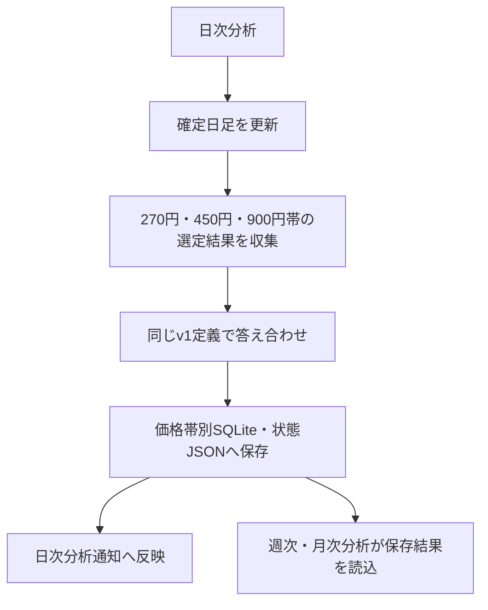

# 詳細設計書 03b 価格帯別トレンド答え合わせ

> 状態: 現行    最終更新: 2026-10-07
> 起動: `run_daily_analysis.py`    関連: [03 取引ループ](./03-trading-loop-design.md)、[全体データフロー](../architecture/flow.md)

## 1. 概要

価格帯別に保存されたフィルタリング選定銘柄について、通常の270円帯と同じv1定義で日次のトレンド答え合わせを行います。450円・900円帯の診断結果と未判定銘柄の日足も取得対象に加えます。注文・取引判断は本機能の対象外です。

## 2. 実行方式

日次分析が取引日引け後に実行し、保存済みの価格帯別結果を評価します。週次・月次分析は日足の取得や再判定をせず、日次に保存済みの結果を読みます。

| 時刻 | 起動主体 | 前後の機能 |
|---|---|---|
| 既定16:30（設定変更可） | `scripts/tasks/run_daily_analysis.ps1` | 日足更新後に答え合わせし、日次分析通知に含める |

## 3. 入出力

本機能は価格帯別の選定・フィルタリング結果と確定日足を読み、価格帯別データベース・状態ファイルへ評価結果を保存します。

| 項目 | 方向 | 場所・形式 | 備考 |
|---|---|---|---|
| 価格帯別選定結果 | 入力 | `SCREENING_PRICE_BAND_RESULT_ROOT/` | 450円・900円帯 |
| 価格帯別フィルタ結果 | 入力 | `data/filtering_price_bands/` | 日付別JSONと診断結果 |
| 確定日足キャッシュ | 入力 | `data/cache/yahoo_daily/` | 日足更新後に読む |
| 価格帯別答え合わせ | 出力 | `data/analysis/price_band_trend_check/databases/` | 価格帯別SQLite |
| 日別評価状態 | 出力 | `data/analysis/price_band_trend_check/status/` | 価格帯・日付別JSON |
| 分析通知 | 出力 | Slack `analysis` | 日次・週次・月次レポート内に表示 |

## 4. 処理フロー

日次分析が価格帯別の入力を照合して判定を行い、価格帯ごとに結果を保存します。期間分析は保存済みデータを集約します。

## 5. 判断ルール・仕様

通常の270円帯の答え合わせは変更せず、価格帯ごとの選定銘柄だけを評価します。

| 条件 | 結果 |
|---|---|
| 価格帯 | 270円・450円・900円 |
| 同一日・同一帯を再実行 | 該当する結果だけを置換 |
| 価格帯別スクリーニング結果が未保存 | 欠測として扱い、理由を区別 |
| 保存された選定銘柄が0件 | 前営業日にスクリーニングがなかった場合は「前日スクリーニングなし」、実際に0件の場合は「選定なし」 |
| 日足等が不足して銘柄を評価できない | 選定数には含め、評価対象外として別件数にする |
| 450円・900円帯の選定が10件未満 | 件数と参考値を表示し、断定に使わない |
| 3帯の判定対象合計が30件未満 | 参考値として扱う |
| 欠測日 | トレンド率の分母に含めない |
| 評価可能な日 | 選定銘柄数をトレンド率の分母にする |

時間切れで未保存の日は欠測にし、未判定の選定銘柄は対象日までの確定日足を取得して追いつきます。日次・週次では270円・450円・900円のトレンド率を同じ行に表示し、欠測があれば理由も併記します。月次では率、トレンド銘柄の始値から終値までの平均値幅、予算と単元から算出した買える枠数、注文上限内で買える選定銘柄の割合、参考目安を表にし、欠測理由別の日数と評価対象外件数も補います。

## 6. レイヤー別の構成

| ファイル | 層 | 役割 |
|---|---|---|
| `src/domain/trend_check.py` | domain | トレンド答え合わせの判定定義 |
| `src/application/price_band_trend_check.py` | application | 価格帯別結果の取得・判定・集計・保存 |
| `src/application/trend_check_usecase.py` | application | 日次答え合わせの共通処理とデータパス |
| `src/infrastructure/persistence/trend_check_repository.py` | infrastructure | SQLiteの答え合わせ結果の永続化 |
| `src/entrypoints/run_daily_analysis.py` | entrypoints | 日足更新、日次答え合わせ、分析通知の起動 |
| `src/entrypoints/run_weekly_analysis.py`、`run_monthly_analysis.py` | entrypoints | 保存済み価格帯別結果の期間集計 |

## 7. 異常系・失敗時の動き

| 事象 | 検知方法 | 動き | 通知 | 理由コード |
|---|---|---|---|---|
| 日足更新失敗 | 日次分析の更新結果 | 古いキャッシュから通常・価格帯別結果を再計算・保存せず、答え合わせを判定不能とする | 分析通知は継続 | 日足更新失敗 |
| 価格帯別結果の時間切れ・未保存 | 保存状態・診断結果 | 欠測として扱い、理由別に集計 | 日次・週次・月次に欠測理由を表示 | `FILTER_TIME_LIMIT`等 |
| 評価に必要な日足等が不足 | 判定結果 | 評価対象外として別件数にする | レポートに件数を表示 | 要確認 |

## 8. 設定項目

共通設定は[config-reference.md](../reference/config-reference.md)を参照してください。

## 9. 決定事項と変更履歴

| 日付 | 決定 | 理由 |
|---|---|---|
| 2026-10-07 | 通常の270円帯を変更せず、450円・900円帯も同じv1定義で評価する | 価格帯別検証結果を通常系列から分離する |
| 2026-10-07 | 欠測と実際の選定0件を区別し、評価対象外件数を別に表示する | 判定数とトレンド率の解釈に必要なため |

## 10. 未決・既知の課題

- 要確認: ここに記載した既知の課題以外に、価格帯別答え合わせの課題があるか。
