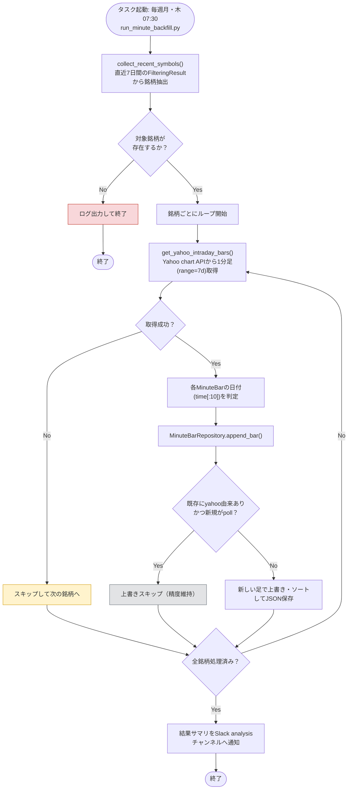

# 詳細設計書 04 分足バックフィル

> 状態: 一部未反映    最終更新: 2026-10-07
> 起動: `run_minute_backfill.py`    関連: [05 バックテスト](./05-backtest-design.md)、[分足データの用途](../../data/minute_bars_parquet/用途_Parquet形式の分足データ.md)

## 1. 概要

直近のフィルタリング結果に登場した銘柄について、Yahoo Financeから1分足を取得し、銘柄・日付単位でParquetに保存します。既存の自前ポーリングデータがあればYahoo由来のデータで補強します。売買判断・注文は本機能の対象外です。

## 2. 実行方式

`run_minute_backfill.py`が直近`--days`日分の通常・価格帯別フィルタリング結果から重複のない銘柄一覧を作り、`MinuteBarBackfillUseCase`を実行します。`--days`の既定値は7日です。現在の`task_schedule.py`は土曜07:30を予定しています。

| 時刻 | 起動主体 | 前後の機能 |
|---|---|---|
| 土曜07:30 | `scripts/tasks/run_minute_backfill.ps1` | バックテスト（08:00）より前 |
| 手動 | `run_minute_backfill.py` | 引数で対象日数・入出力ディレクトリを指定可能 |

図中の起動曜日・時刻と保存方式については第4章の「要確認」を参照してください。

## 3. 入出力

入力する通常および価格帯別のフィルタ結果から銘柄を集め、Yahoo Financeの1分足を銘柄・日付別のParquetパーティションへ保存します。完了した取込結果をSlack `analysis`へ通知します。

| 項目 | 方向 | 場所・形式 | 備考 |
|---|---|---|---|
| 通常フィルタ結果 | 入力 | `FILTERING_RESULT_DIRECTORY` | 日付別JSON |
| 価格帯別フィルタ結果 | 入力 | `FILTERING_PRICE_BAND_RESULT_ROOT/<価格上限>/` | 通常ディレクトリを明示指定した場合は対象外 |
| Yahoo 1分足 | 入力 | Yahoo Finance chart API | `--days`で取得期間を指定 |
| 分足データ | 出力 | `data/minute_bars_parquet/symbol=<銘柄>/date=<日付>/data.parquet` | `MINUTE_BAR_PARQUET_DIR`で変更可能 |
| 取込結果通知 | 出力 | Slack `analysis` | 対象数、取込本数、所要時間 |

## 4. 処理フロー

銘柄を重複なく集め、Yahooの分足を日付で分けて保存します。取得できない銘柄はスキップし、その他の銘柄の処理を続けます。

> 要確認: この図は退避した既存図をそのまま保持しています。図中は毎週月・木07:30とありますが、現行`task_schedule.py`は土曜07:30を予定し、`minute_bar_backfill_usecase.py`の冒頭コメントは毎週月曜と記載しています。実際のOSタスクスケジューラ登録状況はこのリポジトリの予定表から確認できません。
>
> 要確認: 図中の保存形式はJSON、保存先API名は`MinuteBarRepository`ですが、現行コードは`ParquetMinuteBarRepository`でParquetへ保存します。図のノード・矢印・ラベルは依頼に従い変更していません。

## 5. 判断ルール・仕様

同じ銘柄・時刻にデータが重なった場合は、Yahoo由来のデータを優先して保持します。

| 条件 | 結果 |
|---|---|
| 対象銘柄のYahooデータが空 | 警告ログを出し、その銘柄は0本として次へ進む |
| 既存データがYahoo由来で、新しいデータが`poll` | 既存のYahooデータを上書きしない |
| 同一時刻に優先されるYahooデータがある | 既存時刻の足を置換し、時刻順に並べて保存 |
| 新しいバーの保存 | `time[:10]`の日付でパーティションを選ぶ |
| Parquetファイルの置換で`PermissionError` | 最大5回試行し、回数に応じた待ち時間で再試行 |

## 6. レイヤー別の構成

| ファイル | 層 | 役割 |
|---|---|---|
| `src/domain/models.py` | domain | `MinuteBar`データモデル |
| `src/application/minute_bar_backfill_usecase.py` | application | 銘柄ごとの取得、日付別振分け、保存呼び出し |
| `src/infrastructure/market_data/get_intraday_bars.py` | infrastructure | Yahoo Financeの分足取得 |
| `src/infrastructure/persistence/parquet_minute_bar_repository.py` | infrastructure | Parquetパーティションの読込・保存・Yahoo優先処理 |
| `src/entrypoints/run_minute_backfill.py` | entrypoints | 対象銘柄収集、依存構築、処理計測、通知 |

## 7. 異常系・失敗時の動き

| 事象 | 検知方法 | 動き | 通知 | 理由コード |
|---|---|---|---|---|
| 対象銘柄がない | 収集した銘柄数 | ログを出して終了 | なし | 要確認 |
| Yahoo分足が空 | 取得結果が空 | 当該銘柄を0本で記録し、次の銘柄へ進む | 警告ログ | 要確認 |
| Parquet保存に`pyarrow`がない | 遅延import | `RuntimeError`を送出する | `process_notification()`の通常設定では個別結果通知のみ | 要確認 |
| Parquet置換が再試行上限後も失敗 | `PermissionError`が継続 | 例外を送出し、以降の処理を中断 | `process_notification()`が例外を記録し再送出 | 要確認 |

## 8. 設定項目

共通設定は[config-reference.md](../reference/config-reference.md)を参照してください。起動引数は`--days`（既定7）、`--filtering-dir`、`--output-dir`です。出力先の設定値は`MINUTE_BAR_PARQUET_DIR`です。

## 9. 決定事項と変更履歴

| 日付 | 決定 | 理由 |
|---|---|---|
| 2026-10-07 | 現行コードに合わせ、Parquet保存を設計として記載する。既存図は変更せず、内容差を要確認にする | 旧図の内容を保持しながら、コードで確認した現行保存方式を区別する |

## 10. 未決・既知の課題

- OSタスクの登録状況と、予定表（土曜）・エントリポイントコメント（月曜）・既存図（月・木）のどれを運用時刻の正とするかは要確認。
- 既存図のJSON保存表記と`MinuteBarRepository`の名称は現行Parquet実装と異なる。図の更新要否は要確認。
