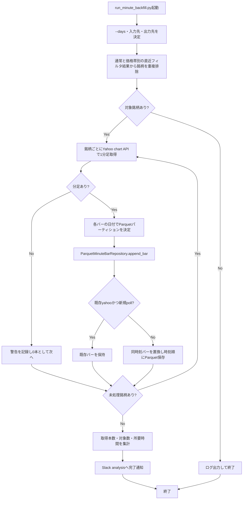

# 詳細設計書 04 分足バックフィル

> 状態: 一部未反映    最終更新: 2026-10-08
> 起動: `run_minute_backfill.py`    関連: [05 バックテスト](./05-backtest-design.md)、[分足データの用途](../../data/minute_bars_parquet/用途_Parquet形式の分足データ.md)

## 1. 概要

直近のフィルタリング結果に登場した銘柄について、Yahoo Financeから1分足を取得し、銘柄・日付単位でParquetに保存します。既存の自前ポーリングデータがあればYahoo由来のデータで補強します。売買判断・注文は本機能の対象外です。

## 2. 実行方式

`run_minute_backfill.py`が直近`--days`日分の通常・価格帯別フィルタリング結果から重複のない銘柄一覧を作り、`MinuteBarBackfillUseCase`を実行します。`--days`の既定値は7日です。現在の`task_schedule.py`は土曜07:30を予定しています。

| 時刻 | 起動主体 | 前後の機能 |
|---|---|---|
| 土曜07:30 | `scripts/tasks/run_minute_backfill.ps1` | バックテスト（08:00）より前 |
| 手動 | `run_minute_backfill.py` | 引数で対象日数・入出力ディレクトリを指定可能 |

リポジトリ内の予定は土曜07:30ですが、エントリポイントの想定運用コメントは毎週月曜です。実際のOSタスク登録状況は確認できていません。

## 3. 入出力

入力する通常および価格帯別のフィルタ結果から銘柄を集め、Yahoo Financeの1分足を銘柄・日付別のParquetパーティションへ保存します。完了した取込結果をSlack `analysis`へ通知します。

| 項目 | 方向 | 場所・形式 | 備考 |
|---|---|---|---|
| 通常フィルタ結果 | 入力 | `FILTERING_RESULT_DIRECTORY` | 日付別JSON |
| 価格帯別フィルタ結果 | 入力 | `FILTERING_PRICE_BAND_RESULT_ROOT/<価格上限>/` | 通常ディレクトリを明示指定した場合は対象外 |
| Yahoo 1分足 | 入力 | Yahoo Finance chart API | `--days`で取得期間を指定 |
| 分足データ | 出力 | `data/minute_bars_parquet/symbol=<銘柄>/date=<日付>/data.parquet` | `MINUTE_BAR_PARQUET_DIR`で変更可能 |
| 取込結果通知 | 出力 | Slack `analysis` | 対象数、取込本数、所要時間 |

## 4. 処理フロー

銘柄を重複なく集め、Yahooの分足を日付別Parquetへ保存します。取得できない銘柄は0本として記録し、次の銘柄へ進みます。

この図は現行のentrypoint・usecase・Parquet repositoryの動作を表します。予定表上の土曜07:30と起動コメント上の月曜が一致せず、OSスケジューラ登録状況も確認できません。

## 5. 判断ルール・仕様

同じ銘柄・時刻にデータが重なった場合は、Yahoo由来のデータを優先して保持します。

| 条件 | 結果 |
|---|---|
| 対象銘柄のYahooデータが空 | 警告ログを出し、その銘柄は0本として次へ進む |
| 既存データがYahoo由来で、新しいデータが`poll` | 既存のYahooデータを上書きしない |
| 同一時刻に優先されるYahooデータがある | 既存時刻の足を置換し、時刻順に並べて保存 |
| 新しいバーの保存 | `time[:10]`の日付でパーティションを選ぶ |
| Parquetファイルの置換で`PermissionError` | 最大5回試行し、回数に応じた待ち時間で再試行 |

## 6. レイヤー別の構成

| ファイル | 層 | 役割 |
|---|---|---|
| `src/domain/models.py` | domain | `MinuteBar`データモデル |
| `src/application/minute_bar_backfill_usecase.py` | application | 銘柄ごとの取得、日付別振分け、保存呼び出し |
| `src/infrastructure/market_data/get_intraday_bars.py` | infrastructure | Yahoo Financeの分足取得 |
| `src/infrastructure/persistence/parquet_minute_bar_repository.py` | infrastructure | Parquetパーティションの読込・保存・Yahoo優先処理 |
| `src/entrypoints/run_minute_backfill.py` | entrypoints | 対象銘柄収集、依存構築、処理計測、通知 |

## 7. 異常系・失敗時の動き

| 事象 | 検知方法 | 動き | 通知 | 理由コード |
|---|---|---|---|---|
| 対象銘柄がない | 収集した銘柄数 | ログを出して終了 | なし | 要確認 |
| Yahoo分足が空 | 取得結果が空 | 当該銘柄を0本で記録し、次の銘柄へ進む | 警告ログ | 要確認 |
| Parquet保存に`pyarrow`がない | 遅延import | `RuntimeError`を送出する | `process_notification()`が例外を記録し再送出 | 要確認 |
| Parquet置換が再試行上限後も失敗 | `PermissionError`が継続 | 例外を送出し、以降の処理を中断 | `process_notification()`が例外を記録し再送出 | 要確認 |

## 8. 設定項目

共通設定は[config-reference.md](../reference/config-reference.md)を参照してください。起動引数は`--days`（既定7）、`--filtering-dir`、`--output-dir`です。出力先の設定値は`MINUTE_BAR_PARQUET_DIR`です。

## 9. 決定事項と変更履歴

| 日付 | 決定 | 理由 |
|---|---|---|
| 2026-10-08 | 現行の銘柄収集・Yahoo取得・Parquet保存フローを設計図へ反映する | 旧図のJSON保存表記と取得経路が現行コードと異なるため |

## 10. 未決・既知の課題

- OSタスクの登録状況と、予定表（土曜07:30）・エントリポイントコメント（月曜）・旧図（月・木07:30）のどれが運用時刻の正かは要確認。
- `collect_recent_symbols()`は`today - days`以降の日付を含むため、`--days=7`のとき日付境界上は8つの暦日ラベルを対象にします。一方Yahoo APIの`range=7d`は直近7日程度です。対象期間の数え方を一致させるかは要確認。
- `get_yahoo_intraday_bars()`はAPI取得結果をそのまま保存処理へ渡し、バックフィルusecase/repositoryに`latest_confirmed_trading_day()`による確定日フィルタはありません。引け前実行時に当日未確定バーが保存されない保証は要確認。
