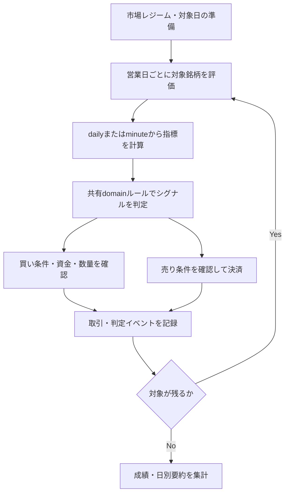

# 詳細設計書 05 バックテストエンジン

> 状態: 現行    最終更新: 2026-10-07
> 起動: `run_backtest.py`    関連: [03 取引ループ](./03-trading-loop-design.md)、[04 分足バックフィル](./04-minute-bar-backfill-design.md)、[ADR-0004](../adr/0004-backtest-production-sizing-default.md)、[ADR-0005](../adr/0005-backtest-explicit-date-range.md)

対象: 過去データを用いてトレードロジックを疑似的に時間進行させ、損益・勝率・ドローダウン等を評価する機能。
担当ユースケース: `application/backtest_usecase.py`
## 1. 概要

過去データを用いてトレードロジックを疑似的に時間進行させ、損益・勝率・ドローダウン等を評価します。固定銘柄の簡易評価と、日々のフィルタ結果を再生する本線の評価を扱います。実注文・本番口座の更新は行いません。

## 2. 実行方式

通常の定期実行は土曜08:00で、手動実行もできます。`run_backtest.py`は引数に応じて固定銘柄モードまたは日次フィルタ結果を再生するモードを選びます。

| 時刻 | 起動主体 | 前後の機能 |
|---|---|---|
| 土曜08:00 | `scripts/tasks/run_backtest.ps1` | 分足バックフィルの後、上場銘柄マスタ更新・週次分析の前 |
| 手動 | `run_backtest.py` | CLI引数で期間・入力・指標算出元を指定 |

### 2つの実行モードと使い分け

`backtest_usecase.py` には評価関数が2つ存在し、想定用途が異なる。

| 関数 | 想定用途 | 対象銘柄の扱い | 指標算出元 |
|---|---|---|---|
| `simulate_backtest` | 固定銘柄リストに対する単純な日足バックテスト（レガシー） | 銘柄リストは全期間固定 | 日足終値のみ |
| `simulate_timeseries_backtest` | 日々のフィルタリング結果を再生する本線バックテスト | `daily_symbols`（日付→銘柄リスト）で**日ごとに対象銘柄が変わる** | `indicator_source`で`daily`/`minute`を選択可 |

- `run_backtest.py`は`--filtering-dir`指定時（＝実運用のフィルタリング結果を使う本来の使い方）は必ず`simulate_timeseries_backtest`を呼ぶ。
- `--filtering-dir`を指定しない固定銘柄モードでも、`--minute-bars-dir`を指定すると`simulate_timeseries_backtest`に切り替わる（分足再生のため日付単位の管理が必要なので）。
- 上記いずれでもない最もシンプルな呼び出し（固定銘柄＋日足のみ）だけが`simulate_backtest`を使う。
- **決定事項**: `simulate_backtest`は動作確認・簡易検証用の位置づけとし、本番相当の評価（③トレードループの再現）は常に`simulate_timeseries_backtest`を正とする。両関数のシグナル判定・約定モデル・出力キーはできる限り重複コピーせず共通化したいが、現状は個別実装されている（10章「既知の課題」参照）。

---

## 3. 入出力

バックテストは履歴データまたはフィルタ結果を入力し、損益・取引・実行前提の集計を返します。CLIは結果JSONを指定された場合に保存し、分析結果をSlack `analysis`へ通知します。

| 項目 | 方向 | 場所・形式 | 備考 |
|---|---|---|---|
| 銘柄・日足履歴 | 入力 | 履歴取得クライアント、入力ファイル | 入手範囲は実行モードによる |
| 日次フィルタ結果 | 入力 | `--filtering-dir` | 日付ごとに対象銘柄を変える本線モード |
| 分足 | 入力 | `--minute-bars-dir`、Parquet | `indicator_source=minute`で使用 |
| バックテスト結果 | 出力 | `--output`指定時のJSON | 指定がない場合は標準出力 |
| 結果通知 | 出力 | Slack `analysis` | 成績、期間、任意の分析 |

主な出力フィールドは`cash`、`final_position`、`total_trades`、`total_pnl`、`win_rate`、`max_drawdown`、`profit_factor`、`signals`、`trade_history`、`daily_summary`、`execution_assumptions`、`volatility_adjustment`、`market_regime_adjustment`です。

## 4. 処理フロー

主軸は`simulate_timeseries_backtest`です。

1. **事前準備**
   - `market_regime_by_date`が未指定で`nikkei_market_bars`/`vix_market_bars`が渡されていれば、`domain/market_regime.py`の`calculate_market_regime_series[_with_details]()`で日付ごとのMarketRegime（NORMAL/CAUTION/DANGER）を算出する。
   - `market_regime_trend_relief_enabled=True`（既定）なら、ADXによるトレンド緩和日（`trend_relief_dates`）も同時に算出する。
   - `market_regime_enabled=False`なら`market_regime_by_date`を強制的に`None`にし、レジーム連動処理を丸ごと無効化する。
2. **日付ループ**（`daily_symbols`のキー＝営業日を古い順に処理）
   - 対象銘柄ごとに保有中ポジションを確認する（ATR損切り／MarketRegime DANGERでの強制スキップ判定）。
   - 指標算出元を切り替える。
     - `indicator_source="daily"`: その日までの終値からSMA5・RSIを計算する。
     - `indicator_source="minute"`: `minute_bar_repository`から分足を取得し、分足ごとにSMA5・RSIを再計算する（デイトレ想定でより実勢に近い判定になる）。
   - `domain/rules.py`の`calculate_price_limit()` / `calculate_rsi()`でシグナルを評価する（`TradeSignal.evaluate`。本番の`trading_usecase.py`と同一のドメイン関数を使用）。
   - BUYシグナル成立時は、`_adjust_backtest_quantity()`で`volatility.py`のATR評価（CAUTION/DANGER）に応じて数量を減らす／スキップする（`enable_volatility_sizing`）。MarketRegime=DANGERの日はスキップし（`record_filter_decision`で`MARKET_REGIME_DANGER_SKIP`として記録）、5章の執行モデルで約定価格を決定する。資金が足りなければスキップし、足りれば`cash`から減算して`holdings`/`avg_cost`を更新する。
   - SELL条件（価格帯上限到達 or 通常%損切り or ATR損切り）が成立した場合は、`close_position()`で決済し、実現損益・保有日数・ATR診断を記録する。
   - `close_at_eod=True`（デイトレ想定、既定）の場合、日をまたぐ前に強制決済する。
3. **集計**
   - 全期間終了後、保有中ポジションを最終日終値で評価し`equity`を算出する。
   - `_calculate_metrics()`で勝率・利益因子・最大ドローダウンを算出する。
   - 日別サマリ（`daily_summary`、日本語キー「日別要約」も同梱）を生成する。

## 5. 判断ルール・仕様

### 執行モデル（約定価格のシミュレーション）

シグナル発生と同一バーで即約定させると楽観的すぎるため、以下のパラメータで約定を遅延・劣化させる。

- `execution_delay_bars`（既定1）: シグナル発生バーからNバー後の価格を約定基準にする
- `order_type`: `market`（成行）→ `market_slippage_bps`（既定5bps）を価格に加算（買い）/減算（売り）。`limit`（指値）→ シグナル価格そのものを約定価格として採用（スリッページなし）
- `fee_rate`（既定`config.BACKTEST_FEE_RATE`=0.055%）: 約定代金に対して都度計算し、cashから減算・実現損益からも控除

`_validate_execution_assumptions()`でfee_rate/slippage/delayが負値でないこと、order_typeが`market`/`limit`のいずれかであることを起動時に検証する。

---

### ボラティリティ連動（ATR）とMarketRegime連携

- **数量調整**: `assess_volatility()`（ATR_PERIOD日のATR比率）でNORMAL/CAUTION/DANGERを判定し、`adjust_quantity_for_volatility()`でCAUTION時は`ATR_CAUTION_LOT_RATIO`（既定0.5）に基づき単元単位で減らし、DANGER時は`ATR_DANGER_ACTION`（既定`skip`）に従いスキップまたは最小単位にする。`volatility_stats`に集計を記録し出力に含める。
- **ATR損切り・利確**: `is_atr_stop_loss_triggered()`で、`resolve_atr_exit_multiplier()`が選択した倍率に応じた決済ラインを判定。固定%損切り（`stop_loss_ratio`）とは独立して評価し、どちらか一方が成立すれば決済する。
  - ADR-0006: 保有中最高値がエントリー価格からATR×`ATR_PROFIT_LOCK_TRIGGER_ATR_MULTIPLE`(既定0.5)以上乖離している(含み益が一定以上乗っている)場合のみ、利確専用の`ATR_PROFIT_LOCK_{NORMAL,CAUTION,DANGER}_MULTIPLIER`(既定2.5/2.0/1.0、損切り用より広め)を使う。含み益がその水準に届いていない間は、従来通り`ATR_STOP_{NORMAL,CAUTION,DANGER}_MULTIPLIER`(1.5/1.0/0.7)のまま。
- **MarketRegime**: 日経平均VIX・実現ボラティリティから算出したレジームがDANGERの日は新規BUYを一律スキップする（`market_regime_stats`に`danger_skipped`等を記録）。`market_regime_trend_relief_enabled`が有効な場合、ADXが`MARKET_REGIME_ADX_TREND_THRESHOLD`を超えるトレンド局面ではDANGER判定を緩和する日（trend_relief_dates）があり、これも件数を記録する。
- **既知の設計判断**: ATR評価とMarketRegime評価はそれぞれ独立した関数呼び出しになっており、同一日に対して重複してassess_volatility()相当の計算が走る箇所がある（パフォーマンス上の無駄はあるが、正確性には影響しない）。

---

### 本番ロジックとの整合性

日別フィルタリングバックテストの判定イベントは実行ごとに `data/backtest/filter_events/<出力JSONのstem>_<YYYYMMDD_HHMMSS_microseconds>.sqlite3` へ保存し、累積実行と週次実行の状態を混在させない。移行済みの過去分は `data/backtest/state/filter_decision_events.sqlite3` のレガシーDBに保管する。本番（ペーパー・実取引）の `data/state/filter_decision_events.sqlite3` とは分離する。

バックテストは「本番の判定ロジックをできるだけ再現する」ことが前提。

- **シグナル判定（SMA5/RSI）は本番と共通**: `domain/rules.py`の純粋関数を両方から呼んでいるため、ここは一致している。
- **数量計算は本番相当サイジングをデフォルトにする（ADR-0004、Issue 3対応済み）**: 本番の`trading_usecase.py`は`calculate_buy_quantity`＋残り枠数ベースの予算配分（`wallet_amount / max(TARGET_POSITIONS - open_position_count, 1)`を`MAX_ORDER_AMOUNT_PER_TRADE`でキャップ）で数量を決める。バックテストも既定で、`target_positions`/`max_order_amount_per_trade`を使い、本番と同じ「残り建玉枠で現金按分→上限額でキャップ→単元で丸め」＋「`open_position_count >= target_positions`での新規買いスキップ（`TARGET_POSITIONS_LIMIT_SKIP`として記録）」を適用する。
  - CLI側は`--target-positions`/`--max-order-amount`を個別指定でき、省略時はそれぞれ`config.TARGET_POSITIONS`/`config.MAX_ORDER_AMOUNT_PER_TRADE`を使う。固定数量の比較用途では`--fixed-qty`を指定して`--qty`を使う。旧`--production-sizing`は非推奨no-opとして残す。`simulate_backtest`（レガシー・固定銘柄モード）は対象外。
  - **残課題**: 本番の`wallet_amount`（APIから都度取得する買付可能額）はバックテストでは`cash`変数で代替している。信用取引や買付余力の考え方が変わった場合はこの対応関係を再検討する。`api_soft_limit`（API発注上限）はバックテストには対応する概念がないため未反映（実発注をしないため影響は限定的と判断）。

---

### 指標算出元の切り替え（`indicator_source`）

- `daily`（既定）: その日の終値のみでSMA5・RSIを評価。1日1回の判定に相当し、実際の分足ベースの本番トレードループとは粒度が異なる（`daily_close_signal_evaluations`でカウント）。
- `minute`: `minute_bar_repository`（`ParquetMinuteBarRepository`）から分足を取得し、分足が出るたびにSMA5・RSIを再評価する（`minute_signal_evaluations`でカウント）。本番のトレードループに最も近い粒度だが、分足データが必要なため`run_minute_backfill.py`によるバックフィルが前提となる（[04 分足バックフィル](./04-minute-bar-backfill-design.md)を参照）。
- 両モードの評価回数を出力に含めているのは、「どちらの粒度でどれだけ判定が走ったか」を後から検証できるようにするため。

---

### A/Bテスト機能（比較実行）

意思決定を裏付けるため、同一条件で機能ON/OFFを比較する専用関数を用意している。

- `compare_market_regime_backtest()`: MarketRegime有効/無効を同一条件で実行し、total_pnl/total_trades/max_drawdownの差分を返す
- `compare_trend_relief_backtest()`: ADXトレンド緩和の有無を比較
- `run_backtest.py`側にも同等の`--compare-atr`／`--compare-market-regime`フラグがあり、CLIから同様の比較ができる（ただし内部実装は`backtest_usecase.py`の関数を直接呼ばず、entrypoints側で個別に組み立てている＝10章の重複課題）

---

## 6. レイヤー別の構成

| ファイル | 層 | 役割 |
|---|---|---|
| `src/domain/rules.py`、`src/domain/volatility.py` | domain | シグナル・ボラティリティ判定 |
| `src/application/backtest_usecase.py` | application | 時系列シミュレーション |
| `src/application/backtest_report_usecase.py` | application | 結果比較・保存 |
| `src/infrastructure/market_data/yahoo_backtest_history_client.py` | infrastructure | Yahoo Finance履歴取得 |
| `src/infrastructure/persistence/backtest_input_repository.py` | infrastructure | 銘柄・履歴ファイル読込 |
| `src/entrypoints/run_backtest.py` | entrypoints | CLI引数解析・依存構築・実行調整 |

## 7. 異常系・失敗時の動き

| 事象 | 検知方法 | 動き | 通知 | 理由コード |
|---|---|---|---|---|
| 執行前提値が不正 | `_validate_execution_assumptions()` | 負値や未対応注文種別を拒否 | 例外 | 要確認 |
| 分足指標を指定したが分足リポジトリがない | CLI引数検証 | `ValueError`で停止 | 例外 | 要確認 |
| 比較オプションを`--live`なしで指定 | CLI引数検証 | `ValueError`で停止 | 例外 | 要確認 |
| 入力データの不足・履歴取得失敗 | 要確認 | 要確認 | 要確認 | 要確認 |

## 8. 設定項目

設定値は[config-reference.md](../reference/config-reference.md)を参照してください。主なCLI引数は`--filtering-dir`、`--minute-bars-dir`、`--indicator-source`、`--output`、`--start-date`、`--end-date`、`--days`です。

### 出力形式

`simulate_timeseries_backtest`の戻り値には英語キー（`total_pnl`, `win_rate`等）と日本語キー（`日別要約`）が混在しています。`run_backtest.py`側で`display_result`を組み立て、日本語ラベルを優先して表示用に変換します。

## 9. 決定事項と変更履歴

| 日付 | 決定 | 理由 |
|---|---|---|
| 要確認（元記載に日付なし） | 本番相当の評価は常に`simulate_timeseries_backtest`（日次フィルタリング結果の再生）を正とする | 元の決定事項サマリに理由の記載なし |
| 要確認（元記載に日付なし） | 約定モデルは「Nバー遅延＋成行スリッページ／指値はスリッページなし」とする | 元の決定事項サマリに理由の記載なし |
| 要確認（元記載に日付なし） | ATR/MarketRegimeはデフォルトで有効 | 元の決定事項サマリに理由の記載なし |
| 2026-09-22（ADR-0004） | 数量計算はデフォルトで本番相当の予算配分を使い、固定数量が必要な場合だけ`--fixed-qty`を指定する | 本番に近い資金の使い方を既定評価にする |
| 2026-09-22（ADR-0005） | 期間を完全一致させる評価では`--start-date`と`--end-date`を両方指定する | 祝日・実行タイミングに左右されず分析期間と一致させる |
| 要確認（元記載に日付なし） | entrypointsは引数解析・実行調整に限定し、データ取得・入力読込・結果比較・保存をapplication/infrastructureへ分離する | 元の決定事項サマリに理由の記載なし |

## 10. 未決・既知の課題

- **entrypoint例外の期限**: `backtest_v2_single_day_check.py` / `backtest_v2_multi_day_check.py`は現状、履歴準備・疑似実行・集計まで行う検証CLIとして期限つき例外にする。ADR-0007 Phase 5で正式バックテストエンジンへ昇格する際にapplicationへ移す。`run_backtest.py`は旧エンジンCLIとしてPhase 6の旧エンジン廃止まで現状維持し、移設対象にしない。行数と方針は[coding-guidelines.md §5](../architecture/coding-guidelines.md)を参照。
- **entrypointの実行調整**: `run_backtest.py`は引数解析、依存オブジェクトの組み立て、バックテスト呼び出し、結果通知に限定する。Yahoo Finance取得、入力ファイル読み込み、結果比較・保存は6章のinfrastructure/applicationモジュールが担当する。
- **`simulate_backtest`と`simulate_timeseries_backtest`のロジック重複**: 約定価格計算・ATR評価・シグナル判定など多くの処理が両関数にほぼ同じ形で存在する。2章の通り本線は`simulate_timeseries_backtest`なので、`simulate_backtest`を薄いラッパー（内部で`daily_symbols`を全期間固定で組み立てて`simulate_timeseries_backtest`を呼ぶ形）に置き換えられないか、次回リファクタリング時に検討する。
- **CLI比較実行の重複**: `--compare-atr`等のCLI比較と`backtest_usecase.py`の`compare_*_backtest()`は別経路でA/Bテストを組み立てている。将来どちらかに統一したい。
