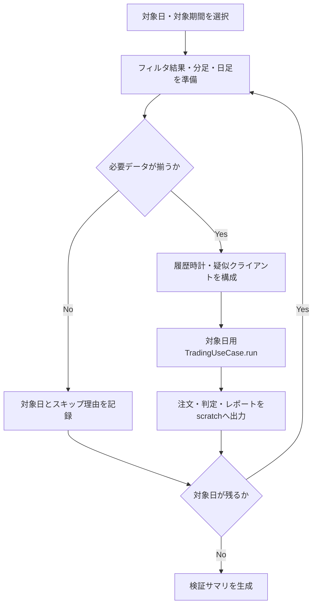

# 詳細設計書 06 TradingUseCaseヒストリカル再生

> 状態: 一部未反映    最終更新: 2026-10-01
> 起動: `backtest_v2_single_day_check.py` / `backtest_v2_multi_day_check.py`    関連: [ADR-0007](../adr/0007-unify-trading-and-backtest.md)、[04 分足バックフィル](./04-minute-bar-backfill-design.md)、[Phase 2〜4検証結果](../reviews/verification-backtest-v2-phase2-4.md)

## 1. 概要

`TradingUseCase.run()`を過去の営業日・価格データで実行する疑似クライアントと、実行に必要な時刻制御を扱います。売買再生では本番と同じ`TradingUseCase`と`PaperOrderClient`を利用し、独自の注文約定・資金管理ロジックは実装しません。本番用の注文履歴、ペーパー口座状態、判定イベントDB、日次レポートを使用しない構成です。ADR-0007に基づく段階的な統合設計です。

## 2. 実行方式

検証CLIから対象日の`TradingUseCase.run()`を実行します。日付・時刻は履歴時計で進め、複数日再生では各日に新しい`TradingUseCase`と`MarketRegimeUseCase`を作成します。検証CLIがOSのタスクスケジューラへ登録されているかは要確認です。

| 実行単位 | 起動スクリプト | 前後の機能 |
|---|---|---|
| 単日検証 | `src/entrypoints/backtest_v2_single_day_check.py` | 対象日のフィルタ結果・分足・日足を準備して再生 |
| 複数日検証 | `src/entrypoints/backtest_v2_multi_day_check.py` | 対象期間からデータが揃う日を選び、日ごとに再生 |

## 3. 入出力

再生には対象日のフィルタ結果と場中の分足価格が必要です。検証用の注文履歴・レポート等はrunごとのscratch領域に分離します。

| 項目 | 方向 | 場所・形式 | 備考 |
|---|---|---|---|
| フィルタ結果 | 入力 | `data/filtering/YYYY-MM-DD.json` | 対象日の結果を選ぶ |
| 分足 | 入力 | `data/minute_bars_parquet/`、Parquet | 場中価格を返す。必要銘柄分がない日は再生対象外 |
| 株式・指数日足 | 入力 | 履歴データ、`data/cache/yahoo_daily/` | 当日より前の確定足だけを使う |
| 注文・レポート等 | 出力 | `data/backtest_v2_scratch/`配下 | 検証ごとに分離。本番用状態を使わない |
| 検証結果 | 出力 | JSONサマリ | 保存名・全出力項目は要確認 |

## 4. 処理フロー

対象日ごとに履歴入力を準備し、依存先を疑似クライアントへ差し替えて`TradingUseCase.run()`を呼び出します。

データ不足日は日足終値で場中価格を代用せず、再生対象から除外します。複数日再生では日ごとにUseCaseを作り直し、共有する`PaperOrderClient`の現金・保有状態と注文履歴を日跨ぎで維持します。

## 5. 判断ルール・仕様

### 既存コードとの契約

`TradingUseCase`はProtocolではなく、必要なメソッドを実行時に参照するダックタイピングです。`order_sender`に`get_wallet_cash`、`get_positions`、`set_price`、`place_market_order`を持つ`PaperOrderClient`を渡せば、wallet/positionsクライアントを別途注入せずに口座状態を共有できます。

`PaperOrderClient(prices={}, cash=starting_cash, state_path=None, realized_pnl_date=target_date.isoformat())`は永続化を行わず、履歴日の実現損益基準日も明示できます。複数日再生ではこのインスタンスのポートフォリオ状態を維持しつつ、日次実現損益をシミュレーション日ごとに区切ります。

`FilteringResultRepository`の実データディレクトリは`data/filtering/`で、ファイル名は`YYYY-MM-DD.json`です。`load_for_date()`があるため、履歴用リポジトリは対象日を選ぶ薄いアダプターとします。

### 疑似クライアント

| クライアント | 契約・動作 |
|---|---|
| `HistoricalClock` | `now()`は現在時刻を返し、`advance()`が次の分足時刻へ進める。対象日の分足時刻は昇順。空配列は拒否。時計と`MinuteBar.time`はJSTのオフセットなし日時として扱う。最後の要素到達後はその値を返し続け、市場終了時刻以降の最終時刻で`is_market_closed()`に終了させる。 |
| `HistoricalBoardClient` | `token`は使わず、`MinuteBar.time <= clock.now()`を満たす最新バーの価格を返す。未来バーは参照せず、対象時刻以前のバーがなければ`None`。日足終値・スリッページは返さず、約定スリッページは`PaperOrderClient`に任せる。 |
| `HistoricalMarketDataClient` | 株式・指数とも`bar.date < clock.current_date()`の確定足だけを返す。`get_yahoo_daily_bars()`は日付を除いた`DailyBar(high, low, close)`へ変換し、`get_yahoo_daily_closes()`は同じ順序で終値を返す。`MarketRegimeUseCase`が使う`get_daily_ohlc("^N225")` / `get_daily_ohlc("^VIX")`も同じ日付境界を適用する。レジーム判定時は日ごとに履歴データを切ったクライアントを使い、最新期間の判定を複数日に使い回さない。 |
| `HistoricalFilteringResultRepository` | `load_latest()`を`load_for_date(clock.current_date())`へ委譲する。結果がない場合または`result.date`が時計の日付と一致しない場合、`TradingUseCase.run()`は取引を開始しない。 |
| `PaperOrderClient` | 価格取得後・注文直前に`set_price()`する同一インスタンスを`order_sender`へ注入する。独自の`WalletClient`/`PositionsClient`/`OrderSender`は追加しない。 |

`HistoricalClock.now()`の呼び出しごとには時刻を進めず、`advance()`は1回につき1要素進めます。引数の秒数は使用せず、`run()`の`sleep`引数へ`clock.advance`を渡します。`now_provider`は初期化時・ループ先頭に加え注文回数判定でも呼ばれるため、`now()`自体を進める方式や即時リターンの`sleep`では分足を飛ばすかループが進まなくなります。

### TradingUseCase側の隔離

疑似クライアントだけでは過去日を正しく再生できないため、以下の実日付参照・副作用をシミュレーション日時へ揃えるか、検証時に無効化します。

| 現行の実日付・副作用 | 再生時の問題 | 対応状況 |
|---|---|---|
| `TradeSignal.to_order_history_entry()`、`is_duplicate_order()`、`is_recent_order()`が実時刻を既定参照 | 注文timestamp・日次重複判定・注文ロックが実行日依存 | 解消。オプション時刻引数と`TradingUseCase._current_now`を使用。本番の既定動作は実時計 |
| 買い注文回数の日付比較が時刻providerを追加で呼ぶ | 有限列providerや呼び出しごとに進む時計が枯渇・ずれる | 解消。現在ループ時刻`now`を使い、EODでも最後に取得した時刻を再利用 |
| `_send_end_of_day_report()`が実日時付で注文を抽出・レポート生成 | 過去日の注文がdaily reportから消える | 解消。日付、`daily_orders`、finalize時刻、`generated_at`に同じシミュレーション日時を使用。出力先は検証ごとのscratch |
| `PaperOrderClient`の日次実現損益リセットが`date.today()`を参照 | 指定した過去日の損益が最初の参照で消去 | 解消。`today_provider`を追加し、バックテストでは`clock.current_date`を注入 |
| `daily_analyzer=None`が既定LLM Analyzerの生成を意味する | EODごとに外部HTTP呼び出しが発生し得る | 検証CLIから明示的なNoOp Analyzerを注入 |
| `filter_decision_repository=None`がSQLite Repositoryを生成する | 想定外のDB作成とティックごとのSQLite処理 | 検証CLIからNoOpまたはrun専用SQLite Repositoryを注入 |
| `MarketRegimeUseCase.execute()`が実日付基準の指数Clientで判定し、結果をUseCase内に保持 | 複数日に同一UseCaseを使うと先読み・古い判定を再利用 | 単日は履歴指数Clientで確認済み。複数日は日ごとに新しい`TradingUseCase`を作成 |

検証CLIでは`get_api_soft_limit()`を設定値へ差し替え、`PaperOrderClient`、NoOp notifier、NoOp analyzerを使います。注文履歴、baseline、report、任意の判定DBはrunごとのscratch pathに分離します。

### データ充足と性能検証

2026-09-27に確認した時点では、`data/filtering/`に16ファイル（2026-09-01〜2026-09-25）があり、9/21は祝日なのに生成された異常ファイルでした。稼働日判定に通るファイルは15日分で、3ヶ月分ではありません。各日のフィルタ結果と必要な全銘柄の分足が揃う日だけを対象にし、欠損日をスキップした場合は対象日・理由を記録します。

`FilterDecisionRepository`は初期化時にSQLiteを用意し、観測更新メソッドは銘柄評価ループから呼ばれます。24.6万ティック規模での影響を決めつけず、実RepositoryとNoOpを同一データ・同一銘柄数で計測します。初回は正確性を優先して専用DBを使い、計測後にNoOp化または書き込み頻度の変更を判断します。

### Phase 1の完了条件

- [x] `PaperOrderClient`再利用と`state_path=None`を採用する。
- [x] 履歴データの厳密な先読み境界を`bar.date < simulated_date`とする。
- [x] フィルタ結果の実在範囲を確認する（2026-09-01〜2026-09-25、16ファイル。9/21は非稼働日）。
- [x] 時計は`now()`で進めず、注入`sleep`から1ティックずつ進める。
- [x] 時計・分足板価格・株式/指数日足・日付別フィルタRepositoryを実装し、契約テストを追加する。
- [x] PaperOrderClientの日次実現損益リセットをシミュレーション日基準にする。
- [x] 注文timestamp、重複判定、注文ロック、EOD抽出・生成日時を現在のシミュレーション時刻に揃える。
- [x] 9/25の指数OHLCと全対象銘柄の分足を実データで確認する。
- [x] 判定イベントRepositoryをNoOp/専用SQLiteで比較する。
- [x] 発注上限取得をローカル値へ差し替え、ペーパー注文とscratch出力だけで動くことを確認する。

## 6. レイヤー別の構成

| ファイル | 層 | 役割 |
|---|---|---|
| `src/application/trading_usecase.py` | application | 本番と共有する売買ループ |
| `src/application/market_regime_usecase.py` | application | 市場レジーム判定 |
| `src/infrastructure/backtest/historical_clients.py` | infrastructure | 履歴時計、板・日足クライアント、日付別フィルタRepository |
| `src/infrastructure/paper/paper_order_client.py` | infrastructure | ペーパー注文・現金・保有状態 |
| `src/infrastructure/persistence/parquet_minute_bar_repository.py` | infrastructure | 分足Parquet読込 |
| `src/entrypoints/backtest_v2_single_day_check.py` | entrypoints | 単日検証の起動・依存構築 |
| `src/entrypoints/backtest_v2_multi_day_check.py` | entrypoints | 複数日検証の起動・依存構築 |

## 7. 異常系・失敗時の動き

| 事象 | 検知方法 | 動き | 通知 | 理由コード |
|---|---|---|---|---|
| 対象日の分足時刻配列が空 | `HistoricalClock`初期化 | 拒否 | 要確認 | 要確認 |
| 対象時刻以前に分足がない | `HistoricalBoardClient` | `None`を返す。売買ループは当該銘柄をスキップ | 要確認 | 要確認 |
| 対象日のフィルタ結果がない、または日付が一致しない | `HistoricalFilteringResultRepository` / `TradingUseCase.run()` | 取引を開始しない | 要確認 | 要確認 |
| 必要銘柄の分足・フィルタ結果が不足 | 対象期間のデータ充足確認 | 日を対象外にし、日付とスキップ理由を記録 | 要確認 | 要確認 |
| 日足しかなく場中価格を復元できない | 入力データ確認 | 日足終値で代用せず、売買再生対象にしない | 要確認 | 要確認 |
| 履歴クライアント・検証実行のその他の失敗 | 要確認 | 要確認 | 要確認 | 要確認 |

## 8. 設定項目

詳細は[config-reference.md](../reference/config-reference.md)を参照してください。再生時に関係する既存設定・注入値は以下です。

| 名前 | 意味 | 既定値 |
|---|---|---|
| `config.LOOP_INTERVAL` | `run()`が`sleep`へ渡す間隔。再生時は値の秒数ではなく`clock.advance`でティックを進める | 要確認 |
| `ALLOW_OVERNIGHT_HOLDING` | 日をまたぐ保有を許す設定。Phase 1の売買再生では未対応 | 要確認（`true`の場合も未対応） |
| `state_path` | `PaperOrderClient`の永続化先 | `None`（検証では永続化しない） |

## 9. 決定事項と変更履歴

| 日付 | 決定 | 理由 |
|---|---|---|
| 2026-09-25（ADR-0007） | `TradingUseCase.run()`を過去データで再利用する方式を段階的に実装する | 本番とバックテストのapplication層オーケストレーションを二重管理しない |
| 要確認（元記載に日付なし） | 約定・現金・保有株・平均取得価格は`PaperOrderClient`を再利用し、独自の注文・資金管理ロジックを実装しない | 本番のペーパー注文クライアントを共有する |
| 要確認（元記載に日付なし） | `bar.date < simulated_date`の確定履歴だけを使い、当日足を含めない | 先読みを避ける |
| 要確認（元記載に日付なし） | 場中価格を日足終値で代用しない | 当日終値を場中に返すと先読みになるため |
| 要確認（元記載に日付なし） | `now()`は時刻を進めず、注入`sleep`から1ティックずつ進める | `TradingUseCase.run()`内の複数の時刻参照に対応する |
| 要確認（元記載に日付なし） | Phase 1の疑似クライアント設計・実装・契約テストを完了 | Phase 2の再生検証へ進むため |

## 10. 未決・既知の課題

- Phase 2単日検証では2026-09-25の対象10銘柄・900分足で308ループを実行し、注文timestamp・EOD日付をシミュレーション日に揃える修正を確認しました。
- Phase 3複数日検証では13日を再生し、NoOp/SQLiteで注文数・損益・最終現金の一致を確認しました。
- Phase 4では平均取得価格欠落に起因するATR売却の不具合を修正しましたが、新旧エンジンの完全一致は確認されず、旧エンジン廃止判断は保留です。詳細は[Phase 2〜4検証結果](../reviews/verification-backtest-v2-phase2-4.md)を参照してください。
- 日足終値のみの場中再生と`ALLOW_OVERNIGHT_HOLDING=true`での持ち越しは未対応です。
- 2026-09-27時点のフィルタ結果は15稼働日分で3ヶ月分に満たず、607Aは初回対象日より前の確定日足がRSI最低本数に届かない課題がありました。キャッシュ追補後の具体的な結果は検証記録を参照してください。
- 旧エンジンとの再比較では、同一の日足・指数・分足スナップショットと決済条件の準備が必要です。期間・取引数が小規模であり、旧側の銘柄日足入力も凍結されていません。
