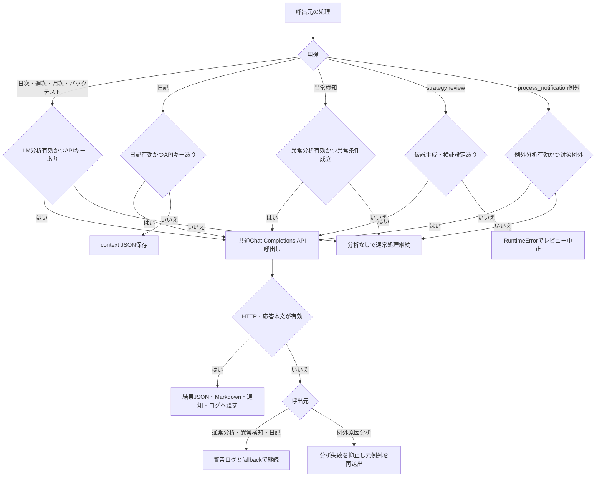

# 詳細設計書 07 LLM連携

> 状態: 現行    最終更新: 2026-10-08
> 起動: `src/entrypoints/run_daily_analysis.py`、`run_weekly_analysis.py`、`run_monthly_analysis.py`、`run_backtest.py`、`run_daily_diary.py`、`run_strategy_review.py`、各 `process_notification()` 利用箇所    関連: [詳細設計テンプレート](./_template.md)、[バックテスト設計](./05-backtest-design.md)、[通知設計](../architecture/notifications.md)、[設定項目](../reference/config-reference.md)

## 1. 概要

LLM機能は、集計・検証済みデータの文章レビュー、日記本文、戦略仮説の補助、例外原因の参考分析などを生成する。各生成結果は売買判定を変更せず、分析・通知・記録の補助に使う。
通常の分析・日記・異常検知機能は既定で無効であり、有効化とAPIキーがそろった場合だけ利用する。戦略レビューの仮説生成・検証はLLM設定がない場合に実行エラーとなる。

## 2. 実行方式

エントリポイントが集計・検証結果を用意し、インフラストラクチャ層のアダプターがChat Completions形式のHTTPリクエストを送る。利用するモデル名・URL・APIキー・タイムアウトは共通設定から渡す。

| 用途 | 起動・呼出箇所 | 有効条件・実行契機 | 生成結果の扱い |
|---|---|---|---|
| 日次レビュー | `run_daily_analysis.py` | `LLM_DAILY_ANALYSIS_ENABLED` とAPIキーが有効 | 日次答え合わせ通知に参考所見として追加。日次JSONにも格納 |
| 週次・月次レビュー | `run_weekly_analysis.py`、`run_monthly_analysis.py` | 同上。週次・月次集計の実行時 | 結果JSONと `analysis` チャンネルの通知に含める |
| バックテスト評価 | `run_backtest.py` | 同上。バックテスト完了後 | 有効な応答を結果JSONと完了通知に追加 |
| 日記 | `run_daily_diary.py` | `LLM_DIARY_ENABLED` とAPIキーが有効 | Markdown日記を生成。未設定・生成失敗時はcontext JSONのみ保存 |
| 戦略レビュー | `run_strategy_review.py` | 仮説生成・検証は `LLM_DAILY_ANALYSIS_ENABLED` とAPIキーが必要。レビュー総括は同設定のアナライザーがあれば実行 | 仮説・定量検証を実行し、結果をまとめた通知文を標準出力 |
| 異常検知コメント | `run_screening.py`／`run_filtering.py` のアプリケーション処理 | `LLM_ANOMALY_ANALYSIS_ENABLED` とAPIキー、かつ異常条件成立時 | スクリーニング／フィルタリング結果通知に参考コメントを追加 |
| 例外原因分析 | `process_notification()` | `LLM_ERROR_ANALYSIS_ENABLED` とAPIキー、かつ除外対象外の例外 | 発生時の参考分析をログに記録し、ライフサイクル通知が有効なら異常終了通知にも短縮掲載 |

日次・週次・月次などの自動実行時刻は[実行スケジュール](../architecture/schedule.md)を参照する。LLM呼出し自体に別のスケジューラはなく、呼出元の処理に同期して実行される。

## 3. 入出力

入力は各呼出元が作成するJSON相当の集計・context・例外情報であり、生成結果は呼出元の結果JSON、Markdown、通知またはログに渡す。アダプターは外部APIを通じて入力を送信する。

| 項目 | 方向 | 場所・形式 | 備考 |
|---|---|---|---|
| API設定 | 入力 | 環境変数を読む `src/config/config.py` | APIキー、モデル、URL、タイムアウト |
| 日次集計 | 入力 | `run_daily_analysis.py` が作る辞書 | 当日実績・市場条件・答え合わせ等 |
| 週次・月次集計 | 入力 | `summary_loader` 等から作る辞書 | 日次・バックテスト・判定イベント等 |
| バックテスト要約 | 入力 | `run_backtest.py` の表示用辞書 | 成績・取引履歴等 |
| 日記context | 入力 | `data/reports/daily`、`data/backtest/runs`、`data/notes/operations` 由来のJSON | `build_diary_context()` が構築 |
| 戦略レビュー結果 | 入力 | 戦略仮説・定量検証結果のJSON | context repository、レポートrepository等から構築 |
| 例外情報 | 入力 | 例外種別、最大500文字の例外メッセージ、最大4000文字のtraceback | `process_notification()` から分析器へ渡す |
| LLM本文 | 出力 | OpenAI互換Chat Completions応答 | `choices[0].message.content` を取得 |
| 分析結果 | 出力 | `data/reports/daily`、`weekly`、`monthly`、`backtest` 等 | 各entrypointの保存処理による |
| 日記本文／fallback | 出力 | `data/notes/diary/<日付>.md` または `.json` | 未設定・失敗時はJSONのみ |
| 例外分析状態 | 入出力 | `data/state/llm_error_state.json` | 原因fingerprint別の要約・発生回数・日時を保持 |

## 4. 処理フロー

呼出元の機能フラグとAPIキーで利用可否を決め、各用途別アダプターが共通HTTP設定で応答を取得する。失敗時の動作は用途に応じてfallbackまたは元例外の再送出となる。

HTTP成功後も本文が空・不正なJSON構造なら失敗扱いとなる。日次分析等ではLLM結果がなくても主処理を続けるが、戦略レビューの仮説生成・検証は必要なアダプターが利用できなければ失敗する。

## 5. 判断ルール・仕様

LLMは参考文を生成し、元の集計や戦略判定を上書きしない。期間レビューのプロンプトは未完了期間・欠損データ・損益の基準などの断定条件を指定している。

| 用途 | 判断・生成仕様 | 返却上限・補足 |
|---|---|---|
| 日次 | 事実に基づく短い所見。売買0件理由・未評価状態・答え合わせ不可理由等を入力の根拠に応じて扱う | 本文最大1800文字。プロンプト上は600字以内 |
| 週次・月次 | 観測事実を必須とし、期間比較・バックテスト・確定判定イベントは所定の可用性条件が満たされる場合だけ評価 | 本文最大2400文字。プロンプト上は900字以内 |
| バックテスト | 入力数値だけを根拠に評価し、不確実性・次回確認事項を示す。投資判断やロジック変更の命令は禁止 | 本文最大1800文字 |
| 日記 | `manual_notes` を一次情報として優先し、数値の再計算や投資助言・売買指示をしない | 約600〜1000字を指示。出力本文を別途切り詰めない |
| 戦略レビュー | 仮説生成・検証を行い、複数結果の横断パターンと1〜2個の次アクション案を総括。未検証を確定扱いしない | 総括は短い日本語。仮説生成・検証クライアントと総括アナライザーは別役割 |
| 異常検知 | スクリーニング／フィルタリングの異常条件成立時だけ分析器を生成・実行 | 出力は参考コメント。異常判定の閾値設定は別設定 |
| 例外原因分析 | minor exception class名はMRO照合で除外。例外クラス、traceback末尾3フレーム、正規化メッセージからSHA-256 fingerprint（先頭16桁）を作る | 分析結果は1行目から2行目、最大200文字にして通知へ追加 |

例外原因分析は同一fingerprintの要約を状態JSONに保存し、発生回数を増分する。最終分析から設定cooldown経過後のみ再呼出しし、状態ファイルのエントリーは最終確認から14日以内のものを残す。

## 6. レイヤー別の構成

| ファイル | 層 | 役割 |
|---|---|---|
| `src/entrypoints/run_daily_analysis.py` | entrypoints | 日次集計と日次LLMレビューの呼出し、保存・通知 |
| `src/entrypoints/run_weekly_analysis.py` | entrypoints | 週次集計とLLMレビューの呼出し、保存・通知 |
| `src/entrypoints/run_monthly_analysis.py` | entrypoints | 月次集計とLLMレビューの呼出し、保存・通知 |
| `src/entrypoints/run_backtest.py` | entrypoints | バックテスト結果のLLM評価、結果保存・通知 |
| `src/entrypoints/run_daily_diary.py` | entrypoints | 日記context構築、LLM本文またはcontext JSONの保存 |
| `src/entrypoints/run_strategy_review.py` | entrypoints | 戦略仮説生成・検証・総括ユースケースの組立て |
| `src/application/analysis_notification.py` | application | 日次・期間分析の通知本文組立て |
| `src/application/run_strategy_review_usecase.py` | application | 戦略レビューの工程実行・通知本文作成 |
| `src/infrastructure/analysis/daily_analyzer.py` | infrastructure | 日次・期間・バックテスト・戦略レビュー総括のHTTPアダプター |
| `src/infrastructure/analysis/diary_context.py`、`diary_writer.py` | infrastructure | 日記用context構築と生成アダプター |
| `src/infrastructure/analysis/anomaly_analyzer.py` | infrastructure | スクリーニング／フィルタリング異常コメント生成 |
| `src/infrastructure/analysis/error_analyzer.py` | infrastructure | 例外fingerprint、LLM分析、状態JSONキャッシュ |
| `src/infrastructure/analysis/strategy_hypothesis_analyzer.py`、`strategy_verification_client.py` | infrastructure | 仮説生成と戦略検証用LLMクライアント |
| `src/infrastructure/notification/slack_notify.py` | infrastructure | `process_notification()`から安全に例外分析を呼び、ログ・ライフサイクル通知に反映 |
| `src/config/config.py` | config | LLM機能フラグと共通API設定、例外分析設定 |

## 7. 異常系・失敗時の動き

外部APIのHTTPエラー、通信例外、応答構造の欠落・本文不在は用途別アダプターで記録する。LLM障害を理由に売買・分析など主処理を変更しない設計だが、戦略レビューの仮説生成・検証は必須工程として失敗する。

| 事象 | 検知方法 | 動き | 通知 | 理由コード |
|---|---|---|---|---|
| 機能無効またはAPIキー未設定 | アダプターfactory | 通常分析は `None` を返してLLM処理を省略。日記はcontext JSONを保存 | LLM通知なし | なし |
| LLM通信・HTTP失敗 | `requests`例外、`raise_for_status()` | 警告ログ。通常分析は `None` とし呼出元処理を継続 | 結果通知には分析部分を含めない | なし |
| 応答本文欠落・形式不正 | `ValueError`、`KeyError`、`IndexError`、`TypeError` | 通常分析は失敗扱い。日記はcontext JSONへfallback | 結果通知には分析部分を含めない | なし |
| 戦略レビュー用の必須LLM未設定 | factory結果が `None` | 仮説生成・検証で `RuntimeError`、entrypointは失敗終了 | 標準エラー／呼出元ログ。専用Slack送信はこのentrypointでは確認できない | なし |
| 例外原因分析の対象外 | 例外MROが除外名に一致 | APIを呼ばず `None` | なし | なし |
| 例外原因分析自体の失敗 | Analyzer内で対象例外を捕捉、または安全呼出しで捕捉 | 警告／例外ログを残し、元例外は呼出元へ再送出 | `notify_lifecycle=True` の場合だけ異常終了を `critical` 送信 | なし |
| 例外状態ファイルの読み書き失敗 | persistence層の例外 | `process_notification()`の安全呼出しで分析器例外を抑止 | 上記ライフサイクル条件に従う | なし |

## 8. 設定項目

設定値の一覧は[config-reference.md](../reference/config-reference.md)を参照する。下表の既定値は `src/config/config.py` に定義された値。

| 名前 | 意味 | 既定値 |
|---|---|---|
| `LLM_DAILY_ANALYSIS_ENABLED` | 日次・週次・月次・バックテスト等の共通分析機能を有効化 | `false` |
| `LLM_DIARY_ENABLED` | 日記本文生成を有効化 | `false` |
| `LLM_ANOMALY_ANALYSIS_ENABLED` | screening/filtering異常分析を有効化 | `false` |
| `LLM_ERROR_ANALYSIS_ENABLED` | `process_notification()`例外原因分析を有効化 | `false` |
| `OPENAI_API_KEY` / `LLM_API_KEY` | APIキー。`OPENAI_API_KEY`があれば優先 | 空文字 |
| `LLM_MODEL` | 共通モデル名 | `gpt-4o-mini` |
| `LLM_API_URL` | Chat Completions URL | `https://api.openai.com/v1/chat/completions` |
| `LLM_TIMEOUT_SECONDS` | LLM HTTP要求のタイムアウト | `120`秒 |
| `LLM_ERROR_ANALYSIS_MODEL` | 例外分析専用モデル | `LLM_MODEL` |
| `LLM_ERROR_ANALYSIS_COOLDOWN_MINUTES` | 同一原因の再分析までの間隔 | `60`分 |
| `LLM_ERROR_ANALYSIS_SKIP_EXCEPTION_TYPES` | 例外分析から除外するMROクラス名リスト | `ConnectionError,Timeout,ConnectTimeout,ReadTimeout,JSONDecodeError` |
| `SCREENING_ANOMALY_MIN_SYMBOLS` | スクリーニング異常検知の銘柄数閾値 | `5` |
| `FILTERING_ANOMALY_MIN_SYMBOLS` | フィルタリング異常検知の銘柄数閾値 | `3` |

## 9. 決定事項と変更履歴

| 日付 | 決定 | 理由 |
|---|---|---|
| 2026-10-08 | 既存実装に基づく現行LLM連携仕様を整理 | 日次・期間分析、バックテスト、日記、戦略レビュー、異常検知、例外原因分析の実装経路を記録 |
| 現行実装 | 生成結果は参考情報として扱い、LLM未設定時に可能な通常処理は継続 | LLM評価が売買判断・集計値の代替にならないようにする |

## 10. 未決・既知の課題

- どの外部LLMモデル・API URLを本番環境で運用しているかは、リポジトリ内の既定値だけでは確定できない。
- LLMへ送信されるデータの運用上の保持期間・外部事業者側のデータ取扱い・承認手順は、コードから確認できない。
- LLM APIの再試行・レート制限時の待機処理は各アダプターに確認できない。
- 例外分析状態JSONが破損・同時更新した場合の復旧・排他制御の保証は、確認できない。
- 戦略レビューentrypointは通知文を標準出力するが、実運用での起動主体・出力の転送先はコードからは確認できない。
- `LLM_ANOMALY_ANALYSIS_ENABLED` の異常条件詳細は呼出元実装に依存し、運用上の検知期待値・閾値調整手順はこの設定だけでは確定できない。
