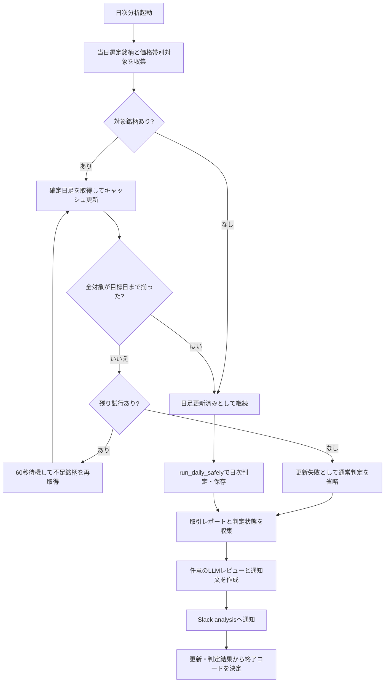

# 詳細設計書 08 日次分析・日足更新・トレンド答え合わせ

> 状態: 現行    最終更新: 2026-10-08
> 起動: `run_daily_analysis.py`、`run_trend_check.py`、`update_daily_bar_cache.py`    関連: [03 取引ループ](./03-trading-loop-design.md)、[03b 価格帯別トレンド答え合わせ](./03b-price-band-trend-check.md)、[設定項目](../reference/config-reference.md)

## 1. 概要

日次分析は、確定日足キャッシュの更新、保存済み結果のトレンド答え合わせ、当日の取引実績と分析コメントの通知を順に行います。
独立したCLIとして日足キャッシュ更新やトレンド答え合わせを実行することもできます。
答え合わせは分析・記録用であり、売買判断や注文処理には利用しません。
価格帯別トレンドの個別仕様は[03b](./03b-price-band-trend-check.md)を参照します。

## 2. 実行方式

通常の日次分析は取引日引け後に起動し、最大3回の日足更新後にトレンド判定・レポート生成・Slack分析通知を実行します。更新が完了しなくても通知は続行します。

| 起動対象 | 起動契機・既定 | CLI・補足 |
|---|---|---|
| 日次分析 | 平日、既定16:30 (`DAILY_ANALYSIS_START_TIME`) | `python -m src.entrypoints.run_daily_analysis [--date YYYY-MM-DD]` |
| 日次トレンド答え合わせ | 単独実行時は既定で今日 | `run_trend_check --date YYYY-MM-DD`。日次分析からは更新済みキャッシュを使って呼び出す |
| 日足キャッシュ更新 | 手動 | `update_daily_bar_cache [--days 120] [--symbols ...] [--cache-dir PATH]` |

`run_trend_check` には週次・月次集計や全期間再計算等のCLIもありますが、定期週次・月次分析への連携は09設計書を参照してください。予定時刻はタスクスケジュールの定義であり、このCLI自体がスケジューラではありません。

## 3. 入出力

通常のトレンド判定は当日のフィルタ結果・関連診断・確定日足等を読み、版別の判定をSQLiteとJSONへ保存します。日次分析の通知には取引レポート、判定結果、任意のLLMレビューをまとめます。

| 項目 | 方向 | 場所・形式 | 備考 |
|---|---|---|---|
| 当日フィルタ結果 | 入力 | `data/filtering/YYYY-MM-DD.json` | `FILTERING_RESULT_DIRECTORY`で変更可能 |
| スクリーニング・診断・分足補助情報 | 入力 | `data/screening/`、`data/filtering_diagnostics/`、`data/minute_bars_parquet/` | 設定でパスを変更可能。候補全体と選定銘柄の属性に使用 |
| 取引実績・注文情報 | 入力 | `data/reports/daily/`、`data/trading/order_history.json` | 日次通知用のレポートと買付情報 |
| 日足キャッシュ | 入出力 | `data/cache/yahoo_daily/*.json` | Yahoo Financeの確定OHLCV。対象日までの不足銘柄を取得 |
| トレンド判定 | 出力 | `data/analysis/trend_check.sqlite3` | 基準版・銘柄別結果・日次サマリ。対象日・版単位で置換 |
| 日次トレンドレポート | 出力 | `data/reports/trend_check/YYYY-MM-DD.json` | `run_trend_check`が生成 |
| 日次分析通知 | 出力 | Slack `analysis` | 日次実績、判定結果、次回確認、任意のLLM評価 |
| 価格帯別トレンド | 入出力 | 価格帯別保存領域・DB・状態ファイル | 詳細な場所・仕様は[03b](./03b-price-band-trend-check.md)を参照 |

## 4. 処理フロー

日次分析は判定対象銘柄の日足が揃った場合だけ通常の答え合わせを実行します。失敗時も分析通知を試みますが、全体の成功戻り値は失敗になります。

日次分析から呼ぶ`run_daily_safely()`はフィルタ結果がない場合に答え合わせをスキップして成功扱いとします。一方、独立CLIの`run_trend_check --date`は対象日のフィルタ結果がない場合、終了コード1で終了します。結果が存在すれば最新の登録基準版で判定・保存します。

## 5. 判断ルール・仕様

判定版はSQLiteに登録され、既定の組み込み基準はv1です。v1の個別しきい値・判定式と価格帯別評価仕様は、それぞれ実装および[03b](./03b-price-band-trend-check.md)を参照してください。

| 条件 | 結果 |
|---|---|
| キャッシュ更新対象の集合 | 対象日の選定・候補銘柄と価格帯別の更新対象の和集合 |
| 対象銘柄が0件 | キャッシュ更新を成功として扱い、後続分析へ進む |
| 対象日が当日で、引け前または非取引日 | 日足更新目標は直近の確定営業日 |
| 日足更新 | `days=120`で取得し、対象日までの最新日が不足する銘柄のみ再試行対象 |
| 通常トレンド判定のフィルタ結果なし | `run_daily_safely`は判定をスキップし成功扱い。`run_trend_check --date`単独CLIはサマリなしとして終了コード1 |
| 同じ日・同じ版の再判定 | SQLite上の同日同版の行とサマリをトランザクションで置換。他版は保持 |
| 判定不能 | 当日足、始値、または必要なATRが得られない場合に判定不能として記録 |
| LLM無効またはAPIキーなし | LLMレビューなしで通知を作成 |

## 6. レイヤー別の構成

| ファイル | 層 | 役割 |
|---|---|---|
| `src/entrypoints/run_daily_analysis.py` | entrypoints | キャッシュ更新の再試行、日次判定、安全な異常処理、実績の通知 |
| `src/entrypoints/run_trend_check.py` | entrypoints | 日次・期間判定CLI、基準版登録、全期間再計算の起動 |
| `src/entrypoints/update_daily_bar_cache.py` | entrypoints | 銘柄探索、確定営業日の決定、手動キャッシュ更新CLI |
| `src/application/trend_check_usecase.py` | application | 判定入力の読込、対象銘柄構成、日次判定実行・保存 |
| `src/application/analysis_notification.py` | application | 当日・期間判定の表示、通知文・結論の組立て |
| `src/application/price_band_trend_check.py` | application | 価格帯別対象取得・判定との連携。[03b](./03b-price-band-trend-check.md)参照 |
| `src/domain/trend_check.py` | domain | 基準版定義と日足判定の純粋ロジック |
| `src/domain/rules.py`、`src/domain/volatility.py` | domain | RSI、日足バー、ATR計算 |
| `src/infrastructure/market_data/yahoo_daily_bar_cache.py` | infrastructure | Yahoo日足取得とローカルJSONキャッシュの読込・更新 |
| `src/infrastructure/persistence/trend_check_repository.py` | infrastructure | 基準版、日次結果・サマリのSQLite永続化 |
| `src/infrastructure/analysis/daily_analyzer.py` | infrastructure | 設定に応じたLLMレビュー呼出し |
| `src/infrastructure/notification/slack_notify.py` | infrastructure | 通知文生成・Slack `analysis`送信 |
| `src/config/config.py`、`src/config/task_schedule.py` | config | データパス・時刻・LLM設定、定期実行予定の定義 |

## 7. 異常系・失敗時の動き

日足取得の再試行は日次分析の入口で行います。独立CLIの更新・判定には日次分析と同じ再試行保証はなく、判定側の失敗通知と通常のSlack送信も別経路です。

| 事象 | 検知方法 | 動き | 通知 | 理由コード |
|---|---|---|---|---|
| 日足取得例外または対象日まで未更新 | 銘柄別最新日と例外ログ | 最大3試行、試行間60秒。最終失敗なら通常の判定を省略し、トレンドを判定不能として日次通知 | Slack `analysis`への日次通知を継続 | 日足更新失敗 |
| 判定入力のフィルタ結果なし | 日次分析の安全実行または独立CLIの日付指定 | 日次分析では成功扱いでスキップ。独立CLIでは終了コード1 | 日次分析通知は継続。独立CLIはSlack失敗通知なし | なし |
| 日次判定・レポート保存例外 | `run_daily_safely`の例外捕捉 | ERRORログ、判定失敗を返す。分析通知の後、全体終了コードを失敗にする | `run_daily_safely`が失敗通知を試行。通知自体の例外はログに記録 | 例外型・メッセージ |
| LLM APIまたは応答形式の失敗 | HTTP・解析例外 | 警告ログ、レビューを`None`として通知の本体処理を続ける | 別途の失敗通知なし | なし |
| Slack送信失敗 | HTTP例外またはWebhook未設定 | ログに記録し、送信結果`False`を返す。再送処理なし | 送信失敗自体の再通知なし | なし |
| 手動キャッシュ更新で対象銘柄なし | 対象リストが空 | エラーログ、終了コード1 | Slack通知なし | 対象銘柄なし |

## 8. 設定項目

網羅的な設定一覧は[config-reference.md](../reference/config-reference.md)を参照してください。日次入口の再試行値は関数既定値であり、CLIオプションやconfig環境変数ではありません。

| 名前 | 意味 | 既定値 |
|---|---|---|
| `DAILY_ANALYSIS_START_TIME` | 日次分析の予定開始時刻 | `16:30` |
| `DEFAULT_RETRY_COUNT` | 日次分析の日足更新試行回数 | `3` |
| `DEFAULT_RETRY_WAIT_SECONDS` | 日足更新の試行間隔 | `60`秒 |
| `update_daily_bar_cache --days` | キャッシュ取得対象の暦日数 | `120` |
| `update_daily_bar_cache --cache-dir` | 手動更新時のキャッシュディレクトリ | `data/cache/yahoo_daily` |
| `LLM_DAILY_ANALYSIS_ENABLED` | 日次LLM評価の有効化 | `false` |
| `LLM_MODEL` | LLMモデル | `gpt-4o-mini` |
| `LLM_TIMEOUT_SECONDS` | LLM要求タイムアウト | `120`秒 |
| `LLM_API_URL` | LLM Chat Completions API URL | `https://api.openai.com/v1/chat/completions` |

## 9. 決定事項と変更履歴

| 日付 | 決定 | 理由 |
|---|---|---|
| 2026-10-08 | 日足が不足する場合は最大3回取得を試み、未解消でも日次通知を行う | 更新失敗と判定不能を通知し、日次処理の状況を残すため |
| 2026-10-08 | トレンド基準を版管理し、同じ日・同じ版を再計算可能にする | 基準変更前後の結果を混在させず、再実行を冪等にするため |
| 2026-10-08 | 価格帯別トレンドの固有仕様を03bへ分離 | 本書との仕様重複を避けるため |

## 10. 未決・既知の課題

- 要確認: Slack `analysis`送信が失敗した場合に、永続化した再送キュー等で再通知する仕組みは確認できない。
- 要確認: 日足の最終更新日が目標日より前の銘柄について、判定不能理由を一律の理由コードに集約するかどうか。
- 要確認: `run_trend_check`単独実行時のフィルタ結果なしを終了コード1とする扱いが、運用スケジュール上の期待と一致するか。
