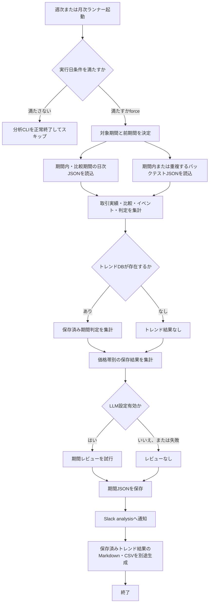

# 詳細設計書 09 週次・月次分析

> 状態: 現行    最終更新: 2026-10-08
> 起動: `run_weekly_analysis.py`、`run_monthly_analysis.py`    関連: [03 取引ループ](./03-trading-loop-design.md)、[03b 価格帯別トレンド答え合わせ](./03b-price-band-trend-check.md)、[08 日次分析](./08-daily-analysis-design.md)、[設定項目](../reference/config-reference.md)

## 1. 概要

週次分析は対象週の日次取引レポート、バックテスト、保存済みトレンド結果を集計し、JSONとSlack通知を作成します。
月次分析は同じ構成で対象月を集計し、判定不能件数・原因も通知に補います。
両者は既存の日次判定結果を読むだけで、日足キャッシュ更新や日次判定の再実行はしません。
価格帯別トレンドの個別集計・表示仕様は[03b](./03b-price-band-trend-check.md)を参照します。

## 2. 実行方式

登録済みタスク予定は土曜10:00の週次分析と、月末最終取引日17:00の月次総合分析です。各PowerShellランナーは分析CLIの後に、保存済みの日次トレンド結果から別個のMarkdown/CSV期間レポートも生成します。

| 起動対象 | 起動契機・既定 | CLI・補足 |
|---|---|---|
| 週次分析 | 土曜10:00 (`src/config/task_schedule.py`) | `python -m src.entrypoints.run_weekly_analysis [--week-start YYYY-MM-DD] [--reports PATH] [--backtests PATH] [--output PATH] [--force]` |
| 月次分析 | 月末最終取引日17:00 | `python -m src.entrypoints.run_monthly_analysis [--month YYYY-MM] [--reports PATH] [--backtests PATH] [--output PATH] [--force]` |
| トレンド期間レポート | 上記分析の後、各PowerShellランナーが起動 | `run_trend_check --weekly` または `run_trend_check --monthly`。後続処理の失敗は分析CLIの終了コードを変更しない |

週次の対象日は月曜から金曜、既定対象週は実行日を含む週です。月次の既定対象は実行日の暦月です。`--force`は週次の土曜制限・月次の月末最終取引日制限を解除します。

## 3. 入出力

分析CLIは期間内の日次レポートとバックテスト結果をファイルから読み、存在するトレンドSQLiteおよび確定済み判定イベントDBを集計して、対象期間のJSONを保存します。週次・月次のトレンド専用Markdown/CSVは後続の`run_trend_check`が別途生成します。

| 項目 | 方向 | 場所・形式 | 備考 |
|---|---|---|---|
| 日次取引レポート | 入力 | `data/reports/daily/*.json` | 対象期間・比較用の前期間から読込 |
| バックテスト結果 | 入力 | `data/backtest/runs/latest_timeseries_*.json` | 生成日が期間内または対象期間と重なるもの |
| 判定イベント | 入力 | `FILTER_DECISION_DATABASE_FILE` | 対象期間の確定イベントを集計 |
| 日次トレンド結果 | 入力 | `data/analysis/trend_check.sqlite3` | DBが存在するときに読込。対象期間内の版を集計 |
| 価格帯別トレンド | 入力 | 価格帯別保存領域・DB・状態ファイル | 個別仕様・保存場所は[03b](./03b-price-band-trend-check.md)を参照 |
| 期間分析JSON | 出力 | 週次 `data/reports/weekly/YYYY-MM-DD_YYYY-MM-DD.json`、月次 `data/reports/monthly/YYYY-MM.json` | `--output`で変更可能。生成時刻・集計・任意のLLMレビューを含む |
| トレンド期間レポート | 出力 | `data/reports/trend_check/weekly/`、`data/reports/trend_check/monthly/` | MarkdownとCSV。別CLIが日次SQLiteの保存結果を集計 |
| 分析通知 | 出力 | Slack `analysis` | 日次実績・答え合わせ・バックテスト別枠・次回確認 |

## 4. 処理フロー

週次・月次のPython分析がJSONとSlack通知を先に作成し、PowerShellランナーはその後に独立したトレンド期間レポートを生成します。トレンドレポートの失敗は先行する分析CLIの終了コードを上書きしません。

期間の比較可否やバックテストの一致判定は集計ロジックの結果に従い、未完了期間・比較条件不一致・完全一致するバックテストがない場合は比較や期間一致実績を提供可能として扱いません。

## 5. 判断ルール・仕様

対象日付は週次なら月曜〜金曜、月次なら暦月初日〜末日です。サマリーは日次レポートの記録値を合算し、バックテスト結果は生成日の範囲または対象期間との重なりで読込対象を選びます。

| 条件 | 結果 |
|---|---|
| 週次`--week-start` | 月曜日以外なら引数エラー。省略時は実行日が属する週 |
| 月次`--month` | 形式は`YYYY-MM`。省略時は当月 |
| 期間完了状態 | `as_of`が期間開始前なら`not_started`、終了日前なら`in_progress`、期間終了日以降なら`complete` |
| 前期間比較 | 現期間完了、両期間に日次レポートがあり、双方が同じ単一取引モードの場合のみ`available=true` |
| バックテスト対象期間一致 | 開始日・終了日が双方とも一致する結果がちょうど1件の場合に限り、期間一致損益・取引数を表示 |
| 期間内バックテスト複数 | 一致件数と状態を記録するが、一意の期間一致実績にはしない |
| トレンドDBなし | Python分析ではトレンド結果を`None`として通知。後続トレンドCLIは独立して実行 |
| トレンドの集計版 | 対象期間に行がある版から最新登録版を優先し、同じ版の行だけ集計 |
| 週次の追加表示 | 曜日別損益・市場状態推移・保存済み日次判定の週内推移 |
| 月次の追加表示 | 判定不能日・判定不能の理由別件数 |
| 価格帯別トレンド | 週次・月次の表示内容と判定は[03b](./03b-price-band-trend-check.md)に記載 |

## 6. レイヤー別の構成

| ファイル | 層 | 役割 |
|---|---|---|
| `src/entrypoints/run_weekly_analysis.py` | entrypoints | 週次範囲決定、期間集計、JSON保存、LLMレビュー、Slack通知 |
| `src/entrypoints/run_monthly_analysis.py` | entrypoints | 月次範囲決定、期間集計、JSON保存、LLMレビュー、Slack通知 |
| `src/entrypoints/run_trend_check.py` | entrypoints | 週次・月次のトレンド期間Markdown/CSV生成 |
| `src/application/analysis_notification.py` | application | 期間実績・判定・次回確認の通知表示と結論 |
| `src/application/price_band_trend_check.py` | application | 価格帯別の期間結果読込・集計。[03b](./03b-price-band-trend-check.md)参照 |
| `src/application/trend_check_report.py` | application | 日次SQLite結果から週次・月次のトレンド期間レポートを生成 |
| `src/infrastructure/analysis/summary_loader.py` | infrastructure | 日次・バックテストJSON読込、期間メタデータ、各集計 |
| `src/infrastructure/analysis/daily_analyzer.py` | infrastructure | 有効時の週次・月次LLMレビュー |
| `src/infrastructure/persistence/trend_check_repository.py` | infrastructure | トレンド基準・日次結果・サマリのSQLite読込 |
| `src/infrastructure/persistence/filter_decision_repository.py` | infrastructure | 確定済み判定イベントの期間集計 |
| `src/infrastructure/persistence/storage.py` | infrastructure | 期間分析結果JSONの書込 |
| `src/infrastructure/notification/slack_notify.py` | infrastructure | `analysis`チャンネルへの通知 |
| `src/config/task_schedule.py`、`src/config/config.py` | config | 定期予定、DB・レポートパス、LLM等の設定 |

## 7. 異常系・失敗時の動き

期間CLIは`process_notification(..., notify_lifecycle=False)`内で実行されます。予期しない例外はログ後に再送出され、Slackの分析通知自体は戻り値を確認するだけで再試行しません。

| 事象 | 検知方法 | 動き | 通知 | 理由コード |
|---|---|---|---|---|
| 実行日が予定日でなく`--force`なし | 曜日または最終取引日判定 | 週次・月次分析をスキップして戻る | 分析通知なし | 対象日外 |
| 日次・バックテストJSONが読めない | 読込例外を捕捉し警告ログ | 該当ファイルを読み飛ばし、利用可能なデータで集計 | 利用可能データによる分析通知 | JSON・I/O例外 |
| 期間一致するバックテストが0件または複数 | 集計結果の一致件数 | 一致実績なしとして表示。複数の場合は一意結果として扱わない | Slack `analysis` | 期間一致なし・複数 |
| LLM API・応答形式の失敗 | HTTP・解析例外 | 警告ログ、LLM評価を省略してJSON・通知処理を継続 | 通知本文は通常通り | なし |
| 分析・集計・JSON書込の予期しない例外 | `process_notification` | 例外をログに記録し再送出。CLIは異常終了 | ライフサイクル通知なし | 例外型・メッセージ |
| Slack分析通知の失敗 | HTTP例外・未設定 | エラーログ後、処理は継続。自動再送なし | 送信失敗自体の再通知なし | なし |
| 後続のトレンド期間レポート失敗 | PowerShellの第2CLI終了コード | トレンド用Markdown/CSVは未生成または不完全になり得るが、分析CLIの終了コードを返す | 別途の分析通知なし | なし |

## 8. 設定項目

共通の設定一覧は[config-reference.md](../reference/config-reference.md)を参照してください。週次・月次CLIはパスと対象期間を引数で上書きできます。

| 名前 | 意味 | 既定値 |
|---|---|---|
| 週次の起動予定 | `task_schedule.py`の週次分析予定 | 土曜10:00 |
| 月次の起動予定 | `task_schedule.py`の月末総合分析予定 | 17:00、月末最終取引日 |
| `--reports` | 日次レポートの読込先 | `data/reports/daily` |
| `--backtests` | バックテスト結果の読込先 | `data/backtest/runs` |
| 週次`--output` | 週次JSONの出力先 | `data/reports/weekly` |
| 月次`--output` | 月次JSONの出力先 | `data/reports/monthly` |
| `--force` | 定期実行日制限を解除 | `false` |
| `LLM_DAILY_ANALYSIS_ENABLED` | 週次・月次レビューのLLM連携を有効化 | `false` |
| `LLM_MODEL` | LLMモデル | `gpt-4o-mini` |
| `LLM_TIMEOUT_SECONDS` | LLM要求タイムアウト | `120`秒 |

## 9. 決定事項と変更履歴

| 日付 | 決定 | 理由 |
|---|---|---|
| 2026-10-08 | 週次・月次は保存済みの日次判定結果を集計し、日足の再取得・再判定を行わない | 日次判定と期間集計を分離するため |
| 2026-10-08 | バックテストは対象期間と完全一致する一意の実行だけを期間一致実績として表示 | 異なる期間の結果を合算・誤認しないため |
| 2026-10-08 | 価格帯別トレンド仕様は03bを参照 | 詳細仕様の重複を避けるため |

## 10. 未決・既知の課題

- 要確認: 月次分析の定期起動日は月末最終取引日だが、期間メタデータの終了日は暦月末である。月末最終取引日が暦月末より前の場合、当日の月次集計が`in_progress`となるかを運用上どう扱うか。
- 要確認: 日次レポートのファイル名とJSON内の`date`が異なる場合はJSON内の日付を優先する。差異の監視・通知仕様は確認できない。
- 要確認: 通知送信失敗・後続のトレンド期間レポート失敗を再実行する仕組みは確認できない。
