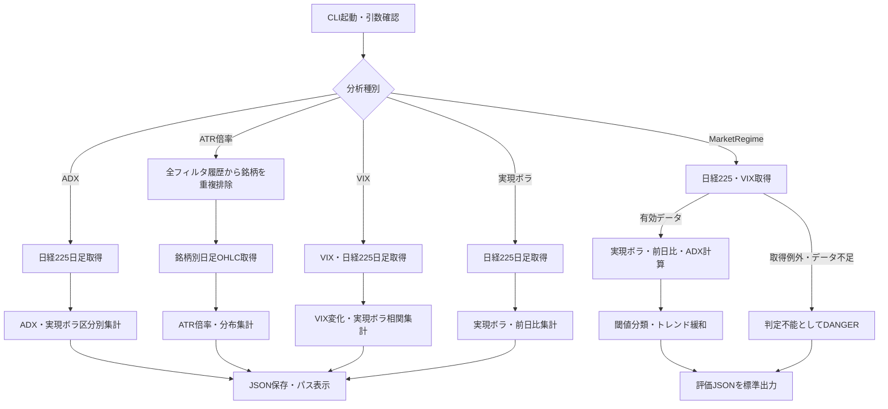

# 詳細設計書 10 市場分析・MarketRegime

> 状態: 現行    最終更新: 2026-10-08
> 起動: `run_adx_analysis.py`、`run_atr_ratio_analysis.py`、`run_vix_analysis.py`、`run_market_regime.py`、`run_market_volatility_analysis.py`    関連: [03 取引ループ](./03-trading-loop-design.md)、[05 バックテスト](./05-backtest-design.md)、[設定項目](../reference/config-reference.md)

## 1. 概要

市場指数の日足やフィルタリング履歴から、ADX・ATR倍率・VIX・実現ボラティリティの分析レポートを作成します。

`MarketRegimeUseCase`は別途、日経225・VIX・ADXを用いてNORMAL/CAUTION/DANGERを判定します。

分析CLIの出力を売買判断に自動反映する機能ではなく、取引ループとバックテストの利用経路は4章に記載します。

## 2. 実行方式

各`run_*.py`は独立したCLIエントリポイントです。分析4本は引数なしでも既定値で実行でき、MarketRegime CLIは設定値を読み込みます。確認したエントリポイントにはこれらの分析CLIを定期実行するスケジュール登録はありません。

| エントリポイント | 起動・入力選択 | 実行処理 |
|---|---|---|
| `run_adx_analysis.py` | 任意。`--period`、`--volatility-window`、`--range`、`--output` | 日経225のADX分布と実現ボラティリティ区分別ADXを集計 |
| `run_atr_ratio_analysis.py` | 任意。`--atr-period`、`--range`、`--filtering-directory`、`--output` | 全フィルタ履歴銘柄のATR倍率を集計 |
| `run_vix_analysis.py` | 任意。`--window`、`--range`、`--output` | VIX・日経225の実現ボラティリティ等を集計 |
| `run_market_volatility_analysis.py` | 任意。`--window`、`--range`、`--output` | 日経225の実現ボラティリティ・前日比を集計 |
| `run_market_regime.py` | 任意。設定ファイルと環境変数 | `MarketRegimeUseCase.execute()`で当日評価しJSONを標準出力 |

## 3. 入出力

各CLIの外部データ入力と出力先は独立しています。4つの分析レポートは既定で`data/analysis/`へJSON保存し、MarketRegime CLIはファイルを保存せず評価結果を標準出力へ出します。

| 分析 | 入力 | 出力 | 既定・備考 |
|---|---|---|---|
| ADX | Yahoo Finance指数日足`^N225`（OHLC） | JSON | `data/analysis/adx_analysis_latest.json`。期間`10y` |
| ATR倍率 | `data/filtering/*.json`の`symbols`、各銘柄のYahoo Finance日足OHLC | JSON | `data/analysis/atr_ratio_analysis_latest.json`。期間`max` |
| VIX | Yahoo Finance日足`^VIX`・`^N225`（OHLC） | JSON | `data/analysis/vix_analysis_latest.json`。期間`10y` |
| 実現ボラティリティ | Yahoo Finance指数日足`^N225`（OHLC） | JSON | `data/analysis/market_volatility_latest.json`。期間`max` |
| MarketRegime | Yahoo Finance日足`^N225`・`^VIX`（確定OHLC） | 標準出力JSON | 日付が当日の日本時間日付以前のバーを取得。永続化しない |

`--output`は4分析CLIのJSON保存先を変更します。保存時に親ディレクトリを作成し、成功すると保存パスを標準出力へ表示します。

## 4. 処理フロー

4つのレポート生成処理と、取引・バックテスト向けのMarketRegime判定は別経路です。分析レポートを生成するだけではMarketRegimeや注文判断は更新されません。

取引起動時の`run_trading.py`は`TradingUseCase.prepare_market_regime()`からMarketRegime評価を取得し、結果を同一実行中で再利用します。バックテストは`--compare-market-regime`を指定した`--live`の日付付き実行で指数履歴から日別レジーム系列を作り、比較結果に含めます。詳細は[03](./03-trading-loop-design.md)・[05](./05-backtest-design.md)を参照してください。

## 5. 判断ルール・仕様

個別分析CLIの算出条件をまとめます。分布要約は空集合なら統計値なしを返し、通常の分位点はp10/p25/p50/p75/p90/p95です。

| 分析 | ルール | 期間・閾値 | レポート内容 |
|---|---|---|---|
| ADX | Wilder平滑化ADXを計算し、同じ日付の実現ボラ区分ごとにADXを集計 | ADX期間14、実現ボラ窓20。区分閾値は`MarketRegimeThresholds()`既定の17/29%。ADX分布bin幅5 | 全ADX時系列・分布とCAUTION/DANGER別ADX要約 |
| ATR倍率 | 既存`assess_volatility()`相当のATR倍率を日次算出。入力銘柄は履歴JSON全件の和集合 | ATR期間14。倍率1.5・2.0以下の観測割合と上側割合 | 全体・銘柄別（件数、中央値、p90）・候補値。候補はp50/p90 |
| VIX | 前日比は百分率。相関は同日付のVIX終値と日経225実現ボラのPearson相関 | 実現ボラ窓20、年率換算252日 | VIX・前日比の分布、相関係数と対応件数 |
| 実現ボラ | 日次終値リターンの標準偏差×√252で年率化。各日の前日比も算出 | 窓20、年率換算252日。分布bin幅5 | 日別時系列と実現ボラ・前日比要約 |

MarketRegimeの判定条件は次の通りです。まず実現ボラとVIXのうち厳しい方を採り、日経225の絶対前日比が閾値以上なら1段階上げ、ADXが閾値以上ならさらに1段階緩和します。

| 指標・条件 | NORMAL | CAUTION | DANGER / 追加動作 |
|---|---|---|---|
| 日経225年率実現ボラ（既定17/29%） | 17%未満 | 17%以上29%未満 | 29%以上 |
| VIX終値（既定17/27） | 17未満 | 17以上27未満 | 27以上 |
| 日経225前日比（既定2%） | 絶対値2%未満 | 基準レジームから1段階上昇 | CAUTIONからDANGERへ。既にDANGERなら維持 |
| 日経225 ADX（既定27） | 閾値未満または算出不可なら変更なし | 閾値以上なら1段階緩和 | DANGER→CAUTION、CAUTION→NORMAL |
| 入力取得・計算 | — | — | 空データ・必要履歴不足・例外時は`data_available=false`、安全側のDANGER。理由を`failure_reason`に格納 |

バックテスト時系列計算は対象日以前のVIXデータだけを対応させます。一方、日次`MarketRegimeUseCase`は取得した各系列末尾の値を使用します。`run_backtest.py --compare-market-regime`の指数系列生成は`MARKET_REGIME_THRESHOLDS`と窓設定を使いますが、ADX閾値は`calculate_market_regime_series()`の既定値27.0を使い、`MARKET_REGIME_ADX_TREND_THRESHOLD`は渡しません。通常の取引起動は環境設定値を`MarketRegimeUseCase`へ渡します。

## 6. レイヤー別の構成

| ファイル | 層 | 役割 |
|---|---|---|
| `src/entrypoints/run_adx_analysis.py` | entrypoints | ADX分析CLI、出力JSON |
| `src/entrypoints/run_atr_ratio_analysis.py` | entrypoints | ATR倍率分析CLI、履歴JSON入力 |
| `src/entrypoints/run_vix_analysis.py` | entrypoints | VIX分析CLI |
| `src/entrypoints/run_market_volatility_analysis.py` | entrypoints | 実現ボラティリティ分析CLI |
| `src/entrypoints/run_market_regime.py` | entrypoints | MarketRegime評価CLI |
| `src/application/market_regime_usecase.py` | application | 指数取得、指標計算、失敗時DANGER評価 |
| `src/domain/market_regime.py` | domain | 状態分類・閾値格上げ・ADX緩和 |
| `src/domain/market_volatility.py` | domain | 実現ボラティリティ、前日比、分布、相関 |
| `src/domain/market_trend.py` | domain | Wilder ADX系列計算 |
| `src/domain/atr_ratio_analysis.py` | domain | ATR倍率系列・要約・候補値 |
| `src/infrastructure/market_data/yahoo_index_client.py` | infrastructure | 指数日足の取得、未確定日の除外 |
| `src/infrastructure/market_data/yahoo_finance_client.py` | infrastructure | 個別銘柄日足取得 |
| `src/config/config.py` | config | MarketRegime閾値・窓・取得範囲 |
| `src/application/trading_usecase.py` | application | 取引開始前に評価して取引ループで利用 |
| `src/application/backtest_usecase.py` | application | 日付別MarketRegimeによるバックテスト調整 |

## 7. 異常系・失敗時の動き

MarketRegimeは市場データを使えない場合にも評価オブジェクトを返し、レジームをDANGERとします。個別の分析CLIは入力不足を非0終了相当の`SystemExit`で止め、データ破損など未処理例外は呼び出し元へ伝播します。

| 事象 | 検知方法 | 動き | 通知 | 理由コード |
|---|---|---|---|---|
| 期間・窓・ADX期間が0以下 | CLI引数検証 | CLI終了。処理・保存を行わない | なし | 引数エラー |
| Yahoo日足が空 | 各CLIの空データ検査 | 分析CLI終了 | なし | 指数/銘柄データ取得不可 |
| MarketRegimeの指数が空、または必要な計算期間なし | UseCase検査 | `data_available=false`、DANGER評価を返す | UseCaseはwarningログ。取引側は状態を通知・再利用 | `failure_reason` |
| MarketRegimeで取得・計算例外 | UseCaseの例外捕捉 | 例外を記録しDANGER評価にフォールバック | exceptionログ。取引側に評価理由を渡す | `failure_reason` |
| ATR入力ディレクトリなし・JSON形式不正・`symbols`配列なし | ファイル読込・形式検査 | 例外で終了 | なし | `FileNotFoundError` / `ValueError` |
| ATR対象銘柄なし | 銘柄集合の検査 | CLI終了 | なし | 対象銘柄なし |
| 個別銘柄の履歴不足・倍率なし | 銘柄ごとの件数・結果検査 | 当該銘柄を除外し、理由を出力JSONへ含める | なし | `insufficient_daily_ohlc` / `no_atr_ratio_points` |
| 出力先作成・書込失敗 | OS例外 | CLI失敗。自動リトライなし | なし | OS例外 |

## 8. 設定項目

各単独分析CLIの引数既定値とMarketRegime設定を記載します。MarketRegime各値は環境変数で上書きできます。

| 名前 | 意味 | 既定値 |
|---|---|---|
| `--period` | ADX計算期間（日） | `14` |
| `--volatility-window` | ADXレポートで用いる実現ボラ窓（日） | `20` |
| ADX `--range` | Yahoo取得期間 | `10y` |
| ATR `--atr-period` | ATR計算期間（日） | `14` |
| ATR/VIX `--range` | Yahoo取得期間 | `max` / `10y` |
| VIX・実現ボラ `--window` | 実現ボラ計算窓（日） | `20` |
| `MARKET_REGIME_REALIZED_VOL_CAUTION` / `DANGER` | 実現ボラ注意・危険閾値（%） | `17.0` / `29.0` |
| `MARKET_REGIME_VIX_CAUTION` / `DANGER` | VIX注意・危険閾値 | `17.0` / `27.0` |
| `MARKET_REGIME_NIKKEI_CHANGE_UPGRADE` | 日経前日比による格上げ閾値（%） | `2.0` |
| `MARKET_REGIME_REALIZED_VOL_WINDOW` | MarketRegime実現ボラ窓（日） | `20` |
| `MARKET_REGIME_DATA_RANGE` | MarketRegime指数取得期間 | `3mo` |
| `MARKET_REGIME_ADX_TREND_THRESHOLD` | ADX緩和閾値 | `27.0` |

## 9. 決定事項と変更履歴

| 日付 | 決定 | 理由 |
|---|---|---|
| 2026-10-08 | 個別の分析レポート生成とMarketRegime判定を別機能として記述 | 実際のCLI、保存先、取引・バックテストの呼出経路が別であるため |
| 2026-10-08 | MarketRegimeの取得・計算失敗はDANGERとして扱う | `MarketRegimeUseCase._unavailable()`の実装に一致させるため |

## 10. 未決・既知の課題

- 5つの分析CLIを定期実行する構成は、確認したエントリポイントと設定から特定できない。運用上の起動主体・頻度は未確認。
- 日次`MarketRegimeUseCase`は日経225・VIX各系列の最終値を使うが、異なる最終取引日のクロス系列照合は実装していない。休場日差が評価へ及ぼす運用影響は未確認。
- `--compare-market-regime`のADX緩和閾値は設定上書きを参照せず27.0固定相当である。取引時の設定値と意図的に別値を許容する運用かは未確認。
- `run_market_regime.py`は結果を標準出力するだけで、評価の永続化や専用通知は行わない。後続運用で保存・通知が必要かは未確認。
- ATR倍率分析はフィルタ結果全履歴を入力とする。履歴の対象期間や古い結果を除外する運用ルールは実装から確認できない。
