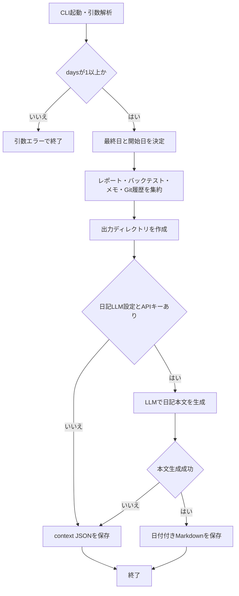

# 詳細設計書 11 日次日記

> 状態: 現行    最終更新: 2026-10-08
> 起動: `src/entrypoints/run_daily_diary.py`    関連: [07 LLM連携](./07-llm-integration-design.md)、[全体データフロー](../architecture/flow.md)、[設定項目](../reference/config-reference.md)

## 1. 概要

指定期間の運用日次レポート、バックテスト結果、手入力メモ、Gitコミット要約を集め、LLMで日本語の開発・トレード日記を生成します。
生成に必要なLLM設定がない場合や本文生成に失敗した場合も、集約したcontextをJSONとして保存します。
生成物はMarkdownまたはJSONであり、取引判断や売買注文、Slack通知を行いません。

## 2. 実行方式

`python -m src.entrypoints.run_daily_diary` をCLIから実行します。エントリポイント内にスケジューラはなく、定期実行の契機は実装から確認できません。

| 引数 | 意味 | 既定値 |
|---|---|---|
| `--date` | 対象期間の最終日（`YYYY-MM-DD`） | 実行環境の日付 |
| `--days` | 対象日数。最終日を含む連続日数 | `1` |
| `--reports` | 日次レポートの読込先 | `data/reports/daily` |
| `--backtests` | バックテスト結果の読込先 | `data/backtest/runs` |
| `--notes` | 手入力メモの読込先 | `data/notes/operations` |
| `--output` | 日記またはcontextの保存先 | `data/notes/diary` |

開始日は最終日から`days - 1`日を引いて算出します。生成結果は最終日をファイル名に使い、日付ごとに出力します。

## 3. 入出力

入力期間は開始日・最終日を含みます。日次レポートは日付が期間内のJSON、バックテスト結果は生成日または対象期間が指定期間に重なるファイルが集約されます。

| 項目 | 方向 | 場所・形式 | 備考 |
|---|---|---|---|
| 日次運用レポート | 入力 | `--reports`内の`*.json` | 既定`data/reports/daily`。JSON内`date`（なければファイル名）で期間を判定 |
| バックテスト結果 | 入力 | `--backtests`内の`latest_timeseries_*.json` | 既定`data/backtest/runs`。生成日または期間の重なりで対象化 |
| 手入力メモ | 入力 | `--notes/YYYY-MM-DD.md` | 既定`data/notes/operations`。期間内の日付ファイルを読み、日付を付けて結合 |
| Gitコミット要約 | 入力 | リポジトリの`git log` | 対象期間を指定してコミット件名を取得。取得失敗時は空リスト |
| LLM設定 | 入力 | 環境変数（`src/config/config.py`） | 機能フラグ、APIキー、モデル、URL、タイムアウト |
| 日記本文 | 出力 | `--output/YYYY-MM-DD.md` | LLM成功時。日付付きMarkdown見出しと本文 |
| 日記context | 出力 | `--output/YYYY-MM-DD.json` | LLM無効・APIキーなし、または本文生成失敗時。入力集約結果をJSON保存 |

context JSONには`period_start`、`period_end`、`commits`、`daily_reports`、`backtest_runs`、`manual_notes`が含まれます。日次レポートからは注文数、損益、運用状態など、バックテストからは損益・取引数等の要約を抽出します。

## 4. 処理フロー

期間を決定して素材を集約し、LLM利用可能時は本文を生成します。LLMが利用できない、または生成に失敗した場合はcontext JSONを出力します。

日次レポート・バックテストの読み込み不能や手入力メモ・Git履歴の取得失敗は警告を記録し、取得できた素材で処理を継続します。

## 5. 判断ルール・仕様

LLM本文は日本語のですます体で、素材に応じて「今日やったこと」「結果」「気づき・つまずいた点」「次にやりたいこと」をMarkdown見出しで扱います。材料がない項目は省略可能です。

| 条件・素材 | 動作 |
|---|---|
| `--days`が1未満 | `argparse`の引数エラーとして終了 |
| 手入力メモあり | LLMプロンプトで一次情報として優先し、日付付きのままcontextにまとめる |
| Gitコミット・取引結果 | 手入力メモの補足情報として扱う |
| 生成指示 | 数値を再計算しない。投資助言・売買指示を避け、検証期間中の個人メモである旨を記載 |
| 本文の長さ | プロンプトで600〜1000字程度を指定。アダプター側で本文を切り詰めない |
| 同じ最終日で再実行 | 同じ出力ファイル名に書き込むため、成功した場合は既存Markdownを置換 |

`--date`の形式変換は`date.fromisoformat()`を使います。変換不能な値の個別回復処理は実装されていません。

## 6. レイヤー別の構成

日記処理専用のapplication層・domain層の実装は確認できず、entrypointからinfrastructureの集約・生成・永続化機能を直接呼び出します。

| ファイル | 層 | 役割 |
|---|---|---|
| `src/entrypoints/run_daily_diary.py` | entrypoints | CLI引数、期間計算、context構築、fallbackと出力先の選択 |
| `src/infrastructure/analysis/diary_context.py` | infrastructure | 日次レポート、バックテスト、手入力メモ、Git履歴のcontext集約 |
| `src/infrastructure/analysis/summary_loader.py` | infrastructure | 日次レポート・バックテストJSONの読込と要約 |
| `src/infrastructure/analysis/diary_writer.py` | infrastructure | 日記用プロンプト、Chat Completions API呼出し、本文検証 |
| `src/infrastructure/persistence/storage.py` | infrastructure | fallback context JSONの保存 |
| `src/config/config.py` | config | 日記機能フラグと共通LLM接続設定 |

## 7. 異常系・失敗時の動き

素材の一部が取得できなくても、読み飛ばし可能なエラーはログに残して継続します。LLM生成失敗時はcontext JSONへfallbackし、Slack等の通知は行いません。

| 事象 | 検知方法 | 動き | 通知 | 理由コード |
|---|---|---|---|---|
| `--days`が1未満 | `argparse`の明示チェック | 引数エラーで終了 | なし | なし |
| `--date`が不正 | `date.fromisoformat()`の変換例外 | 個別の捕捉・fallbackなし | なし | なし |
| 日次レポート・バックテストJSONの読込失敗 | OS・JSON・日時変換例外 | 警告ログを出し当該ファイルをスキップ | なし | なし |
| 手入力メモの読込失敗 | `OSError` | 警告ログを出し当該メモを除外 | なし | なし |
| Git履歴を取得できない | `OSError`またはGitコマンド失敗 | 警告ログを出しコミット一覧を空にする | なし | なし |
| LLM無効またはAPIキーなし | writer factoryが`None` | context JSONを保存して終了 | なし | なし |
| LLM通信・HTTP失敗、本文不在・応答構造不正 | requests例外、または応答値検証 | 警告ログ。本文を`None`としてcontext JSONへfallback | なし | なし |
| API認証 | 現行writerのリクエストヘッダー | `Authorization`でBearer認証を使い、設定キー`LLM_API_KEY`を送る | なし | なし |
| JSON保存時のOSエラー | `write_json()`内部 | エラーログを記録し`False`を返す。呼出元は戻り値を確認しない | なし | なし |
| 出力ディレクトリ・Markdown保存時のOSエラー | ファイル操作例外 | entrypointで捕捉されず終了 | なし | なし |

## 8. 設定項目

入出力ディレクトリは設定環境変数ではなくCLI引数で指定します。LLM共通設定の一覧は[config-reference.md](../reference/config-reference.md)を参照してください。

| 名前 | 意味 | 既定値 |
|---|---|---|
| `LLM_DIARY_ENABLED` | 日記本文生成を有効化。`1`、`true`、`yes`を有効値として認識 | `false` |
| `OPENAI_API_KEY` / `LLM_API_KEY` | LLM APIキー。`OPENAI_API_KEY`が優先 | 空文字 |
| `LLM_MODEL` | 日記生成に使用するモデル | `gpt-4o-mini` |
| `LLM_API_URL` | Chat Completions API URL | `https://api.openai.com/v1/chat/completions` |
| `LLM_TIMEOUT_SECONDS` | API要求のタイムアウト秒数 | `120` |
| `--date` | 対象期間の最終日 | 実行日 |
| `--days` | 対象日数 | `1` |
| `--reports` / `--backtests` / `--notes` / `--output` | 読込元・保存先 | `data/reports/daily` / `data/backtest/runs` / `data/notes/operations` / `data/notes/diary` |

## 9. 決定事項と変更履歴

この設計書は、現行entrypoint・infrastructure・configの実装で確認できる挙動のみを記録します。

| 日付 | 決定 | 理由 |
|---|---|---|
| 2026-10-08 | 実装済みのCLI、入力集約、LLM生成、JSON fallbackを現行仕様として記載 | コードと既存のLLM連携・データフロー資料で確認できる範囲に限定 |

## 10. 未決・既知の課題

- 日記CLIをいつ・どの運用主体が起動するか、定期実行するかは、entrypointおよび確認した既存資料から特定できません。
- JSON fallback保存の失敗は`write_json()`が`False`を返しますが、entrypointは戻り値を確認せず、別の失敗通知や再試行も実装していません。
- 日付形式不正や出力先の作成・Markdown書込み失敗はentrypointで捕捉されず、呼出元へ伝播します。利用者向けの個別通知・回復手順は確認できません。
- LLM利用時に日記Markdownのみを生成し、context JSONは保存しません。Markdown保存後の確認済み・公開済み状態を記録する仕組みは確認できません。
