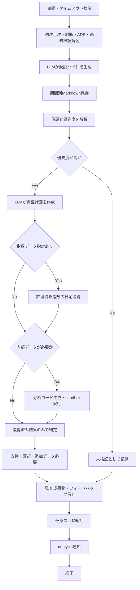

# 詳細設計書 12 戦略レビュー

> 状態: 現行    最終更新: 2026-10-08
> 起動: `run_strategy_review.py`    関連: [03 取引ループ](./03-trading-loop-design.md)、[05 バックテスト](./05-backtest-design.md)、[設定項目](../reference/config-reference.md)

## 1. 概要

対象期間の既存分析・診断・ADR等を読み、LLMで戦略仮説を生成して、優先度「高」の仮説を定量検証するCLIです。

検証コードは読取専用データと制限付きPython実行環境で動かし、仮説ごとの結果・監査資料・後続レビュー用フィードバックを保存します。

この処理はYahooの日足キャッシュを読む実装ではありません。Yahoo Finance指数日足は、検証計画で選択された場合だけ外部APIから取得します。

## 2. 実行方式

`run_strategy_review.py`は開始日と終了日を必須とする手動CLIです。開始日が終了日を超える場合、またはタイムアウト秒数が正数でない場合は引数エラーで停止します。CLI既定の分析コード実行タイムアウトは60秒です。

処理順序は、(1)入力コンテキスト読込と仮説生成、(2)優先度「高」の仮説検証、(3)結果総括（LLM利用可能時）、(4)analysis通知です。仮説生成・検証用LLMが利用できない場合は処理に失敗します。総括LLMだけが失敗した場合は件数・判定による通知を続けます。

## 3. 入出力

レビューの仮説生成は週次・月次分析などの既存ファイルを読みます。仮説の定量検証は対象期間のParquet分足とSQLite判定イベントにアクセスし、条件付きでYahoo Finance Chart APIの許可済み指数日足を取得します。

| 項目 | 方向 | 場所・形式 | 備考 |
|---|---|---|---|
| 週次・月次分析 | 入力 | `data/reports/weekly/*.json`、`data/reports/monthly/*.json` | 対象期間と重なるレポートを抽出 |
| 補助診断 | 入力 | `data/analysis/`内のfilter-entry・regime-skip診断JSON | 対象期間と重なるファイル。存在しない場合は警告 |
| 過去の決定・検証 | 入力 | `docs/adr/`、`data/strategy_verification/*/verified_hypotheses.json` | ADR要約と同名仮説ごとの最新検証結果 |
| 内部検証データ | 入力 | `data/minute_bars_parquet/symbol=.../date=.../data.parquet` | 対象期間ファイルのみ |
| 判定イベント | 入力 | `data/state/filter_decision_events.sqlite3` | 読取専用。対象期間の`occurred_at`で絞り込み |
| 外部指数データ | 条件付き入力 | Yahoo Finance Chart APIの日足OHLC | 検証計画が選んだ`^N225`、`^VIX`、`^DJI`、`^GSPC`のみ。対象期間へ絞る |
| 仮説アドバイザー | 出力 | `data/strategy_hypotheses/YYYY-MM-DD_YYYY-MM-DD.md` | 対象期間別Markdown |
| 検証成果物 | 出力 | `data/strategy_verification/<実行ID>/` | run metadata、結果Markdown、JSONフィードバック、仮説ごとの監査資料 |
| 総括 | 条件付き出力 | 実行ディレクトリの`strategy_review_summary.md` | 総括LLMが有効で応答を返した場合 |
| 通知 | 出力 | Slack `analysis` | 件数、判定、成果物パス。送信失敗はログに記録 |

**Yahoo日足キャッシュ確認:** `run_strategy_review.py`は`data/analysis/`やレポート等のJSONをコンテキストとして読みますが、日足キャッシュ（例: `yahoo_daily`）を読む処理はありません。外部指数取得もキャッシュ読込ではなく、計画で指定された場合の`StrategyExternalMarketDataClient`によるYahoo Finance Chart API呼出です。通常の内部検証データは分足Parquet・判定イベントSQLiteです。

## 4. 処理フロー

パイプラインは仮説生成後に高優先度のみ自動検証し、成功・検証不能・未検証の件数をまとめて通知します。

内部分析コードはAST検査後に隔離された子プロセスで実行します。分析コードから使えるのは許可テーブルへのSELECTクエリ関数等に限られ、検証データへの書込みやネットワークアクセスは許可されません。

## 5. 判断ルール・仕様

仮説生成で既存の検証履歴を提示し、重複する棄却仮説を避けます。レビュー本線の自動検証対象は「高」のみで、中・低などは除外結果として保存します。

| 段階 | 判断・制約 | 結果 |
|---|---|---|
| コンテキスト抽出 | 週次・月次レポートの期間が指定期間と重なるものを採用。診断JSONは指定globに一致し対象期間が判明したものを最大5件まで採用 | 取得できない診断は警告を`data_warnings`へ |
| 仮説生成 | アドバイザーに3〜5件の構造的仮説、根拠・反証データ・検証案を要求。棄却済みの再提示を避け、支持済みは新しい観察に基づく発展形に限定 | Markdownに保存 |
| 自動選別 | `priority == "高"`のみパイプラインで検証 | それ以外は「未検証(優先度…のため対象外)」として記録 |
| 調査計画 | LLMが内部データ要否、外部指数、ニュース要否を選ぶ。許可指数は`^N225`、`^VIX`、`^DJI`、`^GSPC` | 一般ニュース検索は未実装。要求時は未取得と明記 |
| 内部分析 | コード生成LLMに読み取り専用Pythonを生成させ、sandboxで実行 | SQLは単一SELECT、許可テーブル・関数、1クエリ最大1000行 |
| 判定 | 実取得済み内部結果・監査可能な外部指数のみを根拠とし、支持/棄却/追加データ必要と信頼度を返す | 実行失敗時に必要なデータが不足すれば検証不能・追加データ必要 |
| フィードバック | 実行ごとに検証結果JSONを保存。次回生成時はタイトル単位の最新検証を最大20件までコンテキスト化 | 同一タイトルの重複フィードバックを避ける |

Sandboxの検査・実行制限は次の通りです。制限値は`strategy_analysis_code_sandbox.py`の定数であり、CLI設定値ではありません。

| 制限 | 値 | 動作 |
|---|---:|---|
| 生成コードサイズ | 32,000 bytes | 超過・非許可ASTは`rejected` |
| ASTノード数 | 2,000 | 超過コードを拒否 |
| Python forループ | 最大8、非入れ子 | 超過・無制限反復元を拒否 |
| 内包表記・ジェネレータ式 | 最大4、単一反復元 | 入れ子を拒否 |
| クエリ結果 | 最大1,000行 | 超過時に実行失敗 |
| 標準出力 | 最大256,000 bytes | 超過時に子プロセス実行失敗 |
| DuckDB | 512MB、1 thread | インメモリDB、外部アクセス無効 |
| 分析コード実行時間 | CLI既定60秒 | 超過時に子プロセスを停止し`timed_out` |

## 6. レイヤー別の構成

| ファイル | 層 | 役割 |
|---|---|---|
| `src/entrypoints/run_strategy_review.py` | entrypoints | CLI引数、依存構築、レビュー実行 |
| `src/application/run_strategy_review_usecase.py` | application | 仮説生成・検証の順次実行、件数集計、総括・通知 |
| `src/application/generate_strategy_hypotheses_usecase.py` | application | コンテキスト入力、生成プロンプト、Markdown保存 |
| `src/application/verify_strategy_hypotheses_usecase.py` | application | 仮説解析、計画・コード生成・実行・判定、監査成果物作成 |
| `src/infrastructure/analysis/strategy_hypothesis_context_repository.py` | infrastructure | 週次/月次・診断・ADR・検証履歴の読込 |
| `src/infrastructure/analysis/strategy_hypothesis_analyzer.py` | infrastructure | 仮説生成用Chat Completionsアダプター |
| `src/infrastructure/analysis/strategy_verification_client.py` | infrastructure | 調査計画・コード・判定用Chat Completionsクライアント |
| `src/infrastructure/analysis/strategy_analysis_code_sandbox.py` | infrastructure | AST allowlist、読取専用データ、子プロセス実行 |
| `src/infrastructure/analysis/strategy_external_market_data_client.py` | infrastructure | 指定された指数の日足をYahoo Financeから取得 |
| `src/infrastructure/analysis/daily_analyzer.py` | infrastructure | 任意の最終レビュー総括 |
| `src/infrastructure/notification/slack_notify.py` | infrastructure | analysisチャンネル通知 |
| `src/config/config.py` | config | LLMキー・モデル・API設定、判定DB既定パス |

## 7. 異常系・失敗時の動き

仮説単位の調査失敗はすべてパイプライン全体の即時中断とはせず、監査結果に状態を残す場合があります。仮説生成・検証ユースケース自体が例外になった場合は失敗通知を試みた後、CLIが終了コード1で終了します。

| 事象 | 検知方法 | 動き | 通知 | 理由コード |
|---|---|---|---|---|
| 日付形式不正、開始日>終了日、タイムアウト<=0 | argparse型変換・範囲検査 | 引数エラーで終了 | なし | argparse error |
| LLM無効またはAPIキーなし | analyzer/client factoryが`None` | 仮説生成/検証の初期化に失敗し終了 | レビュー失敗通知を試行 | RuntimeError |
| 仮説生成API応答なし・不正 | API応答検査・仮説レポート解析 | レビュー失敗として終了 | 失敗段階「仮説生成」 | RuntimeError / ValueError |
| 内部DB不存在 | Sandboxのファイル検査 | 当該仮説は検証不能扱い。必要条件を満たさなければ判定不能 | 最終通知に検証不能件数 | `failed` |
| 生成コード不許可・構文不正・SQL不許可 | AST/SQL検証 | `rejected`。仮説判定に使える他の結果がなければ検証不能 | 最終通知に件数 | `rejected` |
| 生成コード実行失敗・タイムアウト | 子プロセス終了状態 | stdout/stderr等を監査資料に保存し、根拠不足なら「追加データ必要」 | 最終通知に判定・未完了件数 | `failed` / `timed_out` |
| 外部指数取得失敗・対象期間にデータなし | 外部クライアント結果status | 外部データを空の結果として記録。内部結果も必要で失敗していれば検証不能 | 検証結果へ記録 | `fetch_failed` / `no_data_in_period` |
| 仮説ごとの計画・生成・判定API例外 | 仮説単位の例外捕捉 | 当該仮説を検証不能として保存し次へ進む | 最終通知に検証不能件数 | 例外型と内容 |
| 総括LLM失敗・空応答 | 例外または空文字検査 | 総括ファイルを作らず、件数・判定で通知継続 | 総括なしと注記 | 総括失敗 |
| Slack通知失敗 | 戻り値falseまたは例外 | ログ記録。処理結果は維持 | 再通知なし | なし |

## 8. 設定項目

LLM利用可否は日次分析と共通の有効化設定・APIキーに依存します。実行引数と主要な設定既定値は以下の通りです。

| 名前 | 意味 | 既定値 |
|---|---|---|
| `--start-date` | 検証・コンテキスト対象期間の開始日 | 必須 |
| `--end-date` | 検証・コンテキスト対象期間の終了日 | 必須 |
| `--timeout-seconds` | 仮説ごとの分析コード実行タイムアウト | `60.0`秒 |
| `LLM_DAILY_ANALYSIS_ENABLED` | 仮説生成・検証・総括のLLM利用を有効化 | `false` |
| `OPENAI_API_KEY` / `LLM_API_KEY` | LLM APIキー（前者優先） | 未設定 |
| `LLM_MODEL` | LLMモデル | `gpt-4o-mini` |
| `LLM_API_URL` | Chat Completions URL | `https://api.openai.com/v1/chat/completions` |
| `FILTER_DECISION_DATABASE_FILE` | 検証で読む判定イベントSQLite | `data/state/filter_decision_events.sqlite3` |

コードsandboxの上限値は5章に示したソース定数が既定値です。CLI引数で変更できるのはコード実行タイムアウトのみです。

## 9. 決定事項と変更履歴

| 日付 | 決定 | 理由 |
|---|---|---|
| 2026-10-08 | 日足キャッシュの読込とYahoo Finance指数の条件付きAPI取得を区別して記述 | コード上、レビューコンテキストはレポートJSON等であり、外部指数データは選択時のみ別クライアントで取得するため |
| 2026-10-08 | 内部検証データへの読取専用sandboxと監査保存を設計範囲に含める | 生成コードの実行・データ入力・成果物保存が実装されているため |

## 10. 未決・既知の課題

- 仮説生成・検証は日次分析用LLM有効化とAPIキーが必要だが、定期スケジュールからの起動登録は確認できない。運用上の起動頻度・担当は未確認。
- コンテキストの過去検証は仮説タイトルをキーに最新結果を選ぶ。タイトル変更・類似表現を同一仮説として扱う機構は確認できない。
- 検証計画がニュースを必要と判定しても一般ニュース検索は実装されず、Yahoo Finance指数以外の外部情報は取得しない。
- ファイル名に`yahoo_daily`を含むキャッシュの読込は本処理に見当たらない。運用資料で想定する日足キャッシュと、このレビューのデータ入力の関係は未確認。
- 出力は対象期間名の仮説レポートを保存し、検証結果は時刻付き実行IDディレクトリに保存する。期間別レポートの同一期間再実行時の上書き運用はコード上の保存仕様どおりで、履歴保持方針は別途未確認。
