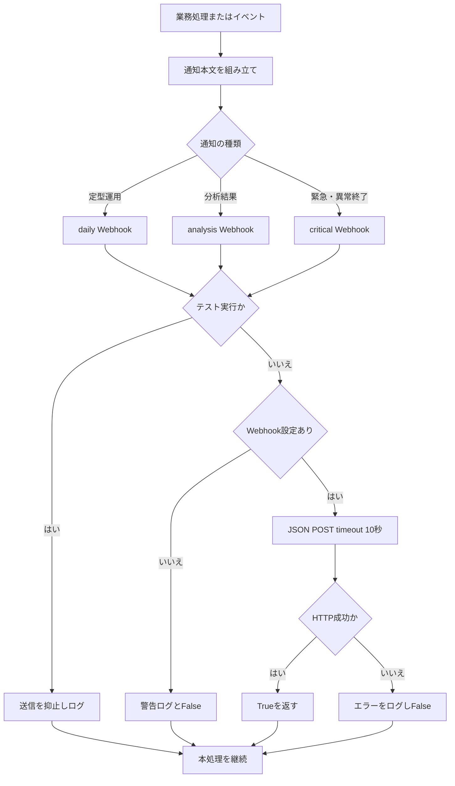

# 詳細設計書 13 通知

> 状態: 現行    最終更新: 2026-10-08
> 起動: 各業務entrypointから `notify_daily()`、`notify_analysis()`、`notify_critical()`、`process_notification()` を呼出し    関連: [詳細設計テンプレート](./_template.md)、[通知運用概要](../architecture/notifications.md)、[実行スケジュール](../architecture/schedule.md)、[設定項目](../reference/config-reference.md)

## 1. 概要

通知はSlack Incoming Webhookを通じ、通常の日次運用、分析・振り返り、緊急事象を3系統に振り分ける。共通整形関数と送信関数は `src/infrastructure/notification/slack_notify.py` にある。
通知失敗はログに記録し、取引等の本処理を止めない。市場傾向文は取引開始通知へ任意情報として加え、取引中間報告は取引ループ中に既定時刻を横切った場合に送信する。

## 2. 実行方式

通知は各entrypointまたは取引ユースケースから同期的に送られ、OSタスク登録は別の起動責務である。`process_notification()` は開始・終了ログを必ず記録し、引数 `notify_lifecycle` が真なら開始・終了通知も行う。

| チャンネル | 主な用途 | 実装上の例 |
|---|---|---|
| `daily` | 定型の日次処理結果、取引開始・中間報告、注文・取引関連の運用通知 | `run_screening.py`、`run_filtering.py`、`run_trading.py` |
| `analysis` | 日次・週次・月次レビュー、バックテスト、分足バックフィル等 | `run_daily_analysis.py`、`run_weekly_analysis.py`、`run_monthly_analysis.py`、`run_backtest.py` |
| `critical` | 即時確認が必要な異常・緊急事象、ライフサイクル通知の異常終了 | `notify_critical()` 呼出箇所、`process_notification()` |

結果通知は主に `format_result_notification()` が「業務」「機能」「概要」「詳細」の見出しで組み立てる。各entrypointで `notify_lifecycle=False` を指定する場合、開始・終了の個別通知ではなく、機能固有の結果通知に依存する。

## 3. 入出力

送信先はチャンネル別Webhook URLで選び、本文はSlackの `{"text": message}` としてPOSTされる。外部宛先URLは設定値であり、ソースコードに直接記載されない。

| 項目 | 方向 | 場所・形式 | 備考 |
|---|---|---|---|
| 通知本文 | 入力 | Python文字列 | 取引レポート、処理結果、異常等 |
| `SLACK_WEBHOOK_DAILY` | 入力 | 環境設定 | 日次チャンネル |
| `SLACK_WEBHOOK_ANALYSIS` | 入力 | 環境設定 | 分析チャンネル |
| `SLACK_WEBHOOK_CRITICAL` | 入力 | 環境設定 | 緊急通知チャンネル |
| Slack要求 | 出力 | `POST` JSON `{"text": ...}` | timeout 10秒、成功ステータスを検査 |
| 送信結果 | 出力 | `bool` | 成功時 `True`、テスト抑止・未設定・失敗時 `False` |
| 送信ログ | 出力 | アプリケーションlogger | URL未設定、HTTP／通信失敗、テスト時抑止等 |
| 例外原因分析状態 | 入出力 | `data/state/llm_error_state.json` | `process_notification()` の例外分析が有効な場合 |

## 4. 処理フロー

呼出元で本文と緊急度を選び、該当Webhookへ送信する。送信失敗は記録して戻るため、通知の配送成否は呼出元処理の成功条件にはならない。

`process_notification()` の例外経路では、KeyboardInterruptをそのまま再送出し、それ以外の `Exception`／`SystemExit` はログ・任意のLLM分析後、設定された場合に異常終了通知を行ってから元例外を再送出する。

## 5. 判断ルール・仕様

チャンネルは送信内容の種別により呼出元で選択され、本文の文面から自動分類はしない。取引開始時の市場傾向と中間報告について、現行コードで確認できる条件・内容は次のとおり。

| 機能 | 条件・ルーティング | 内容 |
|---|---|---|
| 取引開始通知 | 市場時間内・当日フィルタ結果あり・トークン取得後、`prepare_market_regime()` を持つuse caseで評価を実行。`daily` へ送信 | 取引モード、対象銘柄数、市場条件。市場評価と対象銘柄の売買代金比から生成した傾向文を追加 |
| 市場傾向文のfallback | 市場評価がない／利用不可なら空リスト。傾向文生成例外も記録して空リスト | 傾向文がなくても既存の取引開始通知は維持 |
| 中間報告時刻 | 設定された2つの時刻を取引ループが通過した時に各1回。既定は日本時間11:30、14:00 | `daily` へ通知。実行開始時刻がその予定時刻より後なら当該報告は送らない |
| 中間報告の内容 | `TradingUseCase` が時点までの注文履歴・保有・市場状態・イベントを集計 | 報告時刻、約定件数（paper）または受付件数（実取引、実約定未照会）、確定／含み損益、保有銘柄、朝のMarketRegime、日経225当日値動き、見送り・停止 |
| 結果通知 | 各機能が本文を組み立てて `notify_daily()` または `notify_analysis()` を選択 | LLMの結果がある場合は日次・週次・月次・バックテスト等の分析通知に参考情報として追記 |
| ライフサイクル異常終了 | `notify_lifecycle=True` の場合 | 例外原因分析があれば短縮結果を付加し `critical` に送信。その後例外を再送出 |

傾向文は `build_market_tendency()` がMarketRegime評価・売買代金比・設定閾値を使って生成する。取引開始通知では市場・傾向行を `market_conditions_detail()` とともに掲載し、activity行は含めない設定で呼び出している。

## 6. レイヤー別の構成

| ファイル | 層 | 役割 |
|---|---|---|
| `src/infrastructure/notification/slack_notify.py` | infrastructure | 本文共通整形、Webhook別送信、ライフサイクル通知と例外時処理 |
| `src/entrypoints/run_trading.py` | entrypoints | 取引起動条件、市場評価後の開始通知 |
| `src/application/trading_usecase.py` | application | 取引中間報告スケジュール判定・集計・`daily` 送信 |
| `src/domain/trading_progress_report.py` | domain | 中間報告本文の整形 |
| `src/application/market_tendency_notification.py` | application | 市場傾向文の安全な生成とfallback |
| `src/domain/market_tendency.py`、`market_regime.py` | domain | 市場傾向およびMarketRegime表現・判定 |
| `src/application/analysis_notification.py` | application | 日次・期間分析通知の本文要素 |
| `src/entrypoints/run_daily_analysis.py` | entrypoints | 日次分析結果を `analysis` に通知 |
| `src/entrypoints/run_weekly_analysis.py` | entrypoints | 週次分析結果を `analysis` に通知 |
| `src/entrypoints/run_monthly_analysis.py` | entrypoints | 月次分析結果を `analysis` に通知 |
| `src/entrypoints/run_backtest.py` | entrypoints | バックテスト結果を `analysis` に通知 |
| `src/config/config.py` | config | Slack Webhook設定と取引中間報告時刻 |

## 7. 異常系・失敗時の動き

Webhook未設定・通信失敗・HTTPエラーは送信関数内で処理され、falseを返す。開始・終了通知の送信処理が例外を上げた場合も捕捉して記録する。

| 事象 | 検知方法 | 動き | 通知 | 理由コード |
|---|---|---|---|---|
| テストruntime | `config._is_test_runtime()` | Slack送信せずINFOログ、`False` | 抑止 | なし |
| Webhook URL未設定 | 空URLの確認 | WARNINGログ、`False` | 送信なし | なし |
| Slack通信／HTTP失敗 | `requests.RequestException`、`raise_for_status()` | ERRORログ（応答本文があれば併記）、`False` | 送信失敗 | なし |
| 処理状態通知の送信例外 | `_send_process_message()` のexcept | 例外ログ。処理本体は継続 | 送信失敗 | なし |
| 中間報告での損益・保有・日経225取得失敗 | 個別取得の例外、または値が利用不可 | ログ記録し、該当値を「取得不可」で本文へ反映。報告送信を続行 | `daily` 送信を試行 | なし |
| 中間報告送信例外 | `_send_trading_progress_report()` のexcept | 例外ログ。取引処理を継続 | 当該報告は失敗 | なし |
| 市場評価未取得・傾向文生成失敗 | 補助関数の検査／例外 | 空行リストと警告ログ。取引開始通知本文の他項目は維持 | `daily` 送信を試行 | `TENDENCY_MARKET_UNAVAILABLE`、`TENDENCY_ACTIVITY_UNAVAILABLE`、`TENDENCY_GENERATION_FAILED`（ログ分類） |
| `process_notification()` 内で例外 | `Exception`／`SystemExit` | 原例外を再送出。LLM分析は任意かつ失敗を抑止 | `notify_lifecycle=True` の時だけ `critical` | なし |

## 8. 設定項目

Webhook値は環境設定から読み込まれる。中間報告時刻は設定可能であり、既定時刻は `src/config/config.py` の値。

| 名前 | 意味 | 既定値 |
|---|---|---|
| `SLACK_WEBHOOK_DAILY` | 定型運用・取引通知のWebhook | 既定値なし（設定必須。テストでは欠落許容あり） |
| `SLACK_WEBHOOK_ANALYSIS` | 振り返り・分析通知のWebhook | 既定値なし（設定必須。テストでは欠落許容あり） |
| `SLACK_WEBHOOK_CRITICAL` | 緊急通知Webhook | 既定値なし（設定必須。テストでは欠落許容あり） |
| `TRADING_PROGRESS_REPORT_1_HOUR` | 第1中間報告の時 | `11` |
| `TRADING_PROGRESS_REPORT_1_MINUTE` | 第1中間報告の分 | `30` |
| `TRADING_PROGRESS_REPORT_2_HOUR` | 第2中間報告の時 | `14` |
| `TRADING_PROGRESS_REPORT_2_MINUTE` | 第2中間報告の分 | `0` |
| Slack HTTP timeout | Webhook POSTの待機上限 | `10`秒（コード定数） |

## 9. 決定事項と変更履歴

| 日付 | 決定 | 理由 |
|---|---|---|
| 2026-10-08 | 現行通知経路をチャンネル・用途別に整理 | 呼出元の送信先選択と共通Webhook処理を明確化 |
| 現行実装 | 通知送信失敗は業務処理を中断させない | Slack障害が取引・集計の本処理に波及しないようにする |
| 現行実装 | 取引中間報告は設定時刻を通過したとき各1回送信 | 取引ループの進行中に時点スナップショットを通知する |

## 10. 未決・既知の課題

- `docs/architecture/notifications.md` に記載された各OSタスクの登録・稼働状態はアプリケーションコードから保証できない。
- Slackへの送信失敗後に再送する処理、永続キュー、配送確認の仕組みは確認できない。
- `notify_lifecycle=False` のentrypointで例外が発生した場合、`process_notification()` 自体による `critical` 異常終了通知は行わない。別経路で常に通知される保証は確認できない。
- 実取引中間報告の件数は「注文受付件数（実約定未照会）」であり、実約定数との照合方法はこの通知処理では確認できない。
- Webhookごとの実際のSlackチャンネル名・閲覧者・保存期間は環境設定およびSlack側の管理事項で、ソースからは確認できない。
- 中間報告のスケジュール判定は取引ループが実行されていることを前提とし、ループ停止中の時刻分を後から補送する仕組みは確認できない。
