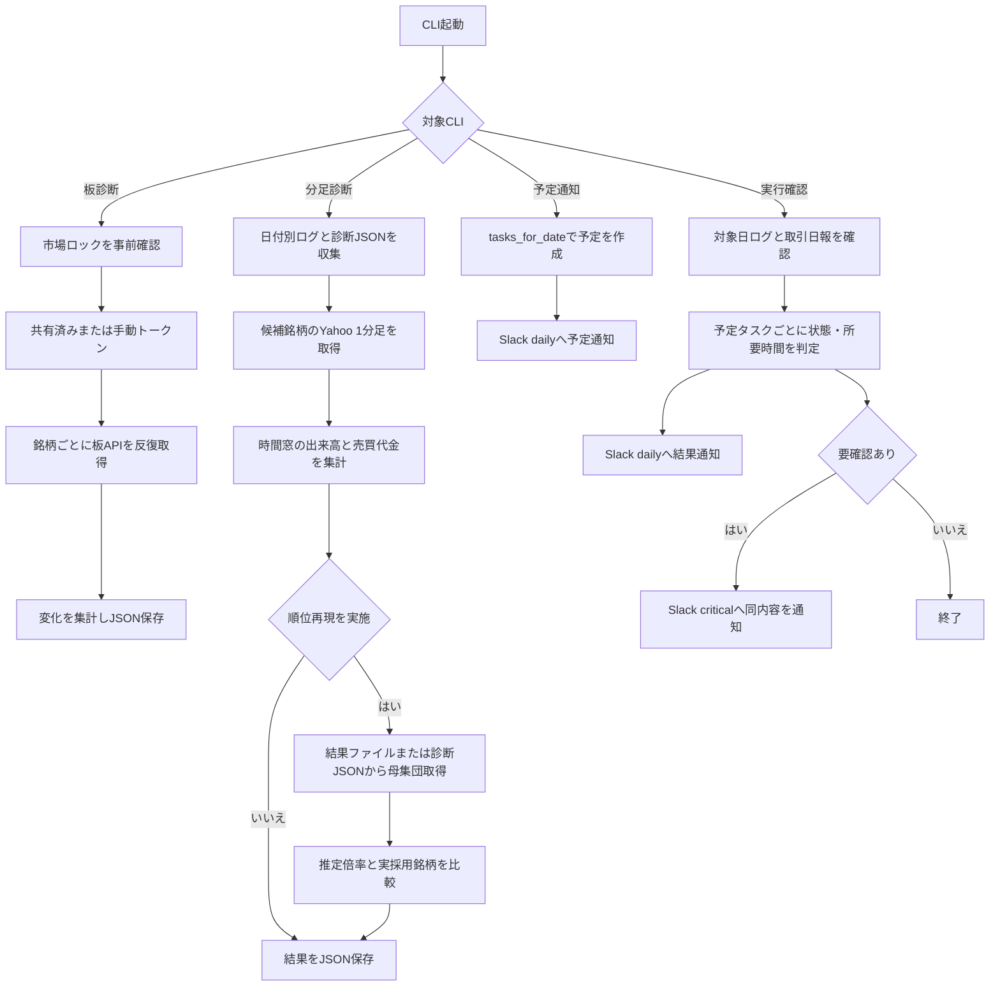

# 詳細設計書 14 診断・保守

> 状態: 現行    最終更新: 2026-10-08
> 起動: `diagnose_board_turnover.py`、`diagnose_missing_turnover_by_minute_bars.py`、`run_daily_task_plan.py`、`run_daily_task_check.py`    関連: [詳細設計テンプレート](./_template.md)、[実行スケジュール](../architecture/schedule.md)、[設定項目](../reference/config-reference.md)、[設計書ギャップ補完タスク](../tasks/task-docs-gap-fill.md)

## 1. 概要

本書は、板売買高・売買代金の観測、フィルタ評価対象外の分足調査、日次タスク予定通知、当日の実行結果確認の4 CLIを扱う。
診断CLIは調査結果を表示・JSON保存するものであり、売買判断やフィルタ結果を修正しない。日次タスクCLIは `task_schedule.py` の予定を日付に応じて通知する。
実際の処理・既定値は現行ソースを正とし、タスク登録資料や運用レビューに記載された事実はコード上の閾値・仕様と区別する。

## 2. 実行方式

`diagnose_board_turnover.py` は明示的なCLIまたは手動実行を想定し、共有済みkabuステーショントークンで板APIを複数回読む。`diagnose_missing_turnover_by_minute_bars.py` は指定日（既定5日）のフィルタリング診断JSONとstderrログを読み、Yahoo 1分足による欠損判定と任意の順位再現を行う。

日次予定・結果通知は別個のWindowsタスクスケジューラ登録スクリプトから起動される。登録スクリプトの既定時刻は予定通知07:00、実行確認18:00で、いずれも日次登録である。`task_schedule.py` は通知する業務タスクを対象日から決めるが、OSタスクを起動する機能ではない。実行確認が見るのは日付別アプリケーションログ上の開始・終了マーカーであり、OSタスク自体の実行履歴を照会するものではない。

## 3. 入出力

4 CLIの入出力は次のとおり。パス設定の既定値は `data/` 以下だが、各ディレクトリは設定で変更できる。

| 対象 | 項目 | 方向 | 場所・形式 | 備考 |
|---|---|---|---|---|
| 板売買代金診断 | 銘柄 | 入力 | `--symbols`、または最新スクリーニング結果JSON | `--symbols` はカンマ区切り。未指定時は `SCREENING_RESULT_DIRECTORY` の最新結果 |
| 板売買代金診断 | 認証・板データ | 入力 | `--token` または共有済みトークン、kabu `/board/{symbol}@1` | トークンは新規発行しない。レスポンスは現在値、売買高・売買代金、時刻、VWAP等 |
| 板売買代金診断 | 調査結果 | 出力 | 標準出力、JSON | 既定JSONはスクリーニング結果ディレクトリの親にある `analysis/` |
| 分足欠損診断 | 欠損候補・評価済み銘柄 | 入力 | スクリーニング結果ディレクトリの親にある `logs/jobs/run_filtering_stderr_<日付>.log`、`FILTERING_DIAGNOSTICS_DIRECTORY/<日付>_*.json` | ログはUTF-16、診断JSONはUTF-8。診断JSONがあれば欠損理由区分を優先 |
| 分足欠損診断 | 分足・日足売買代金 | 入力 | Yahoo Finance intraday chart API、同じ親の `cache/yahoo_daily/<銘柄>.json` | 1分足は既定7日分を取得。日足API失敗時はキャッシュを読む |
| 分足欠損診断 | 再現用母集団・採用銘柄 | 入力 | スクリーニング／フィルタ結果JSON、または診断JSON | 既定は `SCREENING_RESULT_DIRECTORY`、`FILTERING_RESULT_DIRECTORY` |
| 分足欠損診断 | 調査・再現結果 | 出力 | 標準出力、JSON | 既定JSONはスクリーニング結果ディレクトリの親にある `analysis/` |
| 日次タスク計画 | 対象日・予定 | 入力 | `date.today()`、`tasks_for_date()` | CLI引数はなく、関数呼び出しでは対象日を注入可能 |
| 日次タスク計画 | 予定メッセージ | 出力 | Slack `daily`、アプリケーションログ | 実行タスクなしの日も理由または「予定なし」を通知 |
| 日次タスク確認 | 対象日・実行記録 | 入力 | `date.today()`、`LOG_FILE_PATH` | ログはUTF-8読込（不正バイト置換）、対象日先頭10文字に絞る |
| 日次タスク確認 | 取引レポート | 入力 | `data/reports/daily/<日付>.json` | 既定パス。取引タスクの完了判定に存在確認を使う |
| 日次タスク確認 | 実行結果メッセージ | 出力 | Slack `daily`、要確認時は `critical` にも通知 | 予定がない日は `daily` のみ |
| Windowsタスクrunner | stderr・終了コード | 出力 | `data/logs/jobs/<runner名>_stderr_<実行日>.log`、プロセス終了コード | runnerはプロジェクト `.venv\Scripts\python.exe` でentrypointを実行。古い同名stderrログを30日保持で整理 |

## 4. 処理フロー

板診断はkabu板を反復取得し、分足診断はログ／診断JSONから候補を集めてYahooデータと照合する。日次通知2本は予定一覧を同じスケジュール定義から作り、結果確認のみログマーカーと取引日報を追加で検査する。

## 5. 判断ルール・仕様

各CLIの目的、主な入出力、利用場面、関連する調査根拠をまとめる。ここでいう「閾値」はコードにある判定値であり、診断結果から運用上の推奨値を導くものではない。

| CLI | 目的・用途 | 主な入出力 | 利用場面 | 関連調査・根拠 |
|---|---|---|---|---|
| `diagnose_board_turnover.py` | 同一銘柄の板情報を反復し、売買高・売買代金の更新や取得時刻を観察する | 入力:銘柄、共有トークン、board API。出力:標準出力とJSON | フィルタ時に板値が欠損または更新されない事象の切り分け。発注せず、DB・状態・フィルタ結果は変更しない | `BoardRepository.get_current_board_with_freshness()`。`tests/test_board_turnover_diagnostics.py`。登録解除をしない |
| `diagnose_missing_turnover_by_minute_bars.py` | `FILTER_TURNOVER_MISSING` 等の候補について、Yahoo分足の実出来高を確認し、任意で上位候補を再現する | 入力:日別ログ、フィルタ診断JSON、Yahoo分足・日足。出力:判定レポートとJSON | 「当日売買代金を計算できない」欠損が市場で未約定だったのか、取得値の欠落等なのかを後追い調査。フィルタ判断そのものは変更しない | `filtering_usecase.py`、`decision_journal_repository.py`、`tests/test_diagnose_missing_turnover_by_minute_bars.py`、[2026-10-05運用レビュー](../../scratch/2026-10-05-operation-review.md) |
| `run_daily_task_plan.py` | 対象日の予定タスクを整形し通知する | 入力:当日の日付と `tasks_for_date()`。出力:Slack `daily` | Windowsタスクスケジューラから毎朝予定を共有。取引・分析などの業務処理自体は起動しない | `task_schedule.py`、`scripts/tasks/register_daily_task_plan_task.ps1`、`tests/test_daily_task_plan.py` |
| `run_daily_task_check.py` | 予定タスクの開始・終了記録、異常終了記録、取引日報の有無を照合する | 入力:当日ログ、予定タスク、取引日報。出力:Slack `daily`、要確認時 `critical` | Windowsタスクスケジューラから夕方に実行状況を報告。タスクスケジューラの履歴や各処理の意味的な成功までは検証しない | `task_schedule.py`、`scripts/tasks/register_daily_task_check_task.ps1`、`tests/test_daily_task_check.py` |

**板診断のコード上の条件**

- `--repeat` は既定2で、実行時に最低1へ補正される。`--interval-seconds` の既定は0秒で、正値なら連続取得間にsleepする。
- 診断行には銘柄ごとの取得回数、累積ユニーク銘柄数、経過秒、例外型、レスポンス項目、現在値、売買高・売買代金等を記録する。要約は各銘柄の最初と2回目だけを比較し、2回を超える取得分は要約比較対象外。
- 銘柄数が45以上（登録上限50の5件手前以上）で警告するが、登録解除はしない。コードコメント上も上限に近づく警告であり、診断側に登録数の強制制限はない。
- 実行時刻が設定市場時間内かをJSONに記録するが、場中かどうかで取得内容や判定を変えない。`--force` はロック事前確認を飛ばす。現行コードではロック確認の `with` を板取得前に抜けるため、板診断全体をロック保持していない。

**分足欠損診断のコード上の条件**

- 対象時間は09:00以上09:30未満。09:30足は含まれず、09:25以上の出来高を最後の5分として別集計する。売買代金概算は各足の終値相当価格×当該足出来高の合計。
- 判定は時間窓の出来高合計が0より大きければ `TRADED`、足があるが合計0なら `NO_VOLUME`、対象日の銘柄足がなければ `NO_BARS`。その日について取得成功銘柄を横断して対象日足が1本もなければ `UNAVAILABLE`、対象銘柄の取得例外または空応答は `FETCH_FAILED`。
- 欠損候補はログの「当日売買代金を計算できません」または「現在値なし」行を読み、同一銘柄は重複排除する。ログだけでは両理由を区別できないため、当日のフィルタ診断JSONが1件以上あれば `FILTER_TURNOVER_MISSING`／`FILTER_CURRENT_PRICE_MISSING` で振り分けた候補を優先する。診断JSONの候補抽出条件は `status == "skipped"`。
- Filtering側で `FILTER_TURNOVER_MISSING` となるのは、`TradingValue` がなく、現在値×出来高で当日売買代金も算出できない場合（出来高欠落、または計算可能な値がない場合）。出来高が存在し現在値がない場合は `FILTER_CURRENT_PRICE_MISSING`。ただしログは両者に同一の売買代金計算不可メッセージを出す。
- 診断JSONに `evaluated` 状態かつ `numerator` のある銘柄は板側の比較値として扱う。Yahoo概算／板 numerator の比も出力する。シミュレーションは既定で有効、`--no-simulation` で無効化可能。
- シミュレーションでは直近7日分の1分足取得結果を再利用し、日足APIを最大90日要求する。比較倍率の分母は対象日前の日足売買代金のうち直近20件の算術平均。日足APIが例外または空結果ならキャッシュの終値×出来高を使う。推定不能銘柄は理由付きで順位から除外する。
- 推定上位は既定10件。`推定倍率 >= 1.0` の件数も別途表示するが、これは集計用の境界であり、フィルタの選考閾値ではない。候補のYahoo推定倍率と板実倍率の比はYahoo売買代金0を別枠にする。
- 既定対象日は `2026-09-29`、`2026-09-30`、`2026-10-01`、`2026-10-02`、`2026-10-05`。`--dates` で置換できる。日付全体の分足が取得不可ならシミュレーションをskipする。人口データは対象日の前営業日スクリーニング結果と当日フィルタ結果が両方あればそれを使い、片方でも無ければ診断JSONがある場合にフォールバックする。

**日次タスク通知のコード上の条件**

- `tasks_for_date()` は土曜に土曜タスク、取引日（日本の営業日カレンダー）に平日タスクを返し、月次分析は月末の最終取引日のみ追加する。結果は表示時刻順。
- 予定文ではスクリーニングだけ「翌営業日向け」と表記する。平日で予定0件なら休場日の説明、その他の予定0件なら予定なしを表示する。
- 実行確認は対象日の予定ごとに開始・終了・異常終了マーカーの有無を判定する。異常終了があれば❌、開始なし／終了なしは⚠️。取引は終了マーカーがあっても日次レポートがなければ⚠️。その他は開始・終了があれば✅。
- 所要時間は対象ログから開始時刻と終了または異常終了時刻を読み、終了時刻が開始時刻以降の場合のみ表示する。ログにマーカーがあるかの判定自体はタイムスタンプの妥当性を必須としない。
- 要確認が1件でもあれば結果を `daily` に送った後、同一内容を「本日のタスク実行要確認」として `critical` にも送る。予定タスクがない場合は要確認なし。

## 6. レイヤー別の構成

| ファイル | 層 | 役割 |
|---|---|---|
| `src/entrypoints/diagnose_board_turnover.py` | entrypoints | CLI引数、ロック事前確認、共有トークン選択、板診断・JSON出力 |
| `src/infrastructure/kabu/board_repository.py` | infrastructure | kabu board APIを呼び、返却項目を診断用形式に整形 |
| `src/infrastructure/execution_lock.py` | infrastructure | 市場処理のファイルロックを提供 |
| `src/infrastructure/persistence/screening_result_repository.py` | infrastructure | 未指定時の最新スクリーニング銘柄を読み込む |
| `src/entrypoints/diagnose_missing_turnover_by_minute_bars.py` | entrypoints | 証跡収集、判定・推定・表示・JSON保存 |
| `src/infrastructure/market_data/get_intraday_bars.py` | infrastructure | Yahoo Financeから分足を取得し `MinuteBar` に変換 |
| `src/application/filtering_usecase.py` | application | 当日売買代金の算出可否、フィルタ理由コードと診断記録を生成 |
| `src/infrastructure/persistence/decision_journal_repository.py` | infrastructure | 判断記録で用いるフィルタ理由コードを定義・保存 |
| `src/entrypoints/run_daily_task_plan.py` | entrypoints | 予定文を作成し `daily` 通知 |
| `src/entrypoints/run_daily_task_check.py` | entrypoints | 日次ログ／レポートを確認し `daily` と必要時 `critical` へ通知 |
| `src/config/task_schedule.py` | config | 予定タスク、営業日・月末判定、表示順を定義 |
| `src/infrastructure/notification/slack_notify.py` | infrastructure | Slack通知を送信。未設定・テスト時・HTTP失敗を処理 |
| `scripts/tasks/run_daily_task_plan.ps1`、`run_daily_task_check.ps1` | scripts | 仮想環境のentrypoint起動と日別stderrログ出力 |
| `scripts/tasks/register_daily_task_plan_task.ps1`、`register_daily_task_check_task.ps1` | scripts | 日次Windowsタスクの登録・解除 |
| `tests/test_board_turnover_diagnostics.py`、`tests/test_diagnose_missing_turnover_by_minute_bars.py`、`tests/test_daily_task_plan.py`、`tests/test_daily_task_check.py` | tests | CLIの判定条件、出力、通知先の回帰テスト |
| `scratch/2026-10-05-operation-review.md` | 運用レビュー | 2026-10-05の運用証跡に基づく事実。実装仕様や一般閾値の定義元ではない |

## 7. 異常系・失敗時の動き

| 事象 | 検知方法 | 動き | 通知 | 理由コード |
|---|---|---|---|---|
| 板診断時に市場ロックを取得できない | `market_workflow_lock()` が `False` | 警告を標準出力して終了コード1。`--force` は事前確認を省略 | なし | なし |
| 板診断に使う共有トークンがない | `peek_token()` が空、かつ `--token` 未指定 | エラーを標準出力して終了コード1。新規発行しない | なし | なし |
| 板診断の対象銘柄が空 | CLI／最新スクリーニング結果の銘柄が空 | エラーを標準出力して終了コード1 | なし | なし |
| 個別板取得が例外または空応答 | 例外を捕捉、またはrepositoryが `None` を返す | 例外型または `board_none` をJSON記録し、後続銘柄の取得を継続 | なし | なし |
| 個別Yahoo分足取得が例外または空応答 | `fetch_all()` で例外捕捉または空リスト | `FETCH_FAILED` と型名または `EMPTY_RESPONSE` を記録し、他銘柄を継続 | なし | `FETCH_FAILED` |
| 日付全体のYahoo足がない | 成功した全銘柄の足に対象日がない | `UNAVAILABLE` として表示。シミュレーションも当日をskip | なし | `UNAVAILABLE` |
| 入力ログ／JSONや出力ファイル操作に失敗 | JSON decode、ファイル権限等の例外 | 分足診断は当該例外を包括捕捉せず停止。板診断の個別API例外以外も包括捕捉しない | なし | なし |
| ログファイルが存在しない | `FileNotFoundError` | タスク確認は空ログとして扱い、予定タスクを未記録（要確認）にする | daily、要確認時critical | なし |
| 日次タスクログが異常終了／開始・終了不足 | タスク名のマーカーを検査 | 異常終了は❌、欠落・不完全は⚠️にし、要確認扱い | daily、critical | なし |
| Slack Webhook未設定、テスト実行、通信／HTTP失敗 | Slack送信関数 | 警告・エラーログを記録し `False`。通知送信自体は呼出元処理を失敗させない | 該当チャンネルへの配送なし | なし |
| PowerShell runnerの仮想環境がない | `.venv\Scripts\python.exe` の存在確認 | PowerShellエラー、終了コード1 | Slack通知前に失敗 | なし |

板診断と分足診断は読み取り専用調査を意図するが、JSON出力ファイルは作成する。日次タスク確認はログが欠けていること自体を業務失敗と断定せず、「要確認」として報告する。

## 8. 設定項目

共通設定一覧は[設定項目](../reference/config-reference.md)を参照。CLI固有の引数、実装既定値、タスク登録時刻を以下に示す。

| 名前 | 意味 | 既定値 |
|---|---|---|
| `SCREENING_RESULT_DIRECTORY` | 板診断の既定銘柄入力、両診断の出力先・各出力パスの基準 | `data/screening` |
| `FILTERING_DIAGNOSTICS_DIRECTORY` | 分足欠損診断が読むフィルタ診断JSON | `data/filtering_diagnostics` |
| `FILTERING_RESULT_DIRECTORY` | 分足シミュレーションが読む当日採用結果 | `data/filtering` |
| `LOG_FILE_PATH` | 日次タスク確認が読むアプリケーションログ | 設定生成先。リポジトリ既定のログファイル |
| 市場開始・終了時刻 | 板診断JSONに記録する場中／場外の判定 | 09:00–15:30 |
| `DAILY_ANALYSIS_START_TIME` | 平日予定表に表示する日次分析開始時刻 | `16:30` |
| `--symbols` | 板診断のカンマ区切り対象銘柄 | 最新スクリーニング結果 |
| `--repeat` | 板診断で同一銘柄を読む回数 | `2`（最低1に補正） |
| `--interval-seconds` | 板取得の銘柄／反復間隔 | `0.0`秒 |
| `--output` | 板診断／分足診断のJSON出力先 | 基準ディレクトリ親の `analysis/` に日時付きJSON |
| `--token`、`--force` | 板診断の共有済みでない手動トークン、ロック事前確認の省略 | 未指定、`False` |
| `--dates` | 分足診断の対象日（カンマ区切り） | `2026-09-29,2026-09-30,2026-10-01,2026-10-02,2026-10-05` |
| `--no-simulation` | 分足診断の上位候補再現を無効化 | `False`（シミュレーション有効） |
| 登録スクリプト `-At` | 予定通知／実行確認のWindowsタスク起動時刻 | `07:00`／`18:00` |
| 登録スクリプト `-TaskName` | Windowsタスク名 | `trade-pjoject-daily-task-plan`／`trade-pjoject-daily-task-check` |

分足診断のログ入力ディレクトリはスクリーニング結果ディレクトリの親にある `logs/jobs`、結果JSONは同じ親の `analysis`。日次レポートは実行確認entrypointの既定でプロジェクトルート `data/reports/daily` を参照する。

## 9. 決定事項と変更履歴

| 日付 | 決定 | 理由 |
|---|---|---|
| 2026-10-08 | 4つの診断・保守CLIを共通10章構成の1設計書に集約 | `docs/tasks/task-docs-gap-fill.md` の診断・保守系未整備項目を現行コードに基づき文書化 |
| 2026-10-08 | `FILTER_TURNOVER_MISSING` の候補収集では診断JSONがある場合に理由コードを優先し、ログだけの場合との違いを明記 | filteringログでは売買代金欠損と現在値欠損が同じ文言になるため |
| 2026-10-08 | 分足シミュレーション比率、1.0境界、上位10件は調査用集計として記述し、フィルタ基準とは扱わない | コードは推定結果を順位・集計表示するが、実フィルタ判定を変更しない |
| 2026-10-08 | 2026-10-05レビューの27件等は当日の観測値として扱い、一般仕様や閾値へ一般化しない | 運用レビューは特定日の保存済みログ・DB・ファイルに基づくため |

## 10. 未決・既知の課題

- `diagnose_board_turnover.py` はロック事前確認のコンテキストを実際の板取得前に抜けるため、診断処理全体を市場処理との排他下で実行する実装ではない。競合回避を全期間保証する必要があるか、現行運用上の期待は不明。
- 板診断の登録警告閾値45件と実際のkabu API登録上限50件の関係、実行時のAPI登録挙動・回復方法はコードだけでは確認できない。診断は登録解除しない。
- 分足診断はYahoo 1分足の取得範囲（取得関数コメントで直近7日程度）に依存する。古い日付や一部銘柄の取得不可を、対象時間の未約定と区別できない場合がある。
- 分足診断の `TRADED` はYahoo分足の出来高が正であることだけを意味し、板APIがフィルタ時点で売買代金を返すべきだったことや原因を確定しない。Yahooの価格×出来高も板 `TradingValue` と一致する保証はない。ソース内の注意文では、Yahoo概算は板値より中央値で約9%小さいと記載されるが、これは固定説明であり、今回の各実行で算出した校正値ではない。
- 分足シミュレーションは前営業日スクリーニング候補の分足値／過去20日平均を使った推定であり、現行フィルタリングが参照する実際の板値を復元するものではない。推定・採用順位差を運用判断へどう適用するかは未定義。
- 日次タスク確認はログ中のマーカー存在と取引日報ファイルの存在で判定する。OSタスクスケジューラの実行履歴、処理結果の完全性、レポート内容の妥当性は確認しない。ログ保持期間やログ欠落時にcritical通知とするかは現行コードからは確認できない。
- `date.today()` を使うため、実行ホストのローカル日付と日本時間の日付が異なる場合の対象日選択は明示制御されない。
- 分足診断は `FILTER_TURNOVER_MISSING` 以外にも `FILTER_CURRENT_PRICE_MISSING` と評価済み銘柄を同時に比較するが、当日の診断JSONが空／欠落の場合に、誤認識のない欠損理由分離をログのみで行う手段はない。
