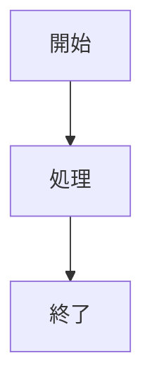

# 詳細設計書 <番号> <機能名>

> 状態: 現行 / 一部未反映 / 構想中    最終更新: YYYY-MM-DD
> 起動: `run_xxx.py`    関連: [設計書](./)、[ADR](../adr/)、[設定項目](../reference/config-reference.md)

## 1. 概要

この機能が何をするかを3〜5行で説明する。目的とスコープ外も記載する。

## 2. 実行方式

いつ、誰が起動するか、前後の機能とのつながりを記載する。

## 3. 入出力

この機能が読むもの・書くものを記載する。

| 項目 | 方向 | 場所・形式 | 備考 |
|---|---|---|---|
| <項目> | 入力 / 出力 | <場所・形式> | <補足> |

## 4. 処理フロー

処理の流れや分岐を図で示し、その要点を1〜2行で説明する。

## 5. 判断ルール・仕様

機能固有の判断条件、パラメータ、理由コードなどを記載する。

## 6. レイヤー別の構成

| ファイル | 層 | 役割 |
|---|---|---|
| <ファイル> | domain / application / infrastructure / entrypoints | <担当> |

## 7. 異常系・失敗時の動き

| 事象 | 検知方法 | 動き | 通知 | 理由コード |
|---|---|---|---|---|
| <事象> | <検知方法> | <動き> | <通知先> | <コード> |

## 8. 設定項目

設定値の一覧は[config-reference.md](../reference/config-reference.md)を参照する。機能固有の設定や補足があれば記載する。

| 名前 | 意味 | 既定値 |
|---|---|---|
| <設定名> | <意味> | <既定値> |

## 9. 決定事項と変更履歴

| 日付 | 決定 | 理由 |
|---|---|---|
| YYYY-MM-DD | <決定> | <理由> |

## 10. 未決・既知の課題

- <未決事項または既知の課題>

## 書き方ルール

表や図にする場合も、その前後に「要は何か」を1〜2行の文章で添える。

| 内容 | 形式 |
|---|---|
| 入出力 | 表（項目 / 方向 / 場所・形式 / 備考） |
| 処理の流れ・分岐 | Mermaid `flowchart` |
| 時間順のやり取り（API・クライアント間） | Mermaid `sequenceDiagram` |
| 状態が移り変わるもの（観測中→確定など） | Mermaid `stateDiagram-v2` |
| 条件と結果の組み合わせ（レジーム別の挙動など） | 表（条件 / 結果） |
| 異常系 | 表（事象 / 検知方法 / 動き / 通知 / 理由コード） |
| 理由コード・設定項目・パラメータ | 表（名前 / 意味 / 既定値） |
| レイヤー別の構成 | 表（ファイル / 層 / 役割） |
| 決定事項・変更履歴 | 表（日付 / 決定 / 理由） |

表は1つ最大6列までとする。図は1枚あたり30ノード程度までとし、超える場合は分割する。
