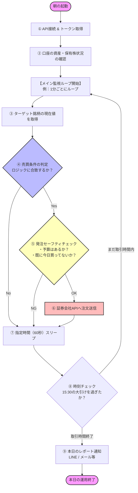

```mermaid
flowchart TD
    Start([朝の起動]) --> 1[① API接続 & トークン取得]
    1 --> 2[② 口座の資産・保有株状況の確認]
    2 --> LoopStart[【メイン監視ループ開始】<br>例：1分ごとにループ]

    %% メイン処理ループ
    LoopStart --> 3[③ ターゲット銘柄の現在値を取得]
    3 --> 4{④ 売買条件の判定<br>ロジックに合致するか？}
    
    %% 条件分岐
    4 -- No --> 7
    4 -- Yes --> 5{⑤ 発注セーフティチェック<br>・予算はあるか？<br>・既に今日買ってないか？}
    
    5 -- NG --> 7[⑦ 指定時間（60秒）スリープ]
    5 -- OK --> 6[⑥ 証券会社APIへ注文送信]
    6 --> 7
    
    %% 時間チェック
    7 --> 8{⑧ 時刻チェック<br>15:30の大引けを過ぎたか？}
    8 -- まだ取引時間内 --> LoopStart
    8 -- 取引時間終了 --> 9[⑨ 本日のレポート通知<br>LINE / メール等]
    
    9 --> End([本日の運用終了])

    %% スタイルの調整
    style Start fill:#f9f,stroke:#333,stroke-width:2px
    style End fill:#f9f,stroke:#333,stroke-width:2px
    style 4 fill:#bbf,stroke:#333,stroke-width:2px
    style 5 fill:#ffb,stroke:#333,stroke-width:2px
    style 6 fill:#fbb,stroke:#333,stroke-width:2px
```