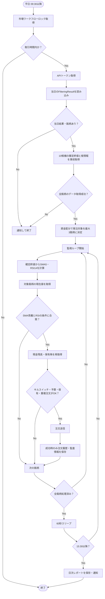

```mermaid
flowchart TD
    Start([平日 09:30以降]) --> Lock[市場ワークフローロック取得]
    Lock --> Session{取引時間内か？}
    Session -->|No| End([終了])
    Session -->|Yes| Token[APIトークン取得]
    Token --> Filter[当日のFilteringResultを読み込み]
    Filter --> FilterCheck{当日結果・銘柄あり？}
    FilterCheck -->|No| NotifySkip[通知して終了]
    FilterCheck -->|Yes| Preflight[10候補の確定終値と板情報を事前取得]
    Preflight --> PreflightCheck{全銘柄のデータ取得成功？}
    PreflightCheck -->|No| NotifySkip
    PreflightCheck -->|Yes| Allocate[資金配分で発注対象を最大3銘柄に決定]
    Allocate --> Loop[監視ループ開始]

    Loop --> History[確定終値からSMA5・RSI14を計算]
    History --> Board[対象銘柄の現在値を取得]
    Board --> Signal{SMA乖離とRSIの条件に合致？}
    Signal -->|No| Next[次の銘柄]
    Signal -->|Yes| Account[現金残高・保有株を再取得]
    Account --> Safety{キルスイッチ・予算・保有・重複注文がOK？}
    Safety -->|No| Next
    Safety -->|Yes| Order[注文送信]
    Order --> Record[成功時のみ注文履歴・監査情報を保存]
    Record --> Next
    Next --> AllDone{全銘柄処理済み？}
    AllDone -->|No| Loop
    AllDone -->|Yes| Sleep[60秒スリープ]
    Sleep --> Closed{15:30以降？}
    Closed -->|No| Loop
    Closed -->|Yes| Report[日次レポートを保存・通知]
    Report --> End
```

週次の保守タスクは、土曜07:30に分足バックフィル、08:00にバックテスト、09:00に週次分析を実行する。